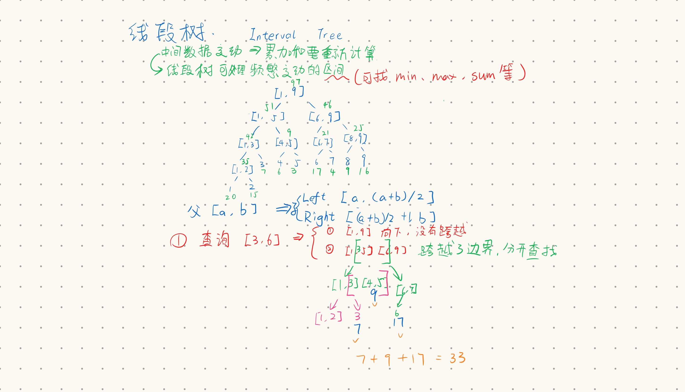

+++
author = "ALKALiKong"
title = "线段树的创建与优化"
date = "2025-06-15"
description = "我自己在做一道线段树的题目的时候从头到尾的优化历程"
tags = [
    "算法",
    "线段树",
    "C++",
]
categories = [
    "Algorithm",
    "DataStructure",
]
+++



本题题目：https://leetcode.cn/problems/my-calendar-i/

# 初始版：

线段树初始思路：

1. 按 [left, mid], [mid+1, right] 向下递归构造子节点。
2. 使用 query 访问，见上图，如果没有跨越当前节点边界，就直接向下递归访问；若跨越了节点边界，则分开查找并加和处理。
3. 使用 update 增加，从树的顶点一直加到树的叶节点。（标准的树递归访问）

``` cpp
class MyCalendar {  
public:  
    struct Node {  
        int left, right;  
        int sum = 0;  
        Node *l, *r;  
  
        Node(int left = 0, int right = 0, int sum = 0, Node* l = nullptr, Node* r = nullptr)  
	        : left(left), right(right), sum(sum), l(l), r(r) {}  
    };  
    Node* root = nullptr;  
  
    MyCalendar() {
	    // 原本这里是 1~1E9
	    root = buildTree(1, 1E2);
	}  
  
    Node* buildTree(int left, int right) {  
        // When left equals right, the node that is currently building is leaf  
        // node.
        if (left >= right) {  
            Node* leaf = new Node(left, right);  
            return leaf;  
        }  
  
        Node* pNode = new Node(left, right);  
        pNode->l = buildTree(left, left + (right - left) / 2);  
        pNode->r = buildTree(left + (right - left) / 2 + 1, right);  
  
        return pNode;  
    }  
  
    bool book(int startTime, int endTime) {  
        int sum = 0;  
        sum += query(root, startTime + 1, endTime);  
        if (sum == 0) {  
            update(root, startTime + 1, endTime, 1);  
            return true;  
        }  
        return false;  
    }  
  
    // [left, right]  
    int query(Node* node, int left, int right) {  
        // 1. 边界检查：无交集时返回0
        if (node->right < left || node->left > right) {
            return 0;
        }
        
        // 2. 完全包含优化：查询区间完全包含节点区间时直接返回
        if (left <= node->left && node->right <= right) {
            return node->sum;
        }

        // 3. 部分重叠时才递归
        int sum = 0;
        int mid = (node->left + node->right) / 2;
        
        if (left <= mid && node->l) {
            sum += query(node->l, left, right);
        }
        if (right > mid && node->r) {
            sum += query(node->r, left, right);
        }
        
        return sum;
    }  
  
    // [left, right]  
    void update(Node* node, int left, int right, int addition) {  
        if (node->left == node->right) {  
            node->sum += addition;  
            return;  
        }  
  
        if (right <= (node->left + node->right) / 2) {  
            update(node->l, left, right, addition);  
        } else if (left > (node->left + node->right) / 2) {  
            update(node->r, left, right, addition);  
        } else {  
            update(node->l, left, (node->left + node->right) / 2, addition);  
            update(node->r, (node->left + node->right) / 2 + 1, right,  
                   addition);  
        }  
  
        node->sum = (node->l ? node->l->sum : 0) + (node->r ? node->r->sum : 0);
    }  
};
```

## 有什么问题？

先是自己跑了一下，题目的数据范围为 1 ~ 1E9，buildTree 空间复杂度为 O(n^2) -> 1E18，远远超过能够接受的范围。上方的代码对所有区间全部开节点，但有区间是用不到的。

# 改进版 1 - 动态开点优化稀疏数据

这个版本实现了动态开点（即只开需要的点，不需要的点不开）

具体的改动就是：

1. 直接去掉 buildTree 函数，因为这个函数会建立所有的节点
2. 因为并非所有节点都存在，所以访问到不存在的节点时 Node 为 nullptr，所以 query 直接对不存在的节点返回预设的初始值 0（这个在其他题目中可以改成其他需要的值）
3. 对于 update 函数，只需要在让 update 访问下一级节点前确保要被访问的节点已被创建即可。在 update 递归访问下一级节点前，检查要访问的节点是否为 nullptr，若是则先 new 出一个新节点再访问。

``` cpp
class MyCalendar {  
public:  
    struct Node {  
        int left, right;  
        int sum = 0;  
        Node *l, *r;  
  
        Node(int left = 0, int right = 0, int sum = 0, Node* l = nullptr, Node* r = nullptr)  
                : left(left), right(right), sum(sum), l(l), r(r) {}  
    };  
    Node* root = nullptr;  
  
    MyCalendar() { root = new Node( 1, 1E9 ); }  
  
    bool book(int startTime, int endTime) {  
        int sum = 0;  
        sum += query(root, startTime + 1, endTime);  
        if (sum == 0) {  
            update(root, startTime + 1, endTime, 1);  
            return true;  
        }  
        return false;  
    }  
  
    // [left, right]  
    int query(Node* node, int left, int right) {  
        // 当前位置尚未被使用到，可以直接返回初始值 0
        if ( node == nullptr ) {  
            return 0;  
        }  
  
        // 当前位置已经被使用，开始向下访问  
        // 1. 边界检查：无交集时返回0
        if (node->right < left || node->left > right) {
            return 0;
        }
        
        // 2. 完全包含优化：查询区间完全包含节点区间时直接返回
        if (left <= node->left && node->right <= right) {
            return node->sum;
        }

        // 3. 部分重叠时才递归
        int sum = 0;
        int mid = (node->left + node->right) / 2;
        
        if (left <= mid && node->l) {
            sum += query(node->l, left, right);
        }
        if (right > mid && node->r) {
            sum += query(node->r, left, right);
        }
        
        return sum;
    }  
  
    // [left, right]  
    void update(Node* node, int left, int right, int addition) {  
        if (node->left == node->right) {  
            node->sum += addition;  
            return;  
        }  
  
        // 在 update 前检查要被访问的节点是否已经被创建，若未被创建就 new 一个出来  
        int mid = (node->left + node->right) / 2;  
        if (right <= mid) {  
            if ( !node->l ) node->l = new Node(node->left, mid);  
            update(node->l, left, right, addition);  
        } else if (left > (node->left + node->right) / 2) {  
            if ( !node->r ) node->r = new Node(mid+1, node->right);  
            update(node->r, left, right, addition);  
        } else {  
            if ( !node->l ) node->l = new Node(node->left, mid);  
            if ( !node->r ) node->r = new Node(mid+1, node->right);  
            update(node->l, left, mid, addition);  
            update(node->r, mid + 1, right, addition);  
        }  
  
        node->sum = (node->l ? node->l->sum : 0) + (node->r ? node->r->sum : 0);
    }  
};
```

## 又有什么问题？？

`76 / 107 个通过的测试用例` 在第 76 个 testcase 用时超限了。我测，看到之后有点想吐血。通过分析可知，这个操作的时间复杂度为 O(MlogN)，M 是区间中的元素个数，logN 是线段树的高度，N 是树中的元素个数。

# 改进版 2 - 实现懒更新

嗯，从这里开始就不是我自己能想的出来的优化了。参考 https://labuladong.online/algo/data-structure/segment-tree-lazy-update/ 得知可以实现懒更新来优化效率。

> **懒更新的思路是，没必要上来就去更新区间的所有叶子节点，而是先把更新记录到非叶子节点（懒标记）。等到之后的操作经过懒标记节点时，再顺手把懒标记逐渐更新到叶子节点（懒标记下推）**。
>
> 它的难点在于，你要正确处理懒标记，保证在懒标记存在时，线段树的查询、更新操作依然能返回正确的结果。

修改点：

1. 节点加`lazy`字段。
2. 写`pushDown`函数。
3. 在`update`和`query`递归前调用`pushDown`。
4. 区间完全覆盖时直接打懒惰标记。

``` cpp
class MyCalendar {  
public:  
    struct Node {  
        int left, right;  
        int sum = 0;  
        int lazy = 0; // 懒惰标记  
        Node *l, *r;  
  
        Node(int left = 0, int right = 0, int sum = 0, Node* l = nullptr, Node* r = nullptr)  
            : left(left), right(right), sum(sum), l(l), r(r) {}  
    };  
    Node* root = nullptr;  
  
    MyCalendar() { root = new Node( 1, 1E9 ); }  
  
    bool book(int startTime, int endTime) {  
        int sum = 0;  
        sum += query(root, startTime + 1, endTime);  
        if (sum == 0) {  
            update(root, startTime + 1, endTime, 1);  
            return true;  
        }  
        return false;  
    }  
  
    // 当被再次访问的节点自身存在 lazy 标记时，将懒惰标记推给他的两个孩子，这样自己就不懒了（笑  
    void pullDown( Node* node ) {  
        // 空节点爬  
        if ( !node ) return;  
        // 当自己没有懒惰标记时，或者自己为叶节点，就没有孩子可以推自己的懒惰了，所以跳过这两种节点  
        if ( node->lazy == 0 || ( node->right - node->left == 0 ) ) return;  
  
        // 对于需要下推懒惰的节点，要确保自己的两个孩子都存在才能接着推  
        int mid = node->left + ( node->right - node->left ) / 2;  
        if ( !node->l ) node->l = new Node( node->left, mid );  
        if ( !node->r ) node->r = new Node( mid+1, node->right );  
  
        node->l->lazy += node->lazy;  
        node->r->lazy += node->lazy;  
        node->lazy = 0;  
  
        // lazy 标记用来记录当前懒惰节点被加的值是多少  
        // sum 是区间和，所以要用 区间节点数量*lazy标记  
        node->l->sum += ( mid - node->left + 1 ) * node->l->lazy;  
        node->r->sum += ( node->right - mid ) * node->r->lazy;  
  
    }  
    // [left, right]  
    int query(Node* node, int left, int right) {  
        // 当前位置尚未被使用到，可以直接返回初始值 0
        if ( node == nullptr ) {  
            return 0;  
        }  
  
        // 当前位置已经被使用，开始向下访问  
  
        // 先把要访问的节点的懒标记推下去  
        pullDown(node);  
  
        // 1. 边界检查：无交集时返回0
        if (node->right < left || node->left > right) {
            return 0;
        }
        
        // 2. 完全包含优化：查询区间完全包含节点区间时直接返回
        if (left <= node->left && node->right <= right) {
            return node->sum;
        }

        // 3. 部分重叠时才递归
        int sum = 0;
        int mid = (node->left + node->right) / 2;
        
        if (left <= mid && node->l) {
            sum += query(node->l, left, right);
        }
        if (right > mid && node->r) {
            sum += query(node->r, left, right);
        }
        
        return sum;
    }  
  
    // [left, right]  
    void update(Node* node, int left, int right, int addition) {  
        if (node->left == node->right) {  
            node->sum += addition;  
            return;  
        }  
  
        // 在更新每个节点前，先把自身的懒标记推下去  
        pullDown(node);  
  
        // 如果当前要更新的区间边界和节点边界相同，那么就进行懒更新  
        if ( left == node->left && right == node->right ) {  
            node->lazy += addition;  
            node->sum += addition * ( node->right - node->left + 1 );  
            return;  
        }  
  
        // 在 update 前检查要被访问的节点是否已经被创建，若未被创建就 new 一个出来  
        int mid = (node->left + node->right) / 2;  
        if (right <= mid) {  
            if ( !node->l ) node->l = new Node(node->left, mid);  
            update(node->l, left, right, addition);  
        } else if (left > (node->left + node->right) / 2) {  
            if ( !node->r ) node->r = new Node(mid+1, node->right);  
            update(node->r, left, right, addition);  
        } else {  
            if ( !node->l ) node->l = new Node(node->left, mid);  
            if ( !node->r ) node->r = new Node(mid+1, node->right);  
            update(node->l, left, mid, addition);  
            update(node->r, mid + 1, right,  
                   addition);  
        }  
  
        node->sum = (node->l ? node->l->sum : 0) + (node->r ? node->r->sum : 0);  
    }  
};
```

至此成功AC! （不过代码写的还是有点臃肿，不知道还有没有什么潜在问题qwq）

几点说明:

1. lazy 标记代表当前被加的数值，sum 代表区间和，这是两个不同的概念。
2. `node->sum = (node->l ? node->l->sum : 0) + (node->r ? node->r->sum : 0);` 我之前误写成了 node->sum += addition 是错误的，正确应该是递归的赋值为自己左右子树孩子的总和。
3. 按理来说 update 函数也应该判断 nullptr，不过我为了确定我写的代码是无误的所以留了一手没有判断，写的时候记得加进去。
4. 这个实现的是区间累加线段树，如需区间赋值线段树还是要用到别的写法的（）
5. 我的写法还是略显繁琐的，不过已经把我这一路优化的思路体现出来了。
6. 2025-07-18: 在写权值线段树时发现了之前写的代码的性能问题，所以更新一下，现在查询应该就是正常的 O(logN) 了。

# 模板

附上线段树万能模板一枚（从上面的网站上 copy 下来的）

``` cpp
class AllInOneSegmentTree {
    struct SegmentNode {
        int l, r;
        int mergeValue;
        SegmentNode* left;
        SegmentNode* right;

        // 累加懒标记, 为 0 表示无懒更新
        int lazyAdd;

        // 赋值懒标记
        int lazyAssign;
        bool hasLazyAssign;

        SegmentNode(int l, int r, int mergeValue) : l(l), r(r), mergeValue(mergeValue), left(nullptr), right(nullptr), lazyAdd(0), lazyAssign(0), hasLazyAssign(false) {}
    };

private:
    SegmentNode* root;
    int defaultValue;
    string type;

public:
    AllInOneSegmentTree(int start, int end, int defaultValue, string type) {
        if (type == "sum" || type == "max" || type == "min") {
            this->type = type;
        } else {
            throw invalid_argument("Invalid type, must be sum, max, or min");
        }
        this->defaultValue = defaultValue;
        int rootMergeValue = computeRangeValue(start, end, defaultValue);
        this->root = new SegmentNode(start, end, rootMergeValue);
    }

    // 计算区间 [l, r] 赋值为 val 后的 mergeValue
    int computeRangeValue(int l, int r, int val) {
        if (type == "sum") {
            return (r - l + 1) * val;
        } else {
            return val;
        }
    }

    // 根据区间长度更新 mergeValue，加上 delta
    int applyAddToValue(SegmentNode* node, int delta) {
        if (type == "sum") {
            return node->mergeValue + (node->r - node->l + 1) * delta;
        } else {
            return node->mergeValue + delta;
        }
    }

    // 根据类型合并左右子节点的值
    int merge(int leftVal, int rightVal) {
        if (type == "sum") {
            return leftVal + rightVal;
        } else if (type == "max") {
            return max(leftVal, rightVal);
        } else if (type == "min") {
            return min(leftVal, rightVal);
        }
        throw invalid_argument("Invalid type");
    }

    // 动态创建线段树节点
    void initChildrenIfNeeded(SegmentNode* node) {
        if (node->l == node->r) {
            return;
        }
        int mid = node->l + (node->r - node->l) / 2;
        if (node->left == nullptr) {
            int leftMergeValue = computeRangeValue(node->l, mid, defaultValue);
            node->left = new SegmentNode(node->l, mid, leftMergeValue);
        }
        if (node->right == nullptr) {
            int rightMergeValue = computeRangeValue(mid + 1, node->r, defaultValue);
            node->right = new SegmentNode(mid + 1, node->r, rightMergeValue);
        }
    }

    // 下传懒标记，保证子节点的数据正确
    void pushDown(SegmentNode* node) {
        if (node->hasLazyAssign) {
            applyAssign(node->left, node->lazyAssign);
            applyAssign(node->right, node->lazyAssign);
            node->hasLazyAssign = false;
            node->lazyAssign = 0;
        }
        if (node->lazyAdd != 0) {
            applyAdd(node->left, node->lazyAdd);
            applyAdd(node->right, node->lazyAdd);
            node->lazyAdd = 0;
        }
    }

    // 将赋值懒标记下传到子节点
    void applyAssign(SegmentNode* child, int val) {
        child->hasLazyAssign = true;
        child->lazyAssign = val;
        child->lazyAdd = 0;
        child->mergeValue = computeRangeValue(child->l, child->r, val);
    }

    // 将累加懒标记下传到子节点
    void applyAdd(SegmentNode* child, int delta) {
        if (child->hasLazyAssign) {
            child->lazyAssign += delta;
            child->mergeValue = computeRangeValue(child->l, child->r, child->lazyAssign);
        } else {
            child->lazyAdd += delta;
            child->mergeValue = applyAddToValue(child, delta);
        }
    }

    // 单点赋值：将索引 index 赋值为 val
    void update(int index, int val) {
        rangeUpdate(index, index, val);
    }

    // 区间赋值：将闭区间 [qL, qR] 赋值为 val
    void rangeUpdate(int qL, int qR, int val) {
        _rangeUpdate(root, qL, qR, val);
    }

    void _rangeUpdate(SegmentNode* node, int qL, int qR, int val) {
        if (node->r < qL || node->l > qR) {
            throw invalid_argument("Invalid update range");
        }
        if (qL <= node->l && node->r <= qR) {
            node->hasLazyAssign = true;
            node->lazyAssign = val;
            node->lazyAdd = 0;
            node->mergeValue = computeRangeValue(node->l, node->r, val);
            return;
        }

        initChildrenIfNeeded(node);
        pushDown(node);

        int mid = node->l + (node->r - node->l) / 2;
        if (qR <= mid) {
            _rangeUpdate(node->left, qL, qR, val);
        } else if (qL > mid) {
            _rangeUpdate(node->right, qL, qR, val);
        } else {
            _rangeUpdate(node->left, qL, mid, val);
            _rangeUpdate(node->right, mid + 1, qR, val);
        }
        node->mergeValue = merge(node->left->mergeValue, node->right->mergeValue);
    }

    // 单点累加：将索引 index 增加 delta（可为负数）
    void add(int index, int delta) {
        rangeAdd(index, index, delta);
    }

    // 区间累加：将闭区间 [qL, qR] 增加 delta（可为负数）
    void rangeAdd(int qL, int qR, int delta) {
        _rangeAdd(root, qL, qR, delta);
    }

    void _rangeAdd(SegmentNode* node, int qL, int qR, int delta) {
        if (node->r < qL || node->l > qR) {
            throw invalid_argument("Invalid update range");
        }
        if (qL <= node->l && node->r <= qR) {
            if (node->hasLazyAssign) {
                node->lazyAssign += delta;
                node->mergeValue = computeRangeValue(node->l, node->r, node->lazyAssign);
            } else {
                node->lazyAdd += delta;
                node->mergeValue = applyAddToValue(node, delta);
            }
            return;
        }
        initChildrenIfNeeded(node);
        pushDown(node);

        int mid = node->l + (node->r - node->l) / 2;
        if (qL <= mid) {
            _rangeAdd(node->left, qL, qR, delta);
        }
        if (qR > mid) {
            _rangeAdd(node->right, qL, qR, delta);
        }
        node->mergeValue = merge(node->left->mergeValue, node->right->mergeValue);
    }

    // 查询闭区间 [qL, qR] 的聚合值
    int query(int qL, int qR) {
        return _query(root, qL, qR);
    }

    int _query(SegmentNode* node, int qL, int qR) {
        if (node->r < qL || node->l > qR) {
            throw invalid_argument("Invalid query range");
        }
        if (qL <= node->l && node->r <= qR) {
            return node->mergeValue;
        }

        initChildrenIfNeeded(node);
        pushDown(node);

        int mid = node->l + (node->r - node->l) / 2;
        if (qR <= mid) {
            return _query(node->left, qL, qR);
        } else if (qL > mid) {
            return _query(node->right, qL, qR);
        } else {
            int leftResult = _query(node->left, qL, mid);
            int rightResult = _query(node->right, mid + 1, qR);
            return merge(leftResult, rightResult);
        }
    }
};
```