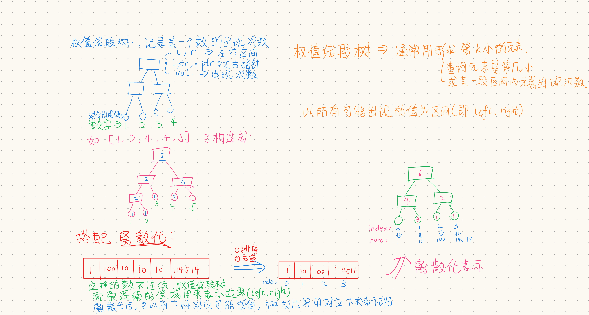

+++
author = "ALKALiKong"
title = "权值线段树及离散化的应用"
date = "2025-07-17"
description = "成分极其复杂的一道考察权值线段树（或者用树状数组）配合离散化的题目，并且一道题踩了好几个坑，让我明白了出题能有多离谱（不是）"
tags = [
    "算法",
    "线段树",
    "离散化",
    "C++",
]
categories = [
    "Algorithm",
    "DataStructure",
]
+++

# 权值线段树及离散化



做到一道题，考察了权值线段树和离散化。在全网找了好久也没有详细讲解权值线段树怎么写的，所以我自己写一篇总结，以后忘了的时候好有东西看看（）

本题题目如下：

> **链接：** https://ac.nowcoder.com/acm/contest/108298/L  
> **来源：** 牛客网
>
> ## 题目描述
>
> 有一组 n 个数字 a₁, a₂, …, aₙ，标记为 1, 2, …, n，它们之间不断地相互竞争。每天一个数字都要与组内的其他所有数字竞争，当它小于竞争对手时就会失败。它总共要参加 n-1 场比赛，如果它至少失败了 ⌈(n-1)/2⌉ 场比赛，它就会因失败而麻木。注意 ⌈x⌉ 是满足 y ≥ x 的最小整数 y。
>
> 因此每天都可能有一些数字因失败而麻木。作为一名善良的心理治疗师，你觉得有义务和他们谈话来鼓励他们。所以你想知道每天有多少个数字麻木，这决定了你的工作量。
>
> 这些数字不会保持不变。每天，其中恰好有一个数字会非常努力地练习并增大自己。一旦数字改变，它就不会再改变，直到它进一步增大自己。所以每天，你可能面临不同的情况。
>
> ## 输入描述
>
> 输入的第一行包含一个整数 T（1 ≤ T ≤ 10⁴），表示测试用例的数量。对于每个测试用例：
>
> 第一行包含两个整数 n（3 ≤ n ≤ 2×10⁵）和 q（1 ≤ q ≤ 2×10⁵），表示组中数字的数量和更新值的天数。
>
> 第二行包含 n 个整数 a₁, a₂, …, aₙ（1 ≤ aᵢ ≤ 10⁹），表示每个数字的值。
>
> 接下来 q 行，每行包含两个整数 p（1 ≤ p ≤ n）和 v（1 ≤ v ≤ 10⁹），表示被增大的数字的标签和增加的值。
>
> 保证所有测试用例的 n 之和以及 q 之和都不超过 5×10⁵。
>
> ## 输出描述
>
> 对于每个测试用例，输出 q 个整数，表示每次更新后麻木数字的数量。
>
> ## 示例1
>
> ### 输入
> ```
> 2
> 5 3
> 1 2 3 4 5
> 2 1
> 3 2
> 2 1
> 4 2
> 4 5 2 3
> 4 1
> 4 3
> ```
>
> ### 输出
> ```
> 3
> 3
> 3
> 1
> 2
> ```
>
> ## 说明
>
> 对于第一个样例：
>
> - 第一次更新后，数字变为 1, 3, 3, 4, 5，其中 1, 3, 3 感到麻木。
> - 第二次更新后，数字变为 1, 3, 5, 4, 5，其中 1, 3, 4 感到麻木。
> - 第三次更新后，数字变为 1, 4, 5, 4, 5，其中 1, 4, 4 感到麻木。

## 初步分析

这道题似乎是与排序后中间的数有关系，实际上就是问比第 n-n/2+1 小的数有几个。经过赛后学长的提示，这道题与树状数组/权值线段树有关。正好之前学过线段树，这次就来探索一下权值线段树是什么。

## 权值线段树

权值线段树就是以**所有能取到的值（值域）**为叶节点，其值表示**某个值出现的次数**，如上图所示。由此，我们可以得出权值线段树节点定义如下：

```C++
struct Node {
    int val; // [l,r] 区间内值出现的次数，若 l==r 则表示某一个值的出现次数
    int l, r; // 闭区间 [l,r]
    Node *lc, *rc; // 左、右子节点指针，和线段树一样
    Node( int l, int r, int v = 0, Node *lc = nullptr, Node *rc = nullptr ) :
        l(l), r(r), val(v), lc(lc), rc(rc) {}
};
```

我习惯用类封装数据结构，所以我们来建一个 class:

```C++
class ValSegTree {
private:
    struct Node {
        int val;
        int l, r;
        Node *lc, *rc;
        Node( int l, int r, int v = 0, Node *lc = nullptr, Node *rc = nullptr ) :
            l(l), r(r), val(v), lc(lc), rc(rc) {}
    };
    Node *root = nullptr;
    
public:
    ValSegTree() {}
};
```

### 构造整棵树

我们以 Testcase #1 为例，所有出现的数为 1,2,3,4,5 ，所以值域为 [0,5] (0是默认的起点)。

`buildTree` 函数如下：

``` C++
Node* buildTree(int left, int right) {  
    if (left >= right) {  
        Node* leaf = new Node(left, right);  
        return leaf;  
    }  
  
    Node* pNode = new Node(left, right);  
    pNode->lc = buildTree(left, left + (right - left) / 2);  
    pNode->rc = buildTree(left + (right - left) / 2 + 1, right);  
    
    return pNode;  
}
```

先递归构造子树，然后再完成当前节点的构造，在类的构造函数处用这个构造即可：

``` c++
ValSegTree() { root = buildTree(0, 5); }
```

你可能会问：那要是值域不长这样怎么办？这时候就要用到**离散化**了，咱们暂且按下不表。

### 更新值

对于权值二叉树来说，一般单次更新都是单点更新，不过也可能有不是单点更新的，不过这并不重要，我们更新的方法和区间线段树的更新方法内在其实都是一样的，只不过对外提供的接口不同罢了。

`update`函数内在实现：

``` c++
private:
    void _update( Node* node, int left, int right, int v ) {
        // 一直递归到 leaf node 为止，更新值
        if (node->l == node->r) {  
            node->val += v;  
            return;  
        }  
  
        if (right <= (node->l + node->r) / 2) {  
            // 要更新的区间完全在当前节点的左子节点内
            _update(node->lc, left, right, v);  
        } else if (left > (node->l + node->r) / 2) {  
            // 要更新的区间完全在当前节点的右子节点内
            _update(node->rc, left, right, v);  
        } else {  
            // 要更新的区间横跨左右节点，分开更新
            _update(node->lc, left, (node->l + node->r) / 2, v);  
            _update(node->rc, (node->l + node->r) / 2 + 1, right, v);  
        }  
  
        node->val = (node->lc ? node->lc->val : 0) + (node->rc ? node->rc->val : 0);
    }
```

仔细观察发现跟之前写的区间线段树的更新方法几乎一模一样（

对于本题，只需要单点更新某个值即可，故暴露公共接口：

``` c++
public:
	// num 代表要更新的那个数字，val 代表权值增加多少
	void update( int num, int val ) {
        // 单点就是左右区间都是他自己
        _update( root, num, num, val );
    }
```

### 查找第K小数字

这里查找就和区间线段树有区别了，区间线段树是根据提供的左右区间查找对应的区间和等内容，但这里是给出了k要查找第k小的数字是什么。我们来观察一下，区间是不是一定是一个有序的东西？那么区间代表了什么？值域！我们前面强调过，每个叶子节点代表了一个值出现了多少次，而区间是从左往右递增的，所以我们就可以通过统计每个区间的权值来计算出第K小的数到底在哪里。

``` c++
private:
	int _query( Node *node, int k ) {
        // 递归到的叶子节点一定是那个数，所以返回对应区间（值），不过后面离散化时要特别注意一下这里
        if ( node->l == node->r ) {
            return node->l;
        }

        // 先看左子树的权值是多少
        int leftCount = node->lc ? node->lc->val : 0;
        if (k <= leftCount) {
            // 如果 k 小于等于左子树的权值，证明第k小的数在左子树里，递归进左子树
            return _query(node->lc, k);
        } else {
            // 如果 k 大于左子树的权值，则去右子树搜索第k小的数，并且k要扣掉左子树的权值
            return _query(node->rc, k - leftCount);
        }
    }
```

暴露的外部接口为：

``` c++
public:
	int getKth( int num ) {
        return _query( root, num );
    }
```

### 求排名/前缀和

其实这俩是一类问题，底层都是求一个数前面的数有多少个。

内部实现如下（注意开闭区间）：

``` c++
private:
	//[left, right] 求该区间内权值的总和（这个区间的值有多少个）
    int _getCountSum( Node *node, int left, int right ) {
        // 如果节点区间完全不在搜索区间内，则直接返回
        if ( node->l > right || node->r < left ) {
            return 0;
        }
        // 若节点区间被完全包含在搜索区间内，则直接返回 （重要）
        if ( left <= node->l && node->r <= right ) {
            return node->val;
        }
        
        //将左右节点的结果相加
        int leftSum = node->lc ? _getCountSum(node->lc, left, right) : 0;
        int rightSum = node->rc ? _getCountSum(node->rc, left, right) : 0;
        return leftSum + rightSum;
    }
```

“**若节点区间被完全包含在搜索区间内，则直接返回**”，为什么这句话很重要呢，是因为我在写这篇文档的时候发现了一个问题：我套用上一个 blog 里所写的线段树的 query 时，发现这个程序会超时。我本以为这两个写法是没区别的，后来经过分析得知：**这种写法可以避免完全查找到每一个叶子节点处，即 O(logn)。**上一个程序我没有发现这个问题，因为我最后使用了懒标记处理了 TLE 问题。但是上一个程序初始版时明显出现了所有查找操作都会找到叶子节点处，导致性能退化至 O(N)。（不过上一个问题即使修改掉 query 依然会爆 TLE）

暴露外部接口如下：

```c++
public:
	// 求前缀和：小于val的数的个数，即 [0,val)
	// 其实也可以定义为 [0,val]，看题目需要了
    int getPrefixSum( int val ) {
        // val 处开区间
        return _getCountSum(root, 0, val-1);
    }
	// 获取某个数的排名（从小到大）
	// 根据上面的定义（即求开区间的前缀和）的话，其实rank就是前缀和+1
	int rank( int val ) {
        return getPrefixSum(val)+1;
    }
```

如此，权值线段树就~~基本完成了！~~吗？

### 析构函数

是的，用完了别忘了销毁啊！！！（我就忘掉了）

```c++
private:
	void deleteTree(Node* node) {
        if (node) {
            deleteTree(node->lc);
            deleteTree(node->rc);
            delete node;
        }
    }
public:
	~ValSegTree() {
        deleteTree(root);
    }
```


## 离散化

当我兴致勃勃的拿着写完的权值二叉树准备开始套的时候，突然就笑不出来了。前面说过，权值线段树的叶子节点代表着值域里的数出现的次数，所以要先确定能取什么值。但是，看一眼数据范围，那个数字甚至能爆 int，难道要开 1E114514 （大雾）吗？上一次写区间线段树可以知道，1E9就能爆掉我的内存，更别提时间复杂度了，在那里，我们用**动态开点**优化掉了这一问题。但是权值线段树似乎不能这样优化，因为区间必须是连续的，所以点全都要开出来。怎么办呢？这时候，我的队友和我说可以使用**离散化**的技巧，把乱七八糟的数映射到一个数组里，就好像进行 Hash 一样。

### 什么是离散化

[OI-Wiki](https://oi-wiki.org/misc/discrete/) 上有写到：

> 离散化是一种数据处理的技巧，本质上可以看成是一种 [哈希](https://oi-wiki.org/string/hash/#hash-的思想)，其保证数据在哈希以后仍然保持原来的 [全/偏序](https://oi-wiki.org/math/order-theory/#偏序集) 关系。
>
> 通俗地讲就是当有些数据因为本身很大或者类型不支持，自身无法作为数组的下标来方便地处理，而影响最终结果的只有元素之间的相对大小关系时，我们可以将原来的数据按照排名来处理问题，即离散化。
>
> 用来离散化的可以是大整数、浮点数、字符串等等。

既然和哈希本质上讲差不多，那大概就能明白原理是什么了，如开头图。

### 如何离散化

1. 创建原数组的副本。
2. 将副本中的值从小到大排序。
3. 将排序好的副本去重。
4. 查找原数组的每一个元素在副本中的位置，位置即为排名，将其作为离散化后的值。

``` c++
vector<int> discrete( const vector<int>& nums ) {
    vector<int> newArr = nums;
    sort(newArr.begin(), newArr.end());
    auto it = unique(newArr.begin(), newArr.end());
    newArr.resize( distance(newArr.begin(), it) );
    return newArr;
}
```

`std::unique`是用来去重的函数，会去除所有的重复元素，并返回最后一个有效元素的下一个位置的迭代器。详见 [CPPReference](https://en.cppreference.com/w/cpp/algorithm/unique.html)。

`std::distance`是用来计算两个迭代器之间的距离的函数，其实这里用 `it - newArr.begin()` 一样可以表示距离，这个距离就是去重后的数组的大小。

### 将离散化与权值线段树结合

离散后的数组就可以用来当作权值线段树的值域了。他的值域，就是离散化数组的下标，下标可以指向一个值。

所以，让我们开始对这个权值线段树的进行改造：

```c++
private:
	// 储存离散化数组
	vector<int> discretedValues;
public:
	// 修改构造函数，使其接受离散化数组
	ValSegTree( const vector<int>& discretedValues ) : discretedValues(discretedValues) {
        // 根据离散化数组（值域）的大小构造树
        root = buildTree(0, discretedValues.size()-1 );
    }
```

但是，我们观察上面的那些函数，发现有很多直接使用了 val 作为边界。但是现在，数值并不直接用在边界内，而是映射到了对应的下标上。所以，我们需要引入一个映射方法，能从数值找到对应他在离散化数组中的位置（下标）。我们稍后讨论如何实现这一点，先记这样的转换函数为 `int vToI( int num );` 。

``` c++
public:
	// 注意：这里默认输入的数字永远在预期内，否则应该进行适当的判断输入的数是否合法
	// 所有原来与 val 作下标有关的，都替换为 int idx = vToI(num);
	// 这样就完成了离散化后的转换
	void update( int num, int v ) {
        int idx = vToI(num);
        _update(root, idx, idx, v);
    }
	// 求前缀和：小于val的数的个数
    int getPrefixSum( int val ) {
        int idx = vToI(val) - 1;
        return _getCountSum(root, 0, idx);
    }
private:
    int _query( Node *node, int k ) {
        if ( node->l == node->r ) {
            // 返回边界变成返回边界在离散化数组里对应的数值
            return discretedValues[node->l];
        }

        int leftCount = node->lc ? node->lc->val : 0;
        if (k <= leftCount) {
            return _query(node->lc, k);
        } else {
            return _query(node->rc, k - leftCount);
        }
    }
```

这样就完成了离散化与权值线段树的结合。

### 数字映射到下标的方式

这里其实这个题目有埋坑，卡住我了。一开始我直接使用 unordered_map 储存了数字到下标的映射，但是被卡 TLE 了，后来学长说有极端数据可以卡默认的 unordered_map ，所以衍生出了两种方案：

1. 修改 unordered_map 的参数，让默认的 hack 失效
2. 使用二分查找对应的下标

先来说第一种方案，学长发过来一个[知乎](https://zhuanlan.zhihu.com/p/500065935?utm_campaign=&utm_medium=social&utm_psn=1893321013716035571&utm_source=zh_message)的帖子，里面记录了 unordered_map 被卡和应对方法，即修改这两个参数： [reserve](https://en.cppreference.com/w/cpp/container/unordered_map/reserve) 和 [max_load_factor](https://en.cppreference.com/w/cpp/container/unordered_map/max_load_factor) 。`reserve`对应预估元素的个数，并且最好是2^n，所以在这里，n（3 ≤ n ≤ 2×10⁵），q（1 ≤ q ≤ 2×10⁵），最多产生 4×10⁵ 个数，当然这是极端数据，所以可以如下设置：

```c++
private:
	unordered_map<int, int> vToI;
public:
	ValSegTree( const vector<int>& discretedValues ) : discretedValues(discretedValues) {
        root = buildTree(0, discretedValues.size()-1 );
        
        vToI.reserve(1<<17);
        vToI.max_load_factor(0.25);
        
        for ( int i = 0; i < discretedValues.size(); ++i ) {
            vToI[discretedValues[i]] = i;
        }
    }
```

这里有一个很神奇的事情：其实你设置 1<<17 或 1<<16 都能通过，但 1<<18 或 1<<19 及更大的就会触发 `运行超时10连重测中` ，我去问 AI，AI 回答我说跟 CPU 的缓存等等有关系，说是`1<<17` (512KB) 可能完全放入 **L2 缓存**。不过咱也不知道是不是跟这个有关，触发这个了大概就是超时超了一点点（？），反正 1<<17 对于这个数据已经够用了，不够他会自己加桶的（

第二种方案可以保证查询速度稳定在 O(logN) 之间，C++ 新版本为我们提供了 [std::lower_bound](https://en.cppreference.com/w/cpp/algorithm/lower_bound.html) 作为二分查找的实现之一，我们只需要以下这么写就可以，不会被卡掉：

```c++
private:
	int vToI( int num ) {
        return lower_bound(discretedValues.begin(), discretedValues.end(), num) - discretedValues.begin();
    }
```

## 题目主体

到了题目主体部分，直接上代码吧，别忘了开 long long （

```c++
#include "bits/stdc++.h"

#define int long long

using namespace std;

class ValSegTree {
private:
    struct Node {
        int val;
        int l, r;
        Node *lc, *rc;
        Node( int l, int r, int v = 0, Node *lc = nullptr, Node *rc = nullptr ) :
            l(l), r(r), val(v), lc(lc), rc(rc) {}
    };
    vector<int> discretedValues;
    Node *root = nullptr;

    int vToI( int num ) {
        return lower_bound(discretedValues.begin(), discretedValues.end(), num) - discretedValues.begin();
    }

    void _update( Node* node, int left, int right, int v ) {
        if (node->l == node->r) {  
            node->val += v;  
            return;  
        }  
  
        if (right <= (node->l + node->r) / 2) {  
            _update(node->lc, left, right, v);  
        } else if (left > (node->l + node->r) / 2) {  
            _update(node->rc, left, right, v);  
        } else {  
            _update(node->lc, left, (node->l + node->r) / 2, v);  
            _update(node->rc, (node->l + node->r) / 2 + 1, right, v);  
        }  
  
        node->val = (node->lc ? node->lc->val : 0) + (node->rc ? node->rc->val : 0);
    }

    int _query( Node *node, int k ) {
        if ( node->l == node->r ) {
            return discretedValues[node->l];
        }

        int leftCount = node->lc ? node->lc->val : 0;
        if (k <= leftCount) {
            return _query(node->lc, k);
        } else {
            return _query(node->rc, k - leftCount);
        }
    }

    //[left, right]
    int _getCountSum( Node *node, int left, int right ) {
        if (node->l == node->r) {   
            return node->val;  
        }

        if (right <= (node->l + node->r) / 2) {  
            return _getCountSum(node->lc, left, right);  
        } else if (left > (node->l + node->r) / 2) {  
            return _getCountSum(node->rc, left, right);  
        } else {  
            int sum = 0;  
            sum += _getCountSum(node->lc, left, (node->l + node->r) / 2);  
            sum += _getCountSum(node->rc, (node->l + node->r) / 2 + 1, right);  
            return sum;  
        }
    }

    void deleteTree(Node* node) {
        if (node) {
            deleteTree(node->lc);
            deleteTree(node->rc);
            delete node;
        }
    }
public:
    ValSegTree( const vector<int>& discretedValues ) : discretedValues(discretedValues) {
        root = buildTree(0, discretedValues.size()-1 );
    }

    ~ValSegTree() {
        deleteTree(root);
    }

    Node* buildTree(int left, int right) {  
        if (left >= right) {  
            Node* leaf = new Node(left, right);  
            return leaf;  
        }  
  
        Node* pNode = new Node(left, right);  
        pNode->lc = buildTree(left, left + (right - left) / 2);  
        pNode->rc = buildTree(left + (right - left) / 2 + 1, right);  
  
        return pNode;  
    }

    void update( int num, int v ) {
        int idx = vToI(num);
        _update(root, idx, idx, v);
    }

    int getKth( int k ) {
        return _query(root, k);
    }

    // 求前缀和：小于val的数的个数
    int getPrefixSum( int val ) {
        int idx = vToI(val) - 1;
        return _getCountSum(root, 0, idx);
    }
};

// 离散化
vector<int> discrete( const vector<int>& nums ) {
    vector<int> newArr = nums;
    sort(newArr.begin(), newArr.end());
    auto it = unique(newArr.begin(), newArr.end());
    newArr.resize( distance(newArr.begin(), it) );
    return newArr;
}

void solve() {
    int n, q;
    cin >> n >> q;

    vector<int> oriArr(n);
    for ( int i = 0; i < n; ++i ) {
        cin >> oriArr[i];
    }

    vector<int> discreted = oriArr;
    vector<pair<int, int>> ops;
    for ( int i = 0; i < q; ++i ) {
        int index, num;
        cin >> index >> num;
        index--;
        ops.push_back( {index, num} );
    }

    vector<int> tmp = discreted;
    // 这里用了一个临时数组来处理加的过程，使得过程中所有的数都能被添加到离散化数组里
    for ( auto &it : ops ) {
        tmp[it.first] += it.second;
        discreted.push_back(tmp[it.first]);
    }
    discreted = discrete(discreted);

    ValSegTree tree(discreted);

    // 向权值线段树添加起始数组
    for ( int i = 0; i < n; ++i ) {
        tree.update(oriArr[i], 1);
    }

    for ( auto &it : ops ) {
        // 先减去被加前的数，再加被加后的数
        tree.update(oriArr[it.first], -1);
        oriArr[it.first] += it.second;
        tree.update(oriArr[it.first], 1);
        
        // 要找比第 n-n/2+1 小的数的数有几个
        int k = n-n/2+1 ;
        int kthValue = tree.getKth(k);
        
        cout << tree.getPrefixSum(kthValue) << "\n";
    }
}

signed main() {
    ios::sync_with_stdio(false);
    cin.tie(0), cout.tie(0);
    int T;
    cin >> T;
    while ( T-- ) {
        solve();
    }
}
```

至此 AC~

## 总结

这道题目还是让我学到不少知识的。

1. 权值线段树的构造
2. 离散化的应用
3. unordered_map 对抗 hack 的方法
4. 别忘了用完即焚，记得开 long long （