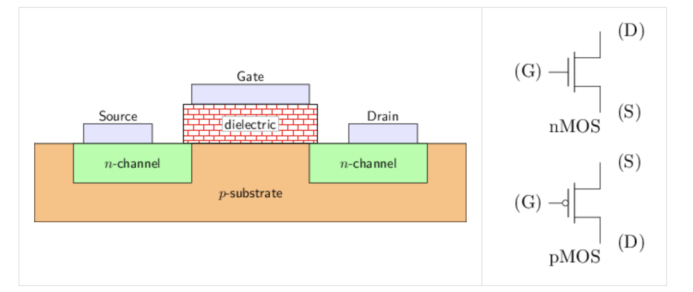
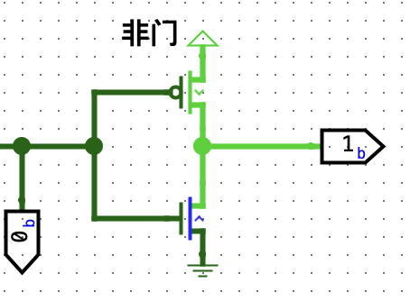
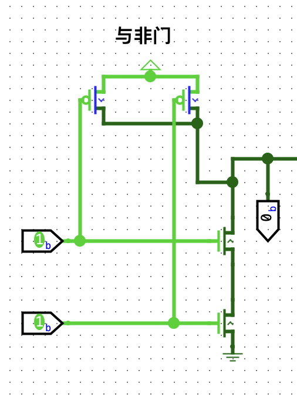
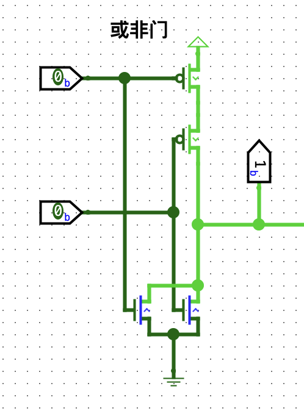
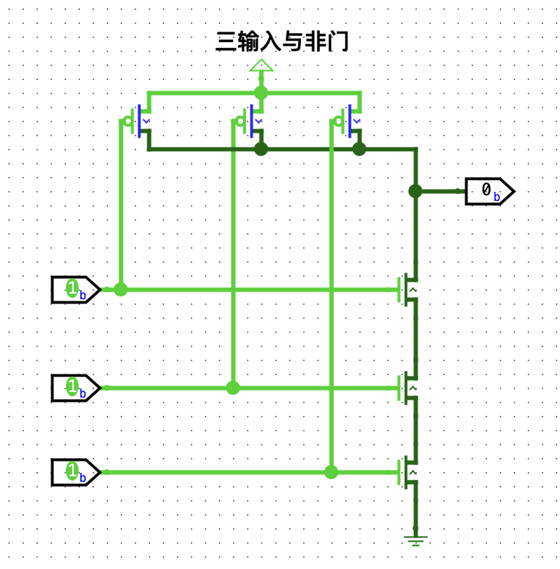
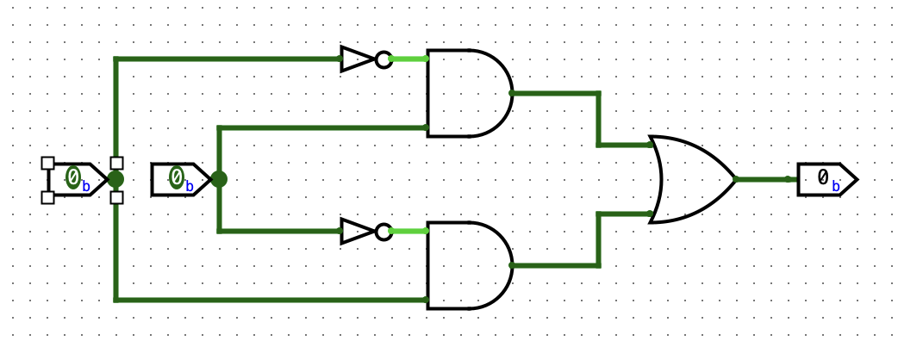
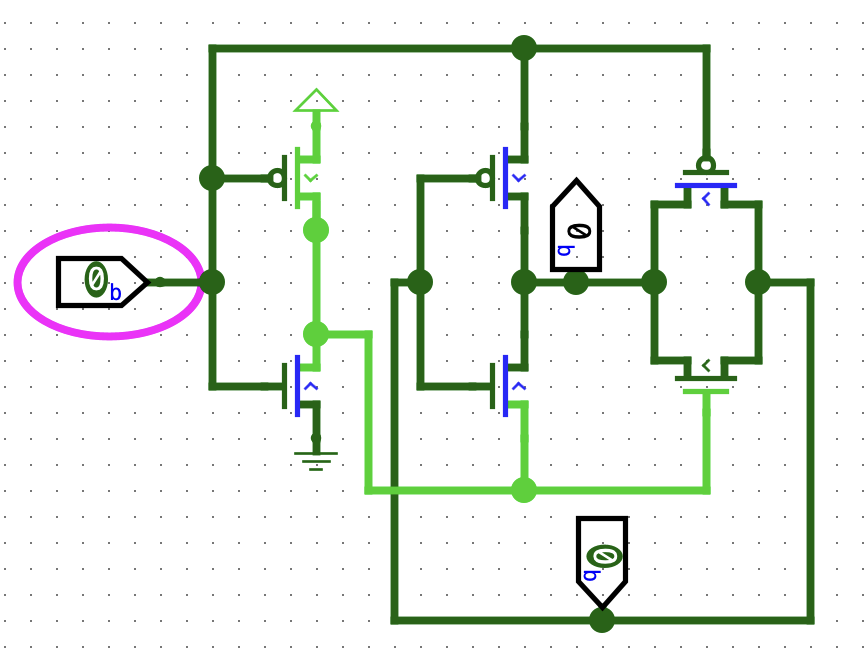

+++
author = "ALKALiKong"
title = "数字电路 布尔代数与门电路设计"
date = "2026-02-18"
description = "数字电路与逻辑设计 布尔代数与门电路设计部分笔记"
math = true
tags = [
    "数字电路",
    "布尔代数",
	"门电路",
]
categories = [
    "数字电路",
]
keywords = [
    "数字电路",
     "门电路",
     "布尔代数",
]
+++
# 前言

这篇文章只是我自己学习过程中所记的笔记，其中可能存在错误，欢迎 dalao 们指正 UwU。

# 布尔代数

## 三种基本逻辑门

### 与门

与门 (AND GATE) 运算符: `·` `*` `^` ` ` （类似 $A\overline{B}$ 这种中间省略不写的）`\land` $\land$ `\cdot` $\cdot$
`&` (Verilog HDL)

### 或门

或门 (OR GATE) 运算符: `∨` `+`  `\lor` $\lor$

`|` (Verilog HDL)

### 非门

非门 (NOT GATE) 运算符: `-` `\overline{}`(latex) $\overline{A}$   `\lnot` $\lnot$
`~` (Verilog HDL)

## 四种常用逻辑门

### 与非门

先与后非，只有全 1 与非后的结果才是 0。( $\overline{1·1}=\overline{1}=0$ )
`z = ~ ( x & y )`

### 或非门

先或后非，只有全为 0 或非后的结果才是 1。($\overline{0+0}=\overline{0}=1$)
`z = ~ ( x | y )`

### 异或门

两数相异时结果为1，两数相同结果为0。`⊕` `\oplus` $A \oplus B$
`^` (Verilog HDL) $F=A\overline{B}+\overline{A}B$  `z = (~x&y)|(x&~y)`

### 同或门

两数相同时结果为1，两数相异结果为0。`⊙` `\odot` $A \odot B$
`~^` (Verilog HDL) $F = AB+\overline{A} \overline{B}$  `z = x~^y = (~x&~y)|(x&y)`

## 布尔代数运算

### 单变量布尔定律

#### 0-1 律

1. $A | 0 = A, A | 1 = 1$ `x|0=x, x|1=1`
2. $A \cdot 0 = 0, A \cdot 1 = A$  `x&0=0, x&1=x`

#### 互补律

1. $A+\overline{A}=1$ `x|~x=1`
2. $A \cdot \overline{A} = 0$   `x&~x=0`

#### 重叠律

1. $A+A=A$   `x|x=x`
2. $A \cdot A = A$   `x&x=x`

#### 还原律

$\overline{\overline{A}}=A$   `~~x=x`

### 多变量布尔定律

#### 交换律

1. $A+B=B+A$   `x|y=y|x`
2. $AB = BA$   `x&y=y&x`

#### 结合律

1. $A + (B + C) = (A + B) + C$   `x|(y|z)=(x|y)|z`
2. $A \cdot (B \cdot C) = (A \cdot B) \cdot C$   `x&(y&z)=(x&y)&z`

#### 分配律

1. $A \cdot (B+C) = (A \cdot B) + (A \cdot C)$   `x&(y|z)=(x&y)|(x&z)`
2. $A+(B \cdot C)=(A+B) \cdot (A+C)$   `x|(y&z)=(x|y)&(x|z)`

注意：式子可能写成 $A+BC$ 的形式，由于四则运算的惯性，容易被忽视掉（或许仅仅对我而言），这一点需要注意。

#### 联合律

1. $(A \cdot B) + (\overline{A} \cdot B) = B \cdot (A+\overline{A}) = B \cdot 1 = B$   `(x&y)|(~x&y)=y`
2. $(A+B) \cdot (\overline{A}+B) = B + (A \cdot \overline{A}) = B + 0 = B$   `(x|y)&(~x|y)=y`

#### 吸收律

1. $A + ( \overline{A} \cdot B ) =A+\overline{A}B= (A+\overline{A})\cdot(A+B) = A+B$   `x|(~x&y)=x|y`
2. $A+(A \cdot B)=A+AB=(A+A)\cdot(A+B)=A\cdot(A+B)=A$   `x|(x&y)=x`
3. $A\cdot(\overline{A}+B) = (A\cdot\overline{A})+(A\cdot B)=0+(A\cdot\overline{B})= A\cdot\overline{B}$   `x&(~x|y)=x&y`
4. $A \cdot (A+B) = (A\cdot A)+(A\cdot B)= A+(A\cdot B)=A$   `x&(x|y)=x`

注意1、2条的第二个形式，极其容易漏掉，要注意到第二个形式实际上也是分配律。

### 常用计算方法

#### 德摩根定律

德摩根定律（De Morgan）描述了如何处理最外层的反，即应该如何把外层的非(`~`)和内层的与、或(`&,|`)进行运算，操作是：把取反符号向下推，即把内层的变量取反、下一层的符号取反，再把最外层的取反符号去掉。
证明过程：要证明 $\overline{A \cdot B} = \overline{A} + \overline{B}$ ，只需证 $\overline{A} + \overline{B}$ 是 $A \cdot B$ 的补元。补元的定义：$X+Y=1, X \cdot Y = 0$。推导过程放在下面计算里，其他式子证明过程类似。
1. $\overline{A \cdot B} = \overline{A} + \overline{B}$   `~(x&y)=(~x)|(~y)`
2. $\overline{A+B} = \overline{A} \cdot \overline{B}$   `~(x|y)=(~x)&(~y)`
3. $\overline{A \cdot B \cdot C} = \overline{A} + \overline{B} + \overline{C}$   `~(x&y&z)=(~x)|(~y)|(~z)`
4. $\overline{A + B + C} = \overline{A} \cdot \overline{B} \cdot \overline{C}$   `~(x&y&z)=(~x)|(~y)|(~z)`

#### 反演规则

反演规则实际上是在求一个逻辑函数的反函数，即给原函数取反，然后**借助**德摩根定律进行化简。（我看的那个课本貌似混淆了反演规则与德摩根定律，导致我在这里卡了很久，也有可能是我没看懂编者的意思罢。）
求 $F=\overline{A}\overline{B} + CD$ 的反函数：$$\overline{F} = \overline{\overline{A}\overline{B} + CD} =(A+B)\cdot(\overline{C}+\overline{D})$$

#### 代入规则

如果将等式两边中所有出现变量的地方都代换成一个逻辑函数，则等式仍然成立。
如 $\overline{A \cdot B} = \overline{A} + \overline{B}$ ，将 A 替换成 $A \cdot C$，则等式仍然成立，即 $\overline{A \cdot C \cdot B}=\overline{A \cdot C}+\overline{B} = \overline{A} + \overline{C} + \overline{B}$ 。（德摩根定律 3、4 条得证）

#### 消去 / 合并定律

1. $AB+A\overline{B}=A\cdot(B+\overline{B})=A\cdot1=A$
2. $(A+B)\cdot(A+\overline{B})=A+(B \cdot \overline{B}) = A + 0 = A$ 

# 数字逻辑电路

## 晶体管

常用的晶体管是`金属-氧化物-半导体场效应晶体管` (Metal-Oxide-Semiconductor Field-Effect Transistor, MOSFET), 简称MOS管. 根据工作原理的不同, MOS管又分nMOS(N型MOS, N表示Negative)和pMOS(P型MOS, P表示Positive)两种, 它们都有三个接口, 分别是栅极(gate), 源极(source)和漏极(drain), 其侧视图如下图所示。

对于 nMOS，$V_G - V_S$ 较大时导通，$V_G - V_S$ 较小时截止。例如，给 $V_S$ 接地，$V_G$ 高电平接通，低电平截止。
对于 pMOS，$V_S - V_G$ 较大时导通，$V_S - V_G$ 较小时截止。例如，给 $V_S$ 接电源，$V_G$ 低电平接通，高电平截止。

## 门电路

以下电路均在 Logisim-evolution 中搭建。Ref: [一生一芯](https://ysyx.oscc.cc/docs/2407/f/3.html)

### 非门

基本逻辑门中的非门，高电平（输入为1）时，PMOS 截断，NMOS 导通，输出为低电平（0）；低电平时，PMOS导通，NMOS截断，输出为高电平（1）。真值表如下：

| x   | o   |
| --- | --- |
| 1   | 0   |
| 0   | 1   |

### 与非门

先来看真值表

| x   | y   | o   |
| --- | --- | --- |
| 0   | 0   | 1   |
| 1   | 0   | 1   |
| 0   | 1   | 1   |
| 1   | 1   | 0   |

前三行输出是1，只要有0就输出高电平，因此应该 PMOS 并联，只有两输入均为1时为0，因此NMOS串联。把 PMOS 与 NMOS 想象成开关，串联的开关需要两个都为通路，并联的开关只需要开一个就为通路。

### 或非门

| x   | y   | o   |
| --- | --- | --- |
| 0   | 0   | 1   |
| 1   | 0   | 0   |
| 0   | 1   | 0   |
| 1   | 1   | 0   |

观察真值表：只有两输入均为0时结果为1，因此 PMOS 串联用来输出 1，NMOS并联，用来输出 0。

### 与门、或门

前面我们已经实现了与非门与或非门，由定义知，与非门是先与后非，因此只要把与非结果再进行一次非运算，就可以输出与门，非门同理。

### 多输入与非门

与非门可以扩展到 N 个输入，其原理与普通的与非门相同。

### 异或门

| x   | y   | o   |
| --- | --- | --- |
| 0   | 0   | 0   |
| 0   | 1   | 1   |
| 1   | 0   | 1   |
| 1   | 1   | 0   |

异或门的真值表如上。按照异或运算的定义 `(~x&y)|(x&~y)`，可以搭建以下半定制电路。

下图为一种异或门全定制电路实现。

### 同或门

同或门可以选择在异或门的基础上加一个非门，也可以从其定义入手：`(x&y)|(~x&~y)`

## 全定制与半定制

全定制电路就是从晶体管级别设计电路，半定制电路预先用全定制方式设计出一些常用的逻辑单元， 例如与门、或门、触发器等，这些逻辑单元称为标准单元；然后再通过这些标准单元构建出大规模电路。
全定制电路的设计难度大，开发周期也很长。现代处理器芯片包含动辄上亿个晶体管，全部使用全定制电路来开发是不现实的。对于超大规模集成电路的设计，更常见的是采用的是半定制电路设计方法。