+++
author = "ALKALiKong"
title = "数字电路 逻辑电路设计"
date = "2026-02-22"
description = "数字电路与逻辑设计 基本组合逻辑电路、整数的机器级表示、时序逻辑电路部分笔记"
math = true
tags = [
    "数字电路",
    "逻辑电路",
	"组合逻辑电路",
    "整数的机器级表示",
    "时序逻辑电路",
]
categories = [
    "数字电路",
    "逻辑电路"
]
keywords = [
    "数字电路",
    "逻辑电路",
	"组合逻辑电路",
    "整数的机器级表示",
    "时序逻辑电路",
    "加法器",
    "译码器",
    "锁存器",
    "寄存器",
]
+++

## 前言
本文是[一生一芯 F3](https://ysyx.oscc.cc/docs/2407/f/3.html)中基本组合逻辑电路、整数的机器级表示、时序逻辑电路部分的笔记与自己实现的实验以及思路，不保证所有内容都正确，相关的Logisim电路文件放在了我的 [Blog 仓库](https://github.com/ALKALiKong233/ALKALiKong233.github.io)的 sharings/Logisim 文件夹内了。感谢一生一芯提供了如此宝贵的学习资料！www

## 基本组合逻辑电路

### 译码器

#### 2-4 译码器

2位输入, 4位输出, 其真值表如下:

| A1  | A0  | Y0  | Y1  | Y2  | Y3  |
| --- | --- | --- | --- | --- | --- |
| 0   | 0   | 1   | 0   | 0   | 0   |
| 0   | 1   | 0   | 1   | 0   | 0   |
| 1   | 0   | 0   | 0   | 1   | 0   |
| 1   | 1   | 0   | 0   | 0   | 1   |

由真值表可得，$Y_0 = \overline{A_1}\overline{A_0}$ ，其他位同理，故直接搭建电路即可。

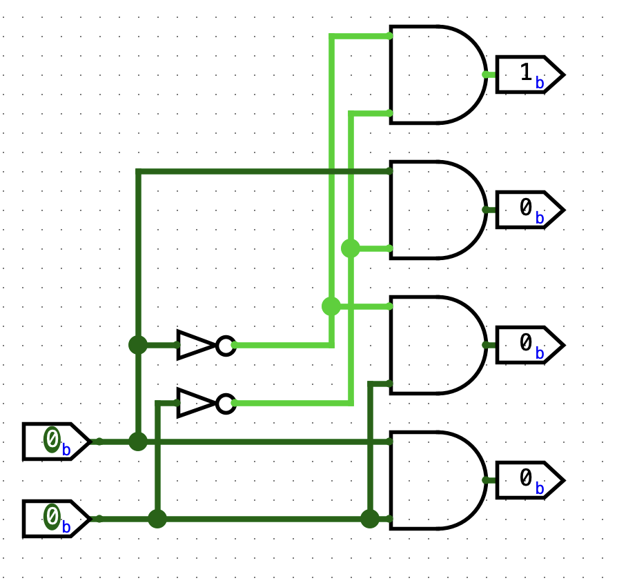

#### 3-8 译码器

3位输入, 有8位输出, 其真值表如下:

| A2  | A1  | A0  | Y0  | Y1  | Y2  | Y3  | Y4  | Y5  | Y6  | Y7  |
| --- | --- | --- | --- | --- | --- | --- | --- | --- | --- | --- |
| 0   | 0   | 0   | 1   | 0   | 0   | 0   | 0   | 0   | 0   | 0   |
| 0   | 0   | 1   | 0   | 1   | 0   | 0   | 0   | 0   | 0   | 0   |
| 0   | 1   | 0   | 0   | 0   | 1   | 0   | 0   | 0   | 0   | 0   |
| 0   | 1   | 1   | 0   | 0   | 0   | 1   | 0   | 0   | 0   | 0   |
| 1   | 0   | 0   | 0   | 0   | 0   | 0   | 1   | 0   | 0   | 0   |
| 1   | 0   | 1   | 0   | 0   | 0   | 0   | 0   | 1   | 0   | 0   |
| 1   | 1   | 0   | 0   | 0   | 0   | 0   | 0   | 0   | 1   | 0   |
| 1   | 1   | 1   | 0   | 0   | 0   | 0   | 0   | 0   | 0   | 1   |

以 $Y_1$ 为例，其表达式为：$Y_1 = \overline{A_2}\overline{A_1}A_0$，其他位同理。不过观察真值表，可以把 $Y_4$ ~ $Y_7$ 看作是 $Y_0$~$Y_3$ 的重复，把 $A_2$ 当作选择器，因此可以考虑使用两个 2-4 译码器组合出 3-8 译码器。

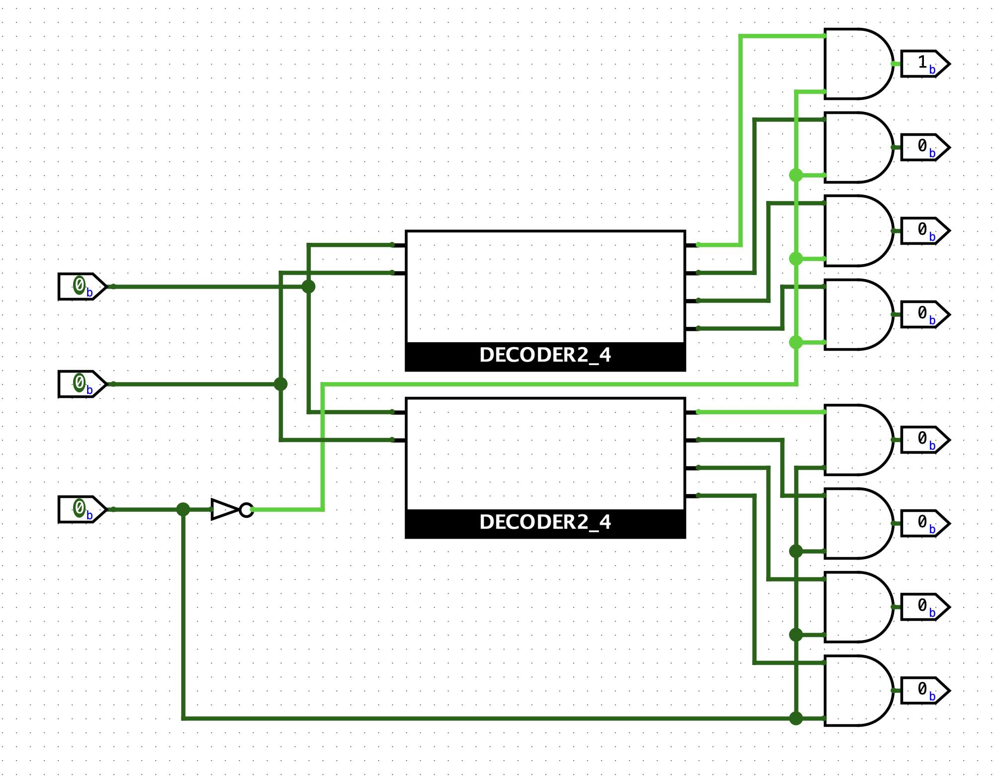

#### 带使能引脚的译码器
观察上面的 3-8 译码器，不难发现每个输出处都使用了与门，这里的与门其实就是起到使能管控的作用。因此，我们可以搭建带使能引脚的 2-4 译码器，然后在 3-8 译码器中直接传入 $A_2$ 作为使能信号。

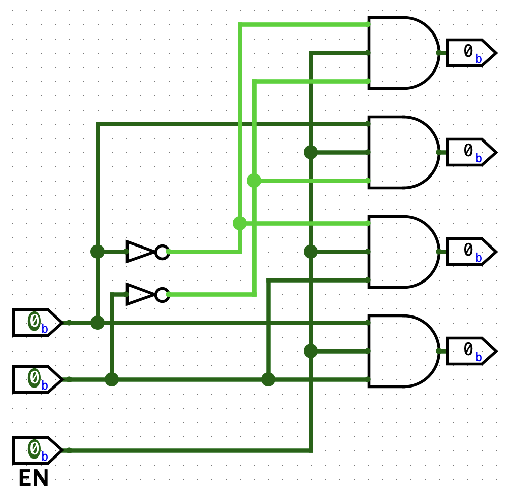

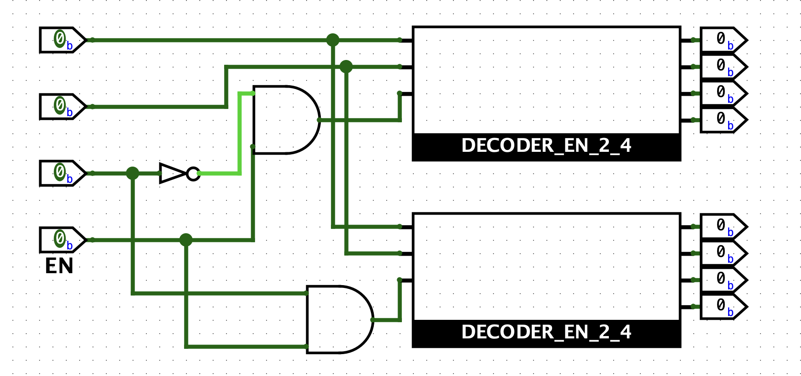

#### 七段数码管译码器
七段数码管译码器（BCD→7段，共阴极，1 表示该段点亮），真值表如下：

| BCD   | a   | b   | c   | d   | e   | f   | g   |
| ----- | --- | --- | --- | --- | --- | --- | --- |
| 0     | 1   | 1   | 1   | 1   | 1   | 1   | 0   |
| 1     | 0   | 1   | 1   | 0   | 0   | 0   | 0   |
| 2     | 1   | 1   | 0   | 1   | 1   | 0   | 1   |
| 3     | 1   | 1   | 1   | 1   | 0   | 0   | 1   |
| 4     | 0   | 1   | 1   | 0   | 0   | 1   | 1   |
| 5     | 1   | 0   | 1   | 1   | 0   | 1   | 1   |
| 6     | 1   | 0   | 1   | 1   | 1   | 1   | 1   |
| 7     | 1   | 1   | 1   | 0   | 0   | 0   | 0   |
| 8     | 1   | 1   | 1   | 1   | 1   | 1   | 1   |
| 9     | 1   | 1   | 1   | 1   | 0   | 1   | 1   |
| 10(A) | 1   | 1   | 1   | 0   | 1   | 1   | 1   |
| 11(b) | 0   | 0   | 1   | 1   | 1   | 1   | 1   |
| 12(C) | 1   | 0   | 0   | 1   | 1   | 1   | 0   |
| 13(d) | 0   | 1   | 1   | 1   | 1   | 0   | 1   |
| 14(E) | 1   | 0   | 0   | 1   | 1   | 1   | 1   |
| 15(F) | 1   | 0   | 0   | 0   | 1   | 1   | 1   |

参考真值表，即可搭建出七段译码器，对 abcdefg 疯狂套与门就行了（），电路过于庞大，就不放图了。

### 编码器

#### 2-4 编码器
编码器相当于译码器的反运算，要求输入的一定是 BCD 码，否则结果是未定义的(undefined, X)，下面是真值表。

| $A_3$ | $A_2$ | $A_1$ | $A_0$ |     | $Y_1$ | $Y_0$ |
| ----- | ----- | ----- | ----- | --- | ----- | ----- |
| 0     | 0     | 0     | 1     |     | 0     | 0     |
| 0     | 0     | 1     | 0     |     | 0     | 1     |
| 0     | 1     | 0     | 0     |     | 1     | 0     |
| 1     | 0     | 0     | 0     |     | 1     | 1     |
| 其     | 他     | 情     | 况     |     | X     | X     |

我们可以得出：$Y_1 = A_3 A_2 \overline{A_1} \overline{A_0}$，$Y_0 = A_3 \overline{A_2} A_1 \overline{A_0}$。由于我们在前面有要求输入一定是 BCD 码，对于其他情况，我们的输出是未定义的，应当让使用者注意输入的情况，所以只有这四种情况，因此我们可以把运算简化为：$Y_1 = A_3 A_2$，$Y_0 = A_3 A_1$，以此搭建电路：

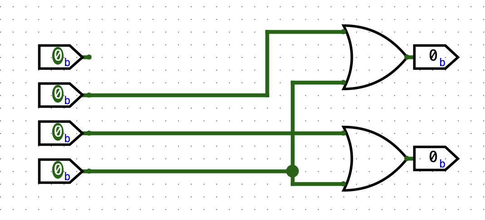

#### 16-4 编码器
在搭建 16-4 编码器之前，我们不妨先来看看 8-3 编码器的真值表：

| 输入（十进制） | Y2  | Y1  | Y0  |
| ------- | --- | --- | --- |
| 0       | 0   | 0   | 0   |
| 1       | 0   | 0   | 1   |
| 2       | 0   | 1   | 0   |
| 3       | 0   | 1   | 1   |
| 4       | 1   | 0   | 0   |
| 5       | 1   | 0   | 1   |
| 6       | 1   | 1   | 0   |
| 7       | 1   | 1   | 1   |

借助我们上次构造 3-8 译码器的经验，我们不难看出，我们可以把第三位看作是 `0~3` 与 `4~7` 的选择，前两位复用 4-2 编码器的结果即可，因此我们可以搭建如下电路：

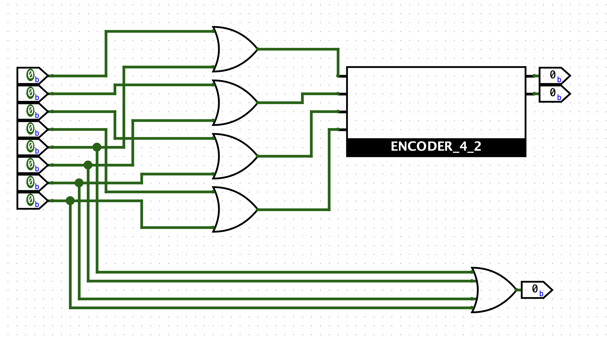

以此类推，16-4 译码器的构造方法也可以用 `0~7/8~F` 做第四位选择，前三位复用 8-3 编码器的结果：

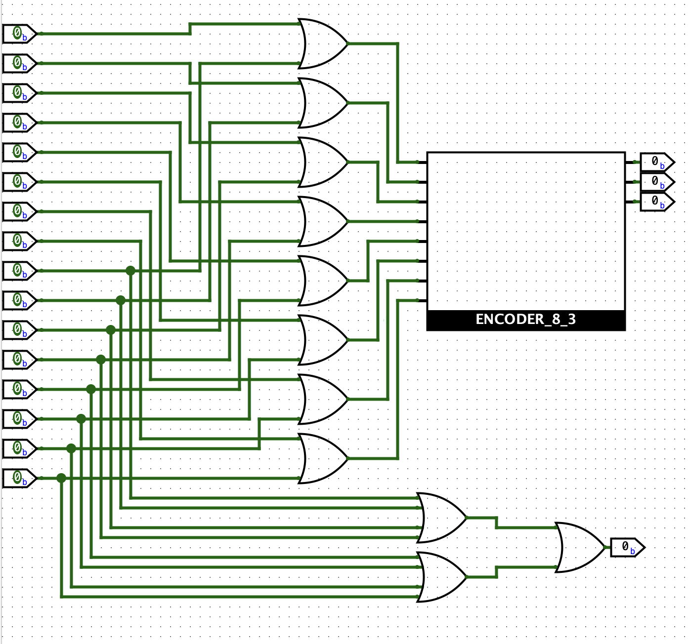

#### 2-4 优先编码器
如果想要输入不是独热码时仍输出有效信息，则需要使用**优先编码器**。优先编码器允许输入信号中出现多个`1`，此时最高位的`1`将被优先编码。 因此，如果输入不全为0，则输出最高位的`1`的位置；如果输入全为0，则输出是未定义的。
设输入为 `I3 I2 I1 I0`（`I3` 优先级最高），输出为 `A1 A0`：

| I3  | I2  | I1  | I0  | A1  | A0  |
| --- | --- | --- | --- | --- | --- |
| 0   | 0   | 0   | 0   | 0   | 0   |
| 0   | 0   | 0   | 1   | 0   | 0   |
| 0   | 0   | 1   | x   | 0   | 1   |
| 0   | 1   | x   | x   | 1   | 0   |
| 1   | x   | x   | x   | 1   | 1   |

可以得出表达式并化简：

$$ A_1 = \overline{I_3}I_2 + I_3 = I_2 + I_3 $$

$$ A_0 = \overline{I_3}\overline{I_2}I_1 + I_3 = \overline{I_3}(\overline{I_2}I_1) + I_3 = I_3 + \overline{I_2}I_1 $$

然后即可绘制电路，V 表示结果是否有效（即这四位里是否有1）：

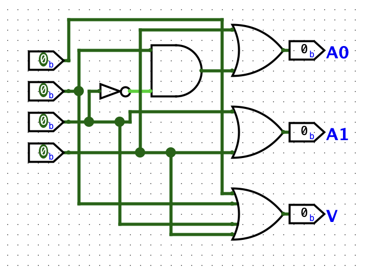

#### 16-4 优先编码器
`I15` 最高优先级，`x` 表示无关项：

| 输入模式（I15...I0）     | A3  | A2  | A1  | A0  |
| ------------------ | --- | --- | --- | --- |
| `0000000000000000` | 0   | 0   | 0   | 0   |
| `1xxxxxxxxxxxxxxx` | 1   | 1   | 1   | 1   |
| `01xxxxxxxxxxxxxx` | 1   | 1   | 1   | 0   |
| `001xxxxxxxxxxxxx` | 1   | 1   | 0   | 1   |
| `0001xxxxxxxxxxxx` | 1   | 1   | 0   | 0   |
| `00001xxxxxxxxxxx` | 1   | 0   | 1   | 1   |
| `000001xxxxxxxxxx` | 1   | 0   | 1   | 0   |
| `0000001xxxxxxxxx` | 1   | 0   | 0   | 1   |
| `00000001xxxxxxxx` | 1   | 0   | 0   | 0   |
| `000000001xxxxxxx` | 0   | 1   | 1   | 1   |
| `0000000001xxxxxx` | 0   | 1   | 1   | 0   |
| `00000000001xxxxx` | 0   | 1   | 0   | 1   |
| `000000000001xxxx` | 0   | 1   | 0   | 0   |
| `0000000000001xxx` | 0   | 0   | 1   | 1   |
| `00000000000001xx` | 0   | 0   | 1   | 0   |
| `000000000000001x` | 0   | 0   | 0   | 1   |
| `0000000000000001` | 0   | 0   | 0   | 0   |

我们的目标是选中最前面的1，我们可以用分治的思想来看待这个问题。首先，我们把 16 位切成四个小块，对于每个小块使用 4-2 优先编码器，会各自输出自己区域内最高位的 1 的位置(A1, A0)，以及自己区域内是否有 1 (V)。然后，我们可以对输出的四个 V 再使用一次 4-2 优先编码器，选择出最靠前的 1 的区域，作为结果的后两位。最后，我们根据抉择出的最靠前的 1 的区域，选择这个区域内最靠前的 1 的位置作为结果的前两位，这里我们可以用多路选择器来做决策（在下面）。

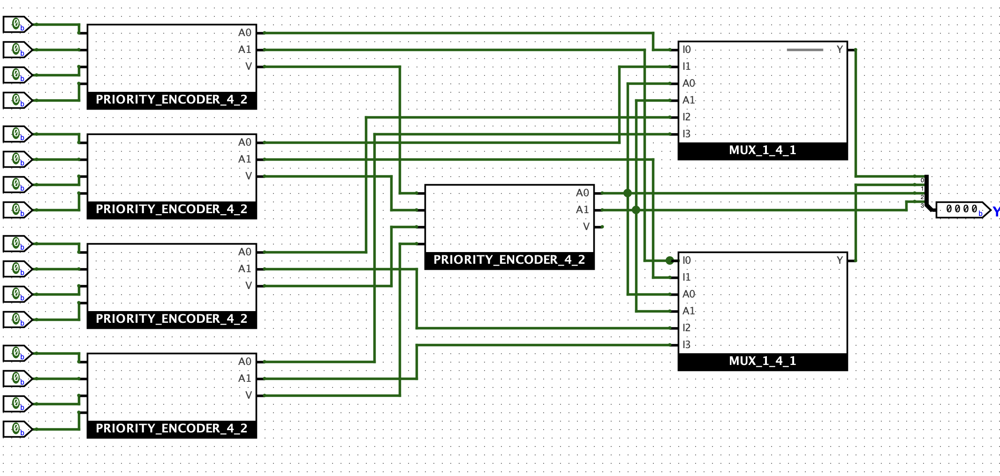

### 多路选择器

#### 1位2选1选择器
多路选择器即在多条路中根据输入条件选择其中路作为输出。1位2选1选择器电路结构如下：

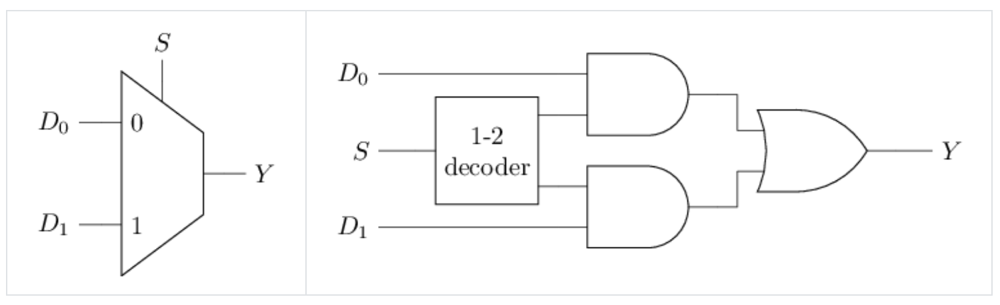

可以看到, 选择器中包含了一个n选1译码器, 如果把选择器的控制信号看作地址, 这个n选1译码器则生成了相应的选择信号, 这组选择信号让被选择的一路数据成功通过与门, 未被选择的数据通过与门后将会变成`0`, 最后通过一个或门将被选择的数据传递到输出端.

#### 3位4选1选择器
用 2-4 译码器作为地址输出，把三位用与门和地址选中输出。

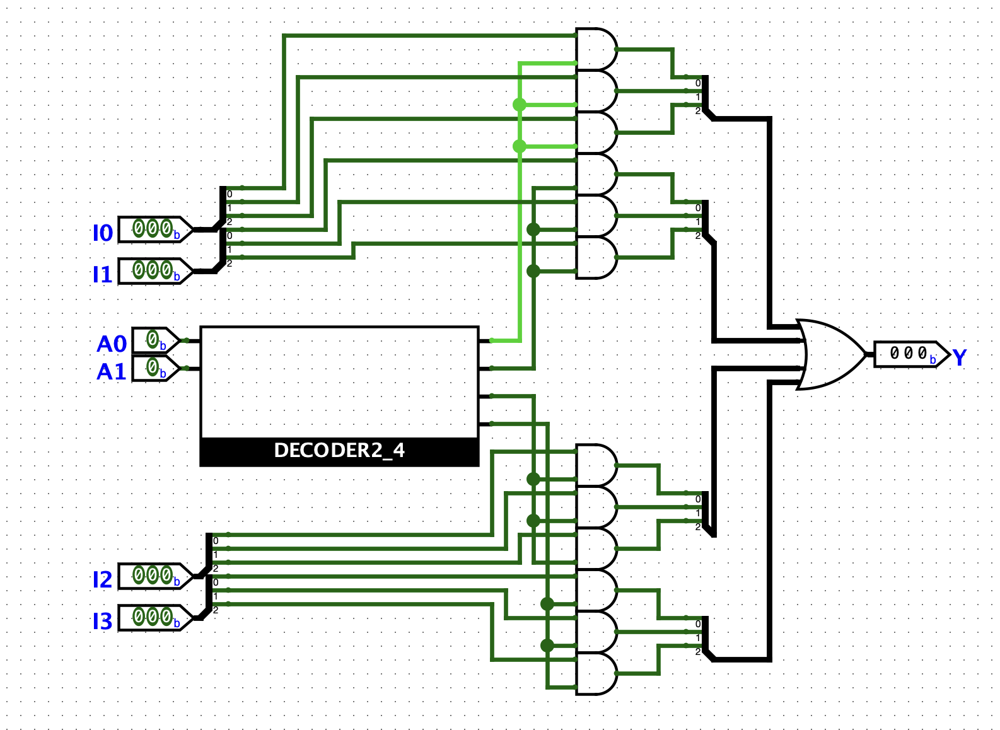

### 比较器
比较器用于检查两个输入的每一位是否完全一致。由于异或门(和同或门)已经具备比较1位数据的功能，因此可通过异或门(和同或门)搭建多位数据的比较器。

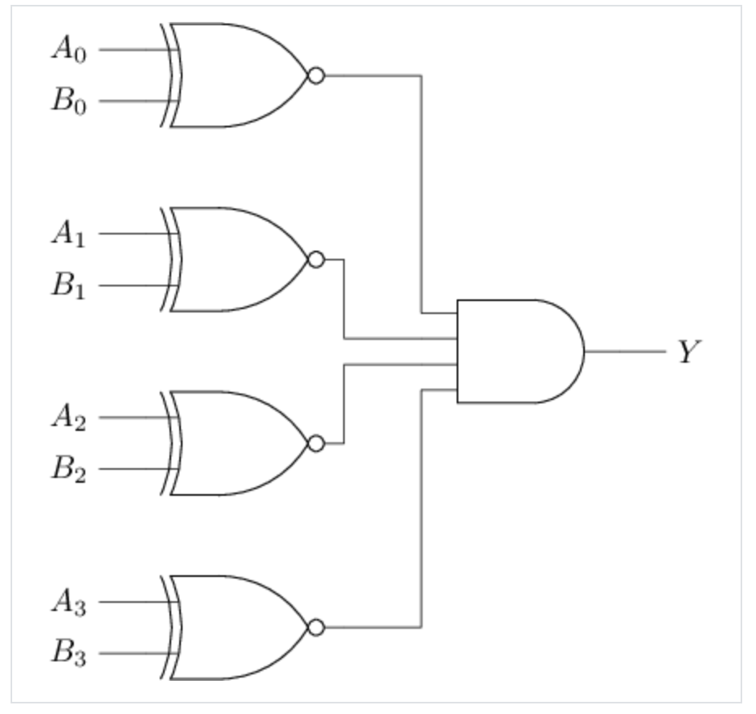

### 加法器

#### 1 位半加器
加法是算术运算的基础, 因此需要考虑如何通过门电路实现加法. 首先考虑1位加法器. 加法的输入是两个加数, 输出和`S`(sum); 加法的结果可能会产生进位, 为了不丢失这部分信息, 还需要输出进位`C`(carry). 根据加法运算的规则, 我们很容易列出1位加法器的真值表:

| `A` | `B` |     | `S` | `C` |
| --- | --- | --- | --- | --- |
| 0   | 0   |     | 0   | 0   |
| 0   | 1   |     | 1   | 0   |
| 1   | 0   |     | 1   | 0   |
| 1   | 1   |     | 0   | 1   |


具体地, 当且仅当两个加数不同时, 和为`1`; 当且仅当两个加数都为`1`时, 进位为`1`. 根据真值表, 我们可以得到`S`和`C`的逻辑表达式: `S = A ^ B`, `C = A & B`，可得1位半加器电路：
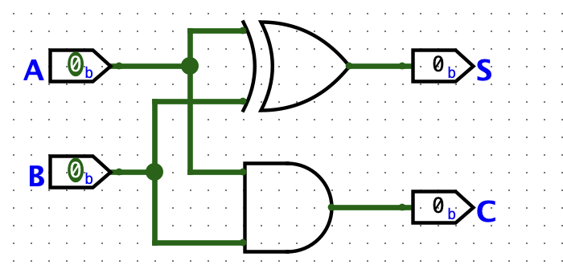
#### 1 位全加器
然而，加法会产生进位，所以我们需要一个可以处理进位的加法器，下面是两种构造方式。
##### 公式法构造
先列出全加器真值表：

| A   | B   | Cin | S   | Cout |
| --- | --- | --- | --- | ---- |
| 0   | 0   | 0   | 0   | 0    |
| 0   | 0   | 1   | 1   | 0    |
| 0   | 1   | 0   | 1   | 0    |
| 0   | 1   | 1   | 0   | 1    |
| 1   | 0   | 0   | 1   | 0    |
| 1   | 0   | 1   | 0   | 1    |
| 1   | 1   | 0   | 0   | 1    |
| 1   | 1   | 1   | 1   | 1    |
可求得表达式：

$$ S = \overline{A}\overline{B}Cin + \overline{A}B\overline{Cin} + A\overline{B}\overline{Cin} + ABCin = Cin(AB+\overline{A}\overline{B}) + \overline{Cin}(\overline{A}B+A\overline{B}) = Cin(A \odot B)+\overline{Cin}(A \oplus B)$$

$$ Cout = \overline{A}BCin + A\overline{B}Cin + AB\overline{Cin} + ABCin = Cin(\overline{A}B + A\overline{B}) + AB(\overline{Cin}+Cin)= Cin(A \oplus B) + AB $$

搭建电路得：

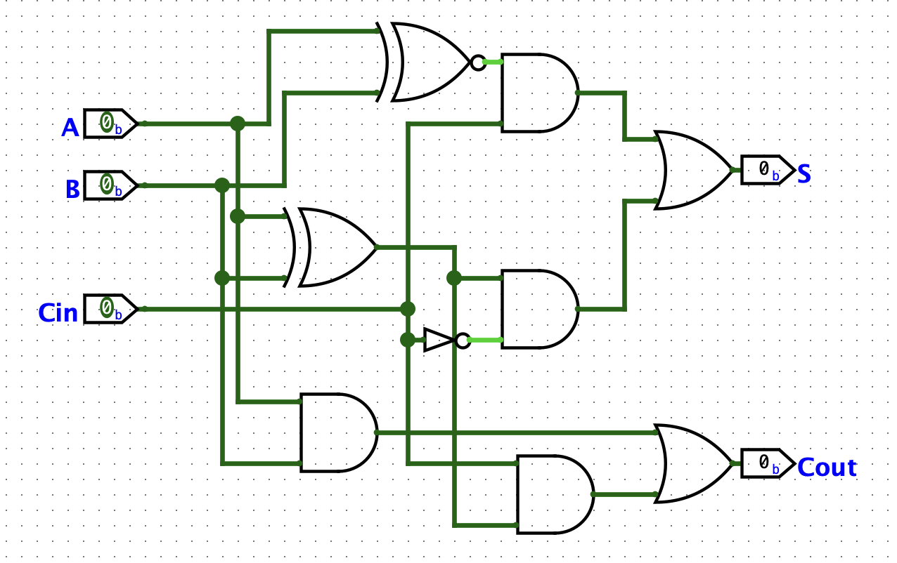

##### 使用半加器构造
全加器与半加器的区别就在于全加器需要处理进位，因此我们可以把半加器输出的结果再与 Cin 相加，再输出。观察真值表，`Cout` 的来源要么来自结果与 Cin 相加，要么来自结果的进位，没有进两位的情况，因此我们使用或门即可。

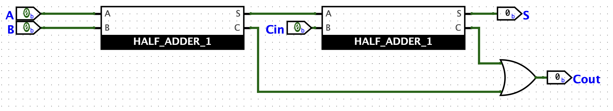

#### 多位加法器
由于全加器可以处理进位，因此我们只需要把几个全加器串联起来，生成的结果就可以用来作为多位全加器了。这种从低位到高位逐位计算的加法器叫做"行波进位加法器"(Ripple-Carry Adder, RCA)。

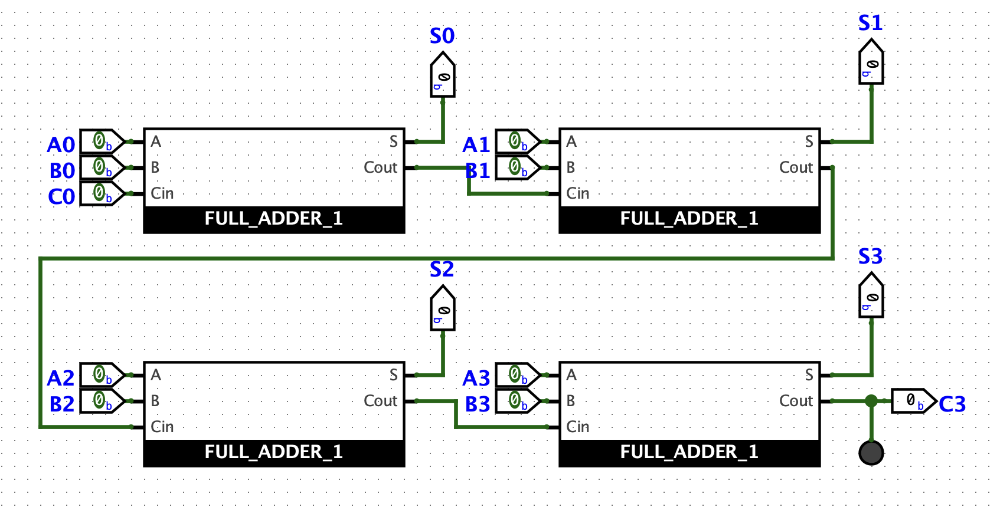

### 减法器

#### 1 位减法器
我们先来看 1 位减法器。
1 位全减法器真值表（`A - B - Bin`）：

| A   | B   | Bin | D   | Bout |
| --- | --- | --- | --- | ---- |
| 0   | 0   | 0   | 0   | 0    |
| 0   | 0   | 1   | 1   | 1    |
| 0   | 1   | 0   | 1   | 1    |
| 0   | 1   | 1   | 0   | 1    |
| 1   | 0   | 0   | 1   | 0    |
| 1   | 0   | 1   | 0   | 0    |
| 1   | 1   | 0   | 0   | 0    |
| 1   | 1   | 1   | 1   | 1    |
根据真值表，我们可以列出下面的表达式：

$$ D = \overline{A}\overline{B}Bin + \overline{A}B\overline{Bin} + A\overline{B}\overline{Bin} + ABBin = Bin(A \odot B) + \overline{Bin}(A \oplus B)$$

$$ Bout = \overline{A}\overline{B}Bin + \overline{A}B\overline{Bin} + \overline{A}BBin + ABBin = Bin(A \odot B)+ \overline{A}B$$

然后，构造 1 位减法器电路：

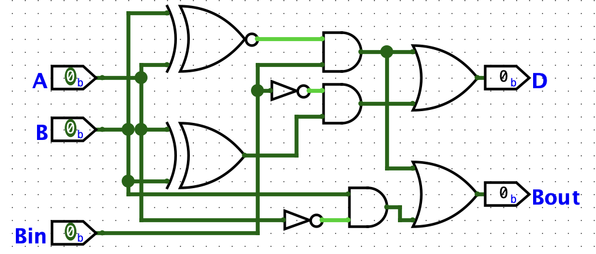

#### 4 位减法器
与 4 位加法器相同，串联起 4 个 1 位减法器即可实现4位减法器。

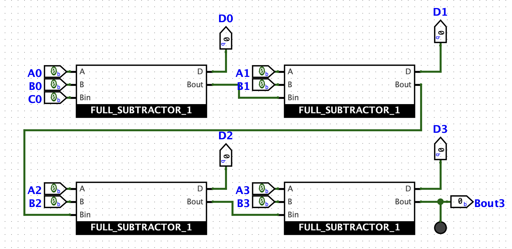

## 整数的机器级表示
学过C语言的我们都知道，整数分为有符号整数与无符号整数。上面我们表示的都是无符号数，那么有符号数怎么办呢？下面有三种表现方法。
### 原码(sign-and-magnitude)
原码是一种直观的编码方式，最高位表示符号位，`0`表示正数，`1`表示负数，其余位表示对应真值的绝对值。例如:

```
0b00000111 = 7
0b10000111 = -7
0b00100010 = 34
0b10100010 = -34
```
#### 计算方法分析
（直接从一生一芯 Copy 过来了，他们分析的很清楚 OAO，我觉得直接概括的话会失去他们分析的思路流程）
考虑采用8位的RCA进行原码加法:

```
 0b00000111 (7)     0b10000111 (-7)     0b10000111 (-7)    0b00000111 (7)
+0b00100010 (34)   +0b10100010 (-34)   +0b00100010 (34)   +0b10000111 (-7)
-----------        -----------         -----------        -----------
 0b00101001 (41)    0b00101001 (41)     0b10101001 (-41)   0b10001110 (-14)
```

通过上述观察, 我们可以得出以下结论:

- 当两数皆为正数时, 通过RCA进行加法所得的结果按原码解释, 与将两数按原码解释后得到的结果在数学意义上相加, 两者一致. 因此, 在这种情况下, 可以直接通过RCA进行原码加法.
- 当两数为负时, RCA所得结果与数学意义不符, 区别在于符号位. 因此, 在这种情况下, 电路需要对符号位进行特殊处理.
- 当仅有一数为负时, RCA所得结果与数学意义不符, 不仅符号位有可能错误, 绝对值也错误. 因此, 在这种情况下, 不能使用RCA进行原码加法.

事实上, 在数学意义上计算第三种情况时, 应该让绝对值较大的一方减去另一方, 符号取绝对值较大的一方. 这意味着, 为了计算原码加法, 电路上还需要设计一个减法器, 然后根据两数符号和绝对值的情况, 选择出正确的处理结果.
#### 原码绝对值大小比较器
为了设计原码加法器，我们需要设计一个绝对值比较器。在原码的前提下，最高位被设计成符号位，因此我们可以选择忽略最高位，只比较剩下的位的大小就可以了。
三位大小比较比较容易，我们从高位往低位看，只需要找到不同之处然后比较就可以了，这里我们直接列出公式，从前往后写出 A>B 的情况，否则 A <= B：

$$O = (A_2 \overline{B_2}) + ( (A_2 B_2) A_1 \overline{B_1} ) + ( (A_2 B_2) (A_1 B_1) A_0 \overline{B_0} ) $$

搭建出电路：

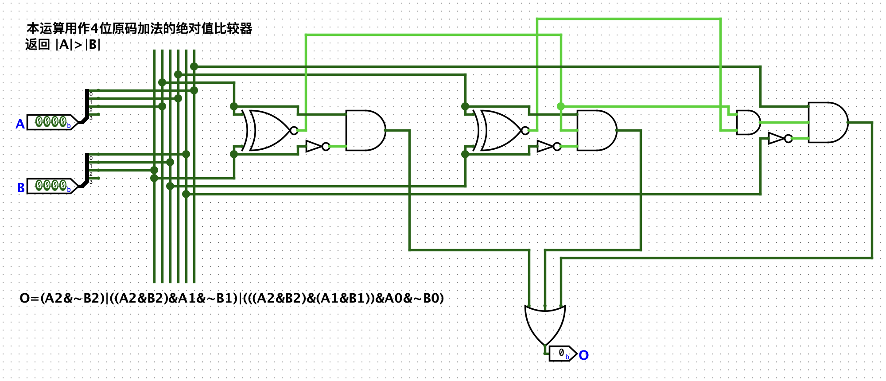

#### 符号处理
由上面的计算可知，两数符号相同时（最高位取与运算为1），结果的符号与原数相同，因此取其中任意一个数字的符号位即可；当两数符号不同时，要取绝对值大的那个符号，我们可以选择用一个 1位2选1选择器来提供绝对值大的那个数字的符号。把两个情况的结果再通入一个 121 选择器，由符号是否相同来决定最后选择哪个情况的符号。
#### 异号处理
对于同号的两个数，直接相加就可以了，但异号的两个数，需要用减法器让大数减小数。我的处理方法是，使用 2 个 3位2选1 选择器，将绝对值大的数和小的数都分别选择出来，然后再提供给减法器相减。需要注意的是，我们并不需要把符号位也传进去，A3 B3 都置 0 就可以了。
在最后，我们将加法结果与减法结果送入 3位2选1 选择器，由符号是否相同来选择这两种情况选择哪一个结果，这样我们就得出了前三位。
#### 最终设计
综上，我们只要处理好符号的关系，就可以完成原码加法器的设计了。

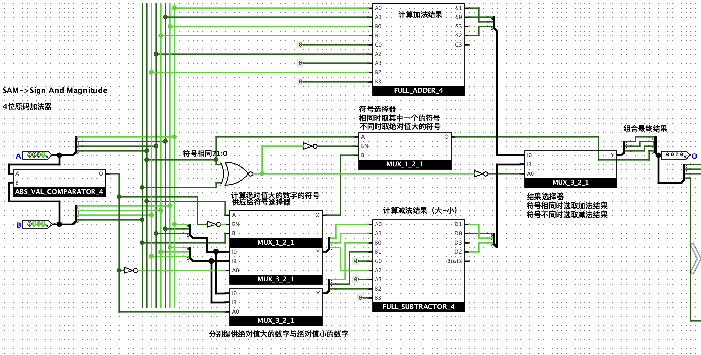

### 反码
为了解决原码加法中设计负数的问题，人们想出了反码。反码一样用最高位表示正负，但对于负数，他们取了对应正数原码的按位取反。例如：
```
0b00000111 = 7
0b11111000 = -7
0b00100010 = 34
0b11011101 = -34
```

#### 计算分析
（依旧从一生一芯 Copy 而来）
考虑采用8位的RCA进行反码加法:

```
 0b00000111 (7)     0b11111000 (-7)     0b11111000 (-7)    0b00000111 (7)
+0b00100010 (34)   +0b11011101 (-34)   +0b00100010 (34)   +0b11111000 (-7)
-----------        -----------         -----------        -----------
 0b00101001 (41)    0b11010101 (-42)    0b00011010 (26)    0b11111111 (-0)
```

通过上述观察, 我们可以得出以下结论:

- 当两数皆为正数时, 通过RCA进行加法所得的结果按反码解释, 与将两数按反码解释后得到的结果在数学意义上相加, 两者一致. 因此, 在这种情况下, 可以直接通过RCA进行反码加法.
- 当有一数为负时, RCA所得结果与数学意义不符, 虽然符号位正确, 但绝对值部分不正确
- 特别地, 当互为相反数的两数相加时, 根据反码的定义, 结果总是`0b11111111`. 按反码解释, 所得结果的真值为`-0`, 如果将其看成数学意义上的`0`, 则RCA结果正确.

但是, 让`-0`作为RCA的输入进行计算, 则又会得到不正确的结果:

```
 0b00000111 (7)     0b11111000 (-7)
+0b11111111 (-0)   +0b11111111 (-0)
-----------        -----------
 0b00000110 (6)     0b11110111 (-8)
```

上述例子说明, 不能直接使用RCA计算反码加法. 为了计算反码加法, 一种方式是先将反码转换为真值等价的原码, 然后使用原码加法器计算结果, 再将结果转换为真值等价的反码.
#### 反码转换器
其实直接除了符号位按位取反就好了，不过可以借助 121 选择器实现自动判断是否需要转换。

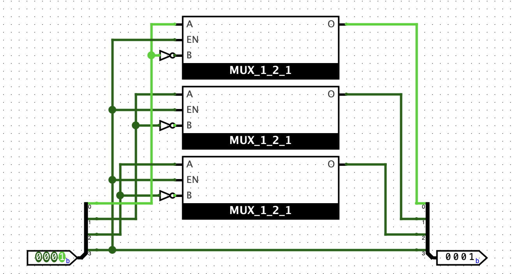

#### 使用原码加法器构造
我们可以一股脑直接把两个数都转换成原码形式，然后送入原码加法器进行加法，然后再转换回来，我们的转换器会自己决定是否需要转换的，因此我们只需要很简单的电路：

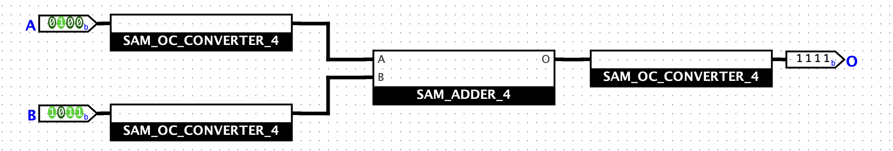

#### 使用 RCA 构造
观察一下上面的几个运算，我们可以发现：使用 RCA 出现计算问题的地方都是有进位溢出的地方。我们把进位再加上，就能得出正确的结果。（忽略我依托狗屎的走线，Logisim 没搞明白外观更改后怎么保存，因此线序都是乱的，先这样吧，其实可以选择直接把四位数据一起传进去的（））

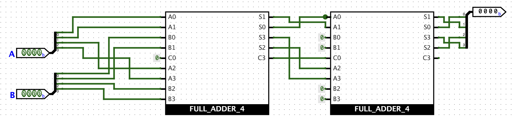

#### 结果分析
Oops，使用原码加法器构造的反码加法器与直接使用 RCA 构造的反码加法器输出的真值表是不一样的，这似乎是因为使用原码进行加法的溢出处理逻辑与使用反码的溢出处理逻辑是不一样的。（这是预期行为嘛？我想应该是，但是不太确定OAO，有大佬看到的话可以给我留个言）

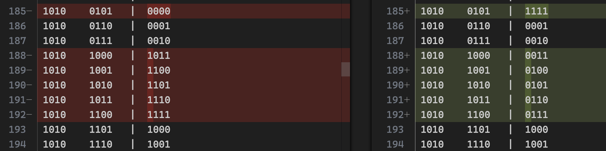

### 补码
补码进一步修正了反码计算的偏差问题，具体地, 对于正数和`0`, 其表示与原码一致; 对于负数, 其表示为相应相反数的原码的按位取反后加`1`. 例如:

```
0b00000111 = 7
0b11111001 = -7
0b00100010 = 34
0b11011110 = -34
```

对于位的补码, 最大数是`0b011...11`, 对应的真值是, 最小数是`0b100...00`, 对应的真值是. 在补码中, 最小数是一个特殊的数, 它不能通过对某个正数进行"取反加1"来得到. 以8位补码为例, 最大数`0b01111111=127`, 对其进行"取反加1", 得到的是`0b10000001=-127`; 而最小数`0b10000000=-128`, 对其进行"取反加1", 得到的是`0b01111111+1=0b10000000=-128`, 与其自身相同. 这是因为`128`已经超过了8位补码所能表示的范围.
#### 计算分析
（依旧 Copy 自一生一芯）
考虑采用8位的RCA进行补码加法:

```
 0b00000111 (7)     0b11111001 (-7)     0b11111001 (-7)    0b00000111 (7)
+0b00100010 (34)   +0b11011110 (-34)   +0b00100010 (34)   +0b11111001 (-7)
-----------        -----------         -----------        -----------
 0b00101001 (41)    0b11010111 (-41)    0b00011011 (27)    0b00000000 (0)
```

通过上述观察, 我们可以看到, 用RCA计算补码加法时, 即使输入包含负数, RCA所得结果仍然符合数学意义. 这意味着, 我们也可以用RCA来计算补码的减法. 这是因为在数学意义上, `A-B=A+(-B)`, 但我们已经说明了, 无论`A`和`B`为何值, RCA所得结果都符合数学意义, 因此有

```
用RCA计算A+(-B) = 数学意义上的A+(-B) = 数学意义上的A-B
```

正是由于可以用加法器计算补码的加法和减法, 现代计算机中普遍用补码来表示整数.

为什么通过RCA计算补码加法可以得出正确的结果呢? 以4位二进制数为例, 我们将二进制数按顺时针顺序排列, 构成一个时钟模型:

```
              0000 (0)
      (-1) 1111  0001 (1)
   (-2) 1110   ^    0010 (2)
 (-3) 1101     |      0011 (3)
(-4) 1100      +       0100 (4)
 (-5) 1011            0101 (5)
   (-6) 1010        0110 (6)
      (-7) 1001  0111 (7)
              1000 (-8)
```

RCA是在二进制层次上进行加法, 加一个正数, 相当于把指针按顺时针方向拨动格; 加一个负数, 相当于把指针按逆时针方向拨动格. 而要让某种编码的加法结果符合数学意义, 就要使得该编码对应的真值也按顺时针递增. 上图的括号`()`展示了补码的例子, 可以看到, 只要不跨越`7`和`-8`之间的边界, 用RCA计算补码加法的结果总是符合数学意义. 我们会在下文进一步讨论跨越边界的情况.

```
              原码                                  反码
              0000 (0)                             0000 (0)
      (-7) 1111  0001 (1)                  (-0) 1111  0001 (1)
   (-6) 1110   ^    0010 (2)            (-1) 1110   ^    0010 (2)
 (-5) 1101     |      0011 (3)        (-2) 1101     |      0011 (3)
(-4) 1100      +       0100 (4)      (-3) 1100      +       0100 (4)
 (-3) 1011            0101 (5)        (-4) 1011            0101 (5)
   (-2) 1010        0110 (6)            (-5) 1010        0110 (6)
      (-1) 1001  0111 (7)                  (-6) 1001  0111 (7)
              1000 (-0)                            1000 (-7)
```

而对于原码和反码, 就不满足上述性质. 具体地, 原码的编码方式存在两个问题:

1. 在`0b0000`和`0b1111`之间存在一个不连续的边界, 在这个边界的两侧, 虽然二进制编码是连续的, 但编码对应的真值并不连续, 从而使得计算结果与数学意义不符. 例如, 用原码计算`0+(-1)`时, 相当于是让指针指向`0`后, 往逆时针拨动一格, 结果是`-7`, 与数学意义不符.
2. 负数的编码方式让真值按顺时针递减, 不满足上文提到的"让真值按顺时针递增"的要求, 从而使得计算结果与数学意义不符. 例如, 用原码计算`(-4)+1`时, 相当于是让指针指向`-4`后, 往顺时针拨动一格, 结果是`-5`, 与数学意义不符.

反码通过取反操作让负数对应的真值按顺时针递增, 修复了原码的第2个问题. 但原码的第1个问题, 在反码中仍然存在. 例如, 用反码计算`0+(-1)`时, 相当于是让指针指向`0`后, 往逆时针拨动一格, 结果是`-0`, 与数学意义不符.

补码在反码的基础上, 通过编码上的`+1`操作, 将负数部分的真值往顺时针转动了1格, 进一步修复了第1个问题.

#### 构造方案
那还说啥了，直接送 RCA 里加去吧。

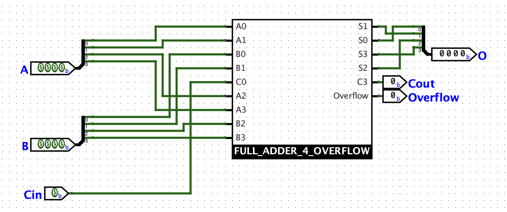

### 溢出
是的，大家应该都发现了，溢出是存在的。我在上面的补码加法器里加了个溢出表示位，这里就是分析何时才会溢出。
#### 溢出判定
溢出我们只关心最后一步加法，考虑：符号位溢出判断真值表（令 `A=A_{n-1}`、`B=B_{n-1}`、`Cin=C_{n-1}`、`Cout=C_n`、`S=S_{n-1}`）：

| $A_{n-1}$ | $B_{n-1}$ | $C_{n-1}$ | $C_n$ | $S_{n-1}$ | 溢出  |
| --------- | --------- | --------- | ----- | --------- | --- |
| 0         | 0         | 0         | 0     | 0         | 否   |
| 0         | 0         | 1         | 0     | 1         | 是   |
| 0         | 1         | 0         | 0     | 1         | 否   |
| 0         | 1         | 1         | 1     | 0         | 否   |
| 1         | 0         | 0         | 0     | 1         | 否   |
| 1         | 0         | 1         | 1     | 0         | 否   |
| 1         | 1         | 0         | 1     | 0         | 是   |
| 1         | 1         | 1         | 1     | 1         | 否   |

由真值表可知，在所有的情况里，只有 $C_{n-1}$ 与 $C_n$ 异号时才溢出，ABS的状态不影响结果，故可以得出溢出判定表达式：

$$ Overflow = C_{n-1} \oplus C_n $$

#### 构造
把 Cout 与前一个运算的 Cout 取异或即可。

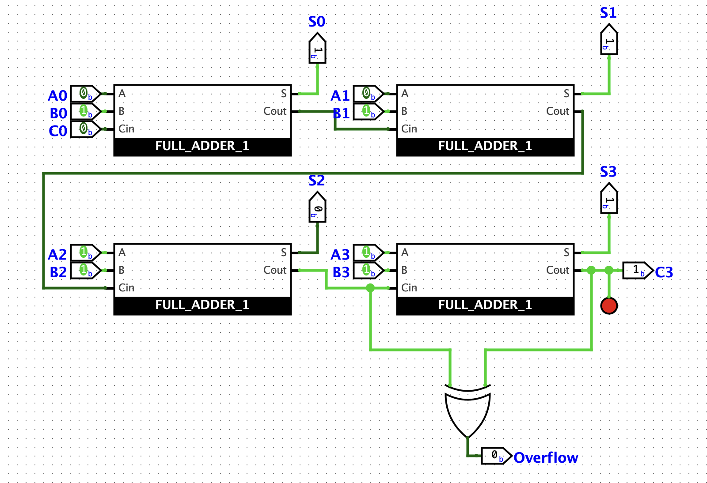

## 时序逻辑电路
上一小节介绍的模块有一个共同的特点, 其输出完全由当前输入决定. 但光靠上文的模块还不能实现所有电路, 例如电子表需要实现`新的秒数 = 旧的秒数 + 1`的功能, 当前输出还取决于其旧值.

因此, 我们需要实现一种新的电路, 它具备以下两种特性: (1) 可以读出电路的旧状态; (2) 可以更新电路的状态. 具备上述特性的电路称为时序逻辑电路, 它可以存储状态, 其输出由当前输入和旧状态共同决定; 相对地, 上一小节介绍的电路称为组合逻辑电路, 它们没有新旧状态的概念.
### 交叉配对反相器
以下分别是电路结构与其状态。交叉配对反相器没有输入端口，我们难以实际应用它。
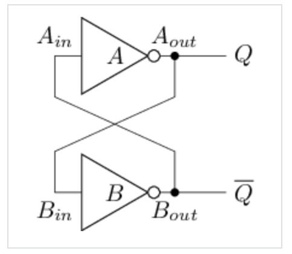

| $Q$ | $\overline{Q}$ | $Q_{new}$ | $\overline{Q}_{new}$ | 说明 |
| --- | --- | --- | --- | --- |
| 0 | 0 | 1 | 1 | 亚稳态 |
| 0 | 1 | 0 | 1 | 存储`0` |
| 1 | 0 | 1 | 0 | 存储`1` |
| 1 | 1 | 0 | 0 | 亚稳态 |

### SR 锁存器
SR锁存器(S-R Latch)通过将交叉配对反相器中的反相器换成或非门, 来向外部提供控制功能. 其中, S表示Set, 相应控制端用于对锁存器置位(设置为`1`); R表示Reset, 相应控制端用于对锁存器复位(设置为`0`). SR锁存器的逻辑符号和电路结构如下: (一生一芯给的结构图更清晰，我就不把我的搬上来瞎大家的眼了)

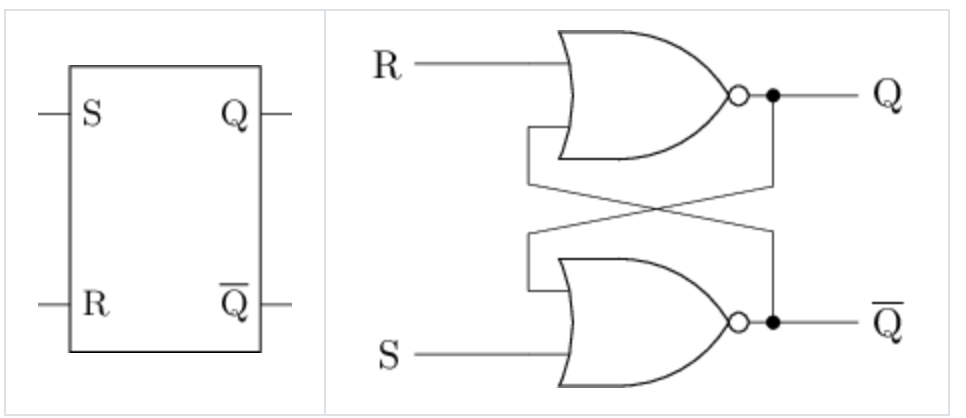

| `S` | `R` | `Q` |
| --- | --- | --- |
| 0   | 0   | 保持  |
| 0   | 1   | 0   |
| 1   | 0   | 1   |
| 1   | 1   | 禁止  |

### D 锁存器
为了从源头避免亚稳态，我们可以在 SR 锁存器前面加点电路，控制输入，这样组成了 D 锁存器
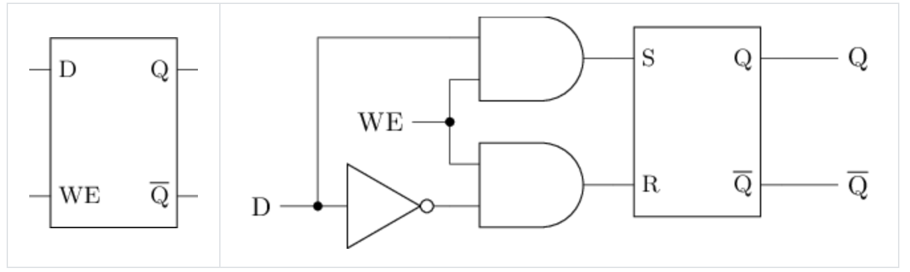

| WE  | D   | Q(t+1) | 行为     |
| --- | --- | ------ | ------ |
| 0   | 0   | Q(t)   | 保持     |
| 0   | 1   | Q(t)   | 保持     |
| 1   | 0   | 0      | 复位/写 0 |
| 1   | 1   | 1      | 置位/写 1 |

其中 `Q(t)` 表示当前状态，`Q(t+1)` 表示下一状态。

#### 复位设计
我们可以多加一个 RST 信号，实现复位。具体地，我们在 R 通入高电平，在 S 通入低电平，即可达到这一目的。不过要注意的是，我们复位信号设计要在 WE = 0 时仍然可用，因此要直达 R 与 S。

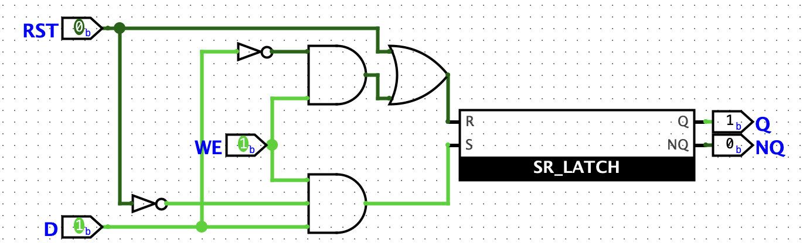

### 同步电路
[一生一芯 F3. 同步电路](https://ysyx.oscc.cc/docs/2407/f/3.html#%E5%90%8C%E6%AD%A5%E7%94%B5%E8%B7%AF)

### D 触发器
锁存器都是电平触发的器件，而触发器是沿边沿触发的器件。**D 触发器**基于 D 锁存器构建的一种触发器。这里介绍的是主从式 D 触发器。下图是带复位的 D 触发器。
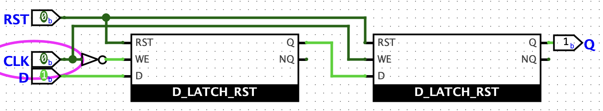

#### 原理分析
(From 一生一芯)
主从式D触发器由两个D锁存器构成, 左边的称为主锁存器, 右边的称为从锁存器. 两个D锁存器的写使能端分别与时钟信号及其取反结果相连. 主从式D触发器的工作过程分为如下阶段:
1. 数据准备阶段. 此时时钟信号`clk`处于低电平, 故主锁存器的写使能端有效, 数据信号`D`可从外部进入主锁存器; 但由于从锁存器的写使能端无效, 故数据信号无法传播到从锁存器, 因而整个D触发器的输出端`Q`保持不变.
2. 采样阶段. 当时钟信号`clk`的上升沿到来时, 主锁存器的写使能端无效, 数据信号`D`无法从外部进入主锁存器, `D`的后续变化将无法对主锁存器造成影响, 从而将时钟信号上升沿到来前的外部数据`D`"锁"在主锁存器中. 与此同时, 从锁存器的写使能端开始有效, 主锁存器中"锁住"的数据将传播到从锁存器, 并作为整个D触发器的输出.
3. 维持阶段. 此时时钟信号`clk`处于高电平, 故主锁存器的写使能端无效, 因此不受数据信号`D`变化的影响; 从锁存器的写使能端虽然有效, 但由于主锁存器保持不变, 故从锁存器也保持不变, 因而整个D触发器的输出端`Q`保持不变.
从整体上看, 当时钟上升沿到来时, 数据被写入D触发器, 并能在后续时钟周期稳定读出该数据, 符合同步电路对存储元件的要求. 因此, D触发器是同步电路设计中的基本存储元件.
#### 使能端
给 D 触发器加一个使能端口有时是很有用的。我的方案是把使能信号与时钟信号“与”起来。

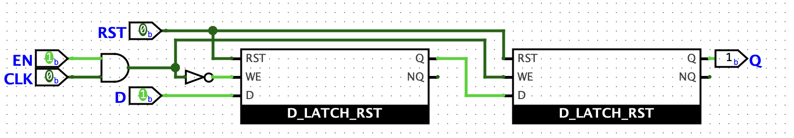

### 寄存器
D 触发器已经可以按时钟信号存储1位信息了，但存储量有点小。我们希望能一次性多存一些内容，因此我们可以把多个 D 触发器共享同一个时钟和使能信号，这样就组成了寄存器。下图是一个四位寄存器，多位寄存器只需要把 D 触发器按照这个方式堆叠就可以了。

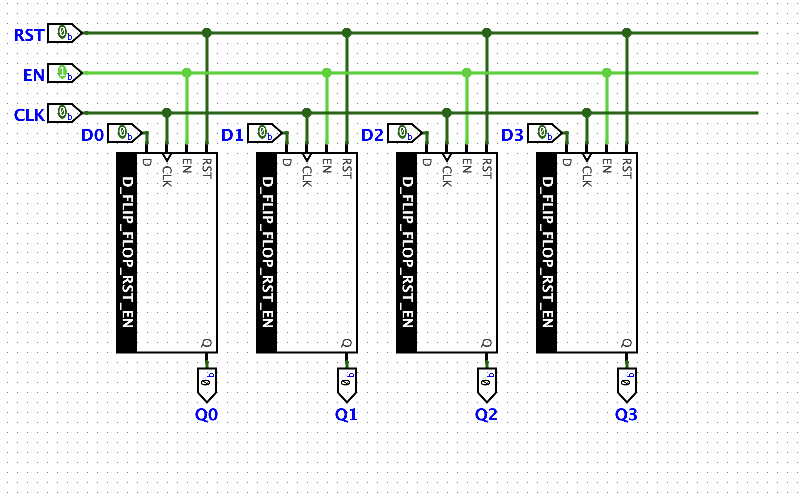

## 实例
### 搭建4位计数器
通过上述4位寄存器和之前搭建的加法器, 实现一个4位计数器, 每次时钟到来时, 寄存器中的值加1, 加到最大值时重新从`0`开始.
#### 分析
要实现这个功能，我们需要 1 个 4 位寄存器用来存放结果，以及一个加法器来进行加法。加法器输入 1 与寄存器的值，计算将会立即完成，然后等待下一个时钟周期将数据存储到寄存器内。

#### 实现

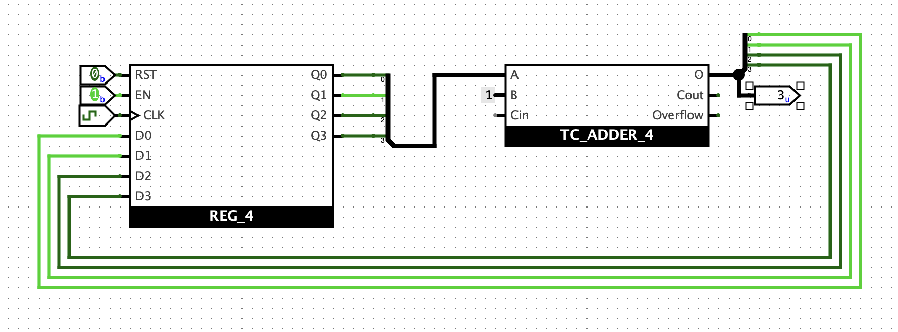
### 设计数列求和电路
尝试通过寄存器和加法器, 计算出`1+2+...+10`的结果. 为了容纳计算结果, 你可以考虑实现8位的寄存器和加法器.
#### 分析
我们先来思考一下平常我们是怎么写 C 语言来实现的：

``` C
int sum = 0;
for ( int i = 1; i <= 10; ++i ) {
	sum = sum + i;
}
```

我们可以看到，这里我们有两个变量，对应电路也就是需要两个寄存器，来分别存储 i 与 sum。因此，我们需要两个寄存器。另外，我们需要两个加法，一个用于 ++i ( i = i + 1 )，一个用于 sum = sum + i。最后，我们还需要一个条件控制，让 i 不再满足 i <= 10 的时候退出循环，这里我们可以选择判断 i == 11 ，因为数字电路搭建一个比较器（检测两数是否相同）是更简单的，若 i == 11，那么我们可以选择关断寄存器的 EN 引脚。

#### 实现

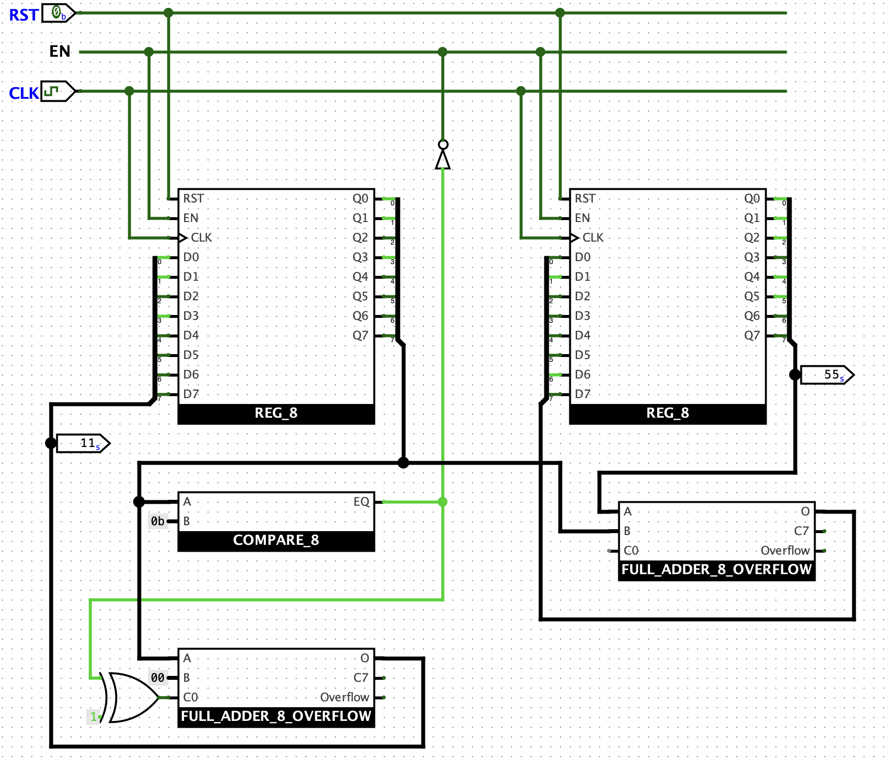
### 实现电子时钟
利用寄存器和七段数码管, 实现一个电子时钟, 具备"分"和"秒"的功能.
#### 分析
看到这个需求，我们首先会想到我们平常的做法：

``` C
int time = 0;
while ( true ) {
    time += 1;
    printf("%02d:%02d", time / 60, time % 60);
}
```

但是问题在于：目前我们没有实现除法器与取模运算器，因此，我们为了输出这四位数，就只能用加法硬去模拟了。
我们使用 4 个寄存器，分别存储 4 个数字，秒针的第一位在变成 10 的时候，通过比较器判断，输出复位信号归 0。但是由于这是一瞬间就完成的事务，因此不能用变成 10 时的信号来作为给第二位的进位。考虑时序，应该使用变成 9 时的信号作为进位，这样复位与下一位进 1 两个寄存器操作就会同时完成。对于后面的那几位，原理相同。

#### 实现
由于我懒得再走一堆乱七八糟的线连数码管了，这里就直接用 Logisim 自带的库来代替了。

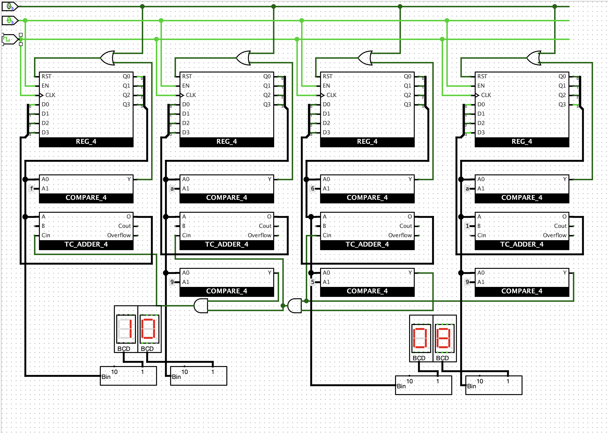
