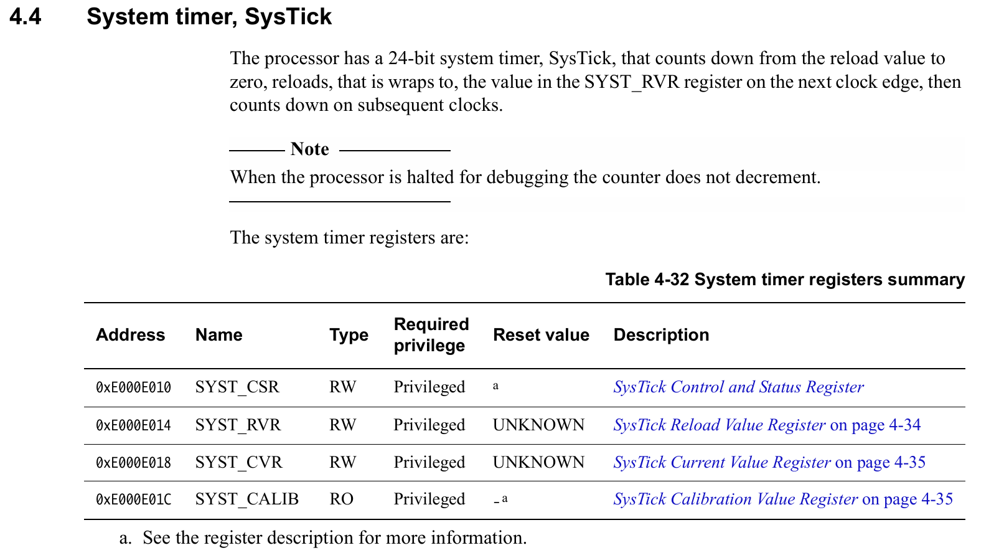
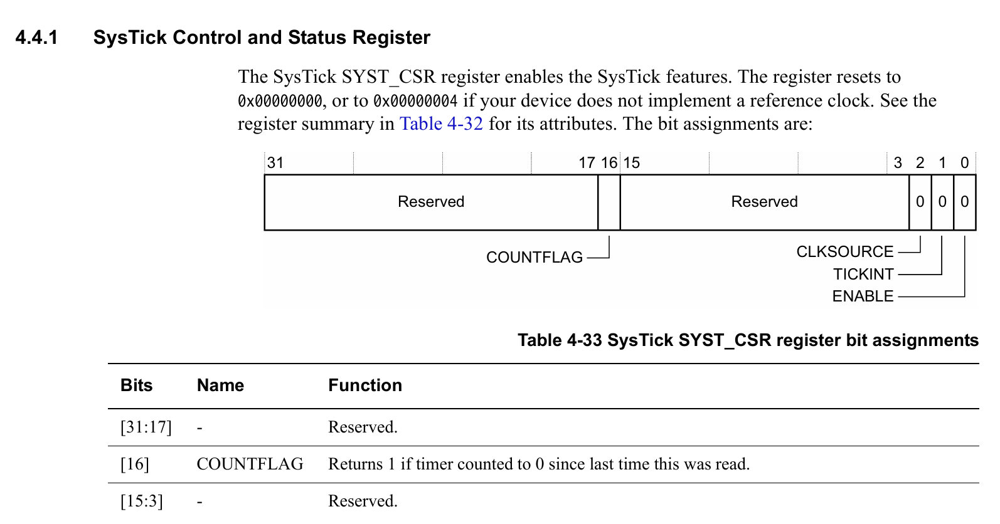
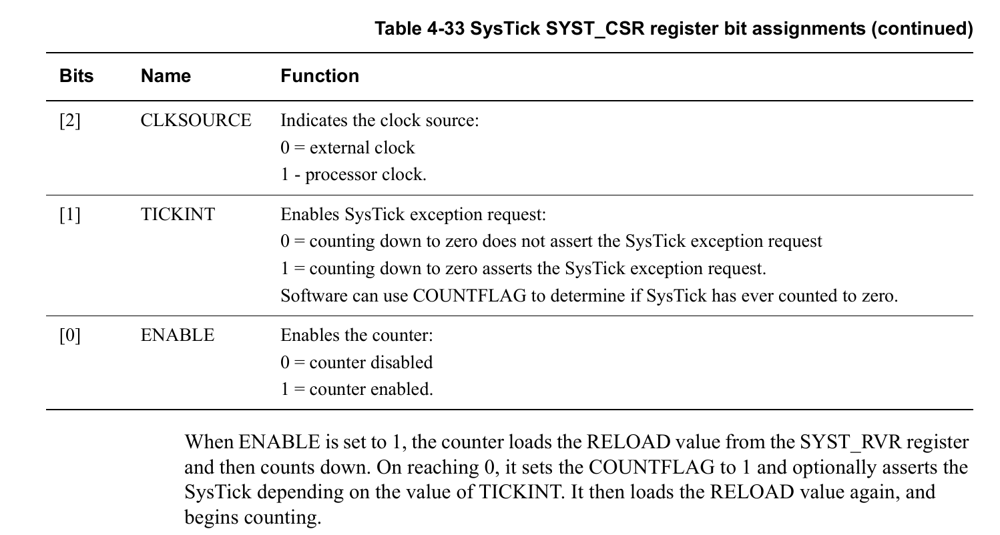

+++
author = "ALKALiKong"
title = "STM32 02 SysTick 计时器"
date = "2025-07-13"
description = "使用 SysTick 成为时间管理大师（大雾）"
tags = [
    "STM32",
    "CMSIS",
    "SysTick",
    "C",
]
categories = [
    "STM32",
    "CMSIS",
]
+++

# 02 SysTick

## 简介

SysTick 是 ARM Core 的一部分，是 24bit 硬件计数器，~~比起之前写的那个 spin 水平不知道高到哪里去了~~



SysTick 有 4 个寄存器：

- CTRL - 开关 systick
- LOAD - 初始值
- VAL - 当前值
- CALIB - 校准寄存器





其中，VAL 在每次开始时会加载 LOAD 中的值，并在每个 cycle 会递减。当 VAL **从 1** 减为 0 时，会触发 SysTick 中断，这时就会调用  `void SysTick_Handler(void)` 函数执行中断时应该做的反应。注意，只有从1减为0时会触发，直接设置为0是不会触发的。（这些在 Cortex-M3 Generic User Guide 中有写明）

## 代码实现

首先，需要初始化 SysTick:

``` C
static inline void systick_init() {
    SysTick->CTRL |= SysTick_CTRL_ENABLE |
                    SysTick_CTRL_TICKINT |
                    SysTick_CTRL_CLKSOURCE;
    /* Our MCU is at 72MHz, so set load to this for 1ms timer */
    SysTick->LOAD = 72000 - 1;
    SysTick->VAL = 0;
}
```

然后，设置中断时所调用的函数：

``` C
// Important: 所有在中断时可能被调用的变量都要设置 volatile 防止编译器无法识别到其变化导致被优化
// 具体可以看 https://github.com/cpq/bare-metal-programming-guide?tab=readme-ov-file#blinky-with-systick-interrupt
volatile uint32_t systick_counter = 0;
void SysTick_Handler(void) {
    systick_counter++;
}
```

最后，我们就可以设计一个用来循环计时的非阻塞型函数：

``` C
// t: expiration time, prd: period, now: current time. Return true if expired
bool timer_expired(uint32_t *t, uint32_t prd, uint32_t now) {
    if (now + prd < *t) *t = 0;                    // Time wrapped? Reset timer
    if (*t == 0) *t = now + prd;                   // First poll? Set expiration
    if (*t > now) return false;                    // Not expired yet, return
    *t = (now - *t) > prd ? now + prd : *t + prd;  // Next expiration time
    return true;                                   // Expired, return true
}
```

主函数：

``` C
int main() {
    // Enable GPIOs in RCC APB2ENR
    rcc_ptr->APB2ENR |= RCC_APB2ENR_IOPDEN;
    rcc_ptr->APB2ENR |= RCC_APB2ENR_IOPBEN;
    // Set the target gpio output
    for ( uint8_t i = 0; i < 4; ++i ) {
        led_init(led_list[i].bank, led_list[i].pin);
    }
    
    // Initialize SysTick timer
    systick_init();
    
    uint32_t timer = 0, period = 500;
    volatile bool led_enabled = true;
    for (;;) {
        if (timer_expired(&timer, period, systick_counter)) {
            for ( uint8_t i = 0; i < 4; ++i ) {
                if ( led_enabled )
                    led_off(led_list[i].bank, led_list[i].pin);
                else
                    led_on(led_list[i].bank, led_list[i].pin);
            }
            led_enabled = !led_enabled;
        }
    }
}
```

## 总结

1. 要使用 SysTick，首先要初始化，设置好 CTRL、LOAD、VAL，然后写好中断时的函数
2. 所有可能被中断等操作改变的变量都要使用 volatile 防止被编译器误解