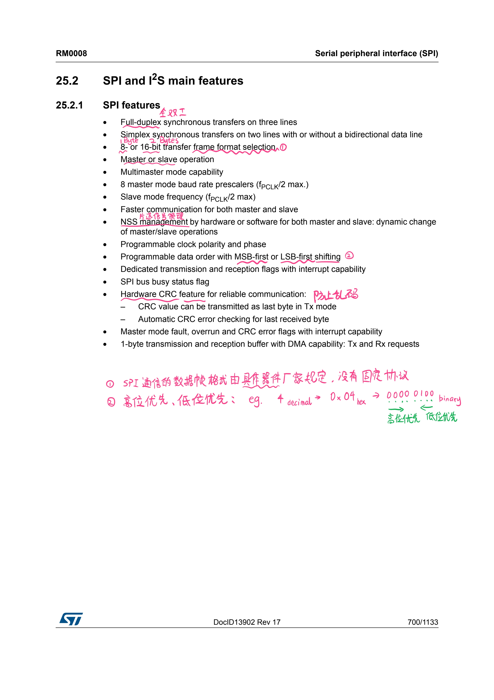
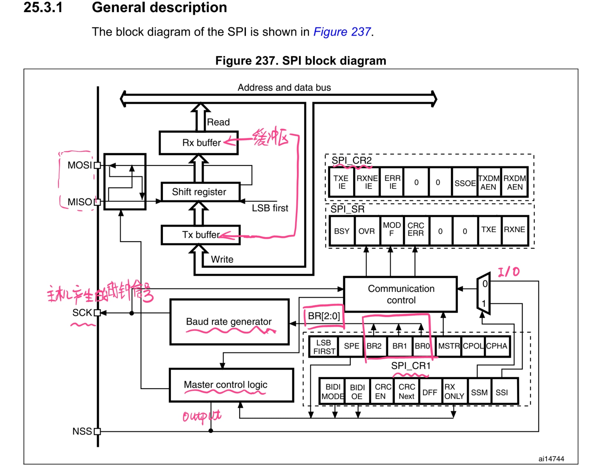
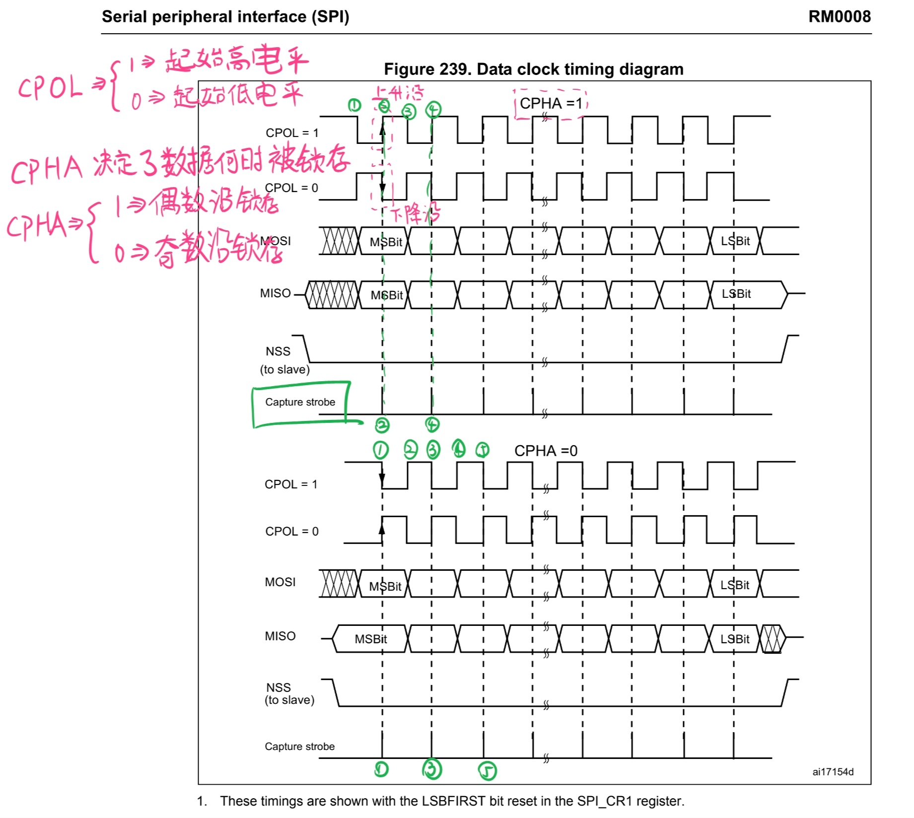
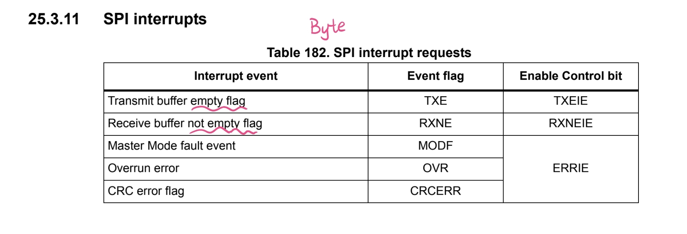
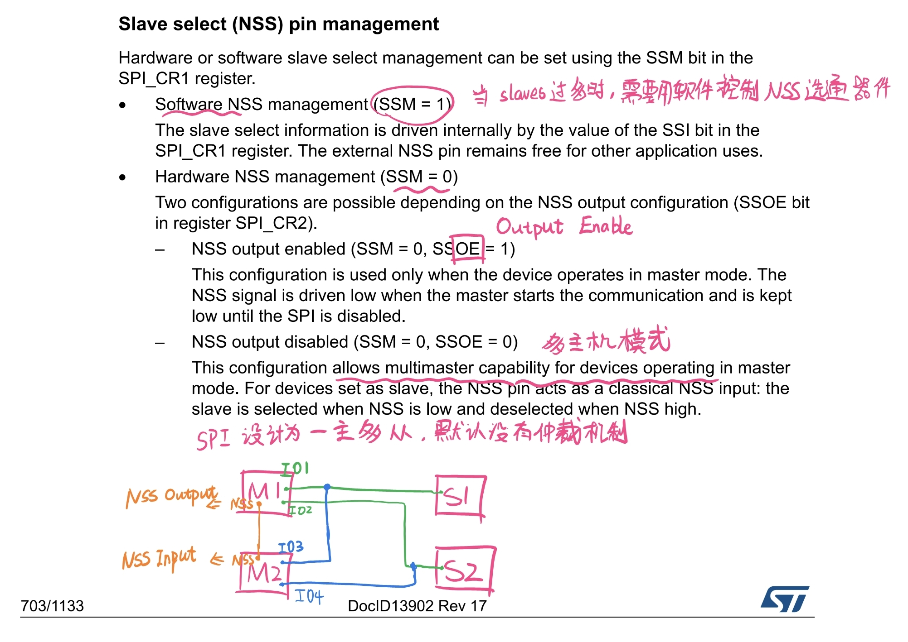
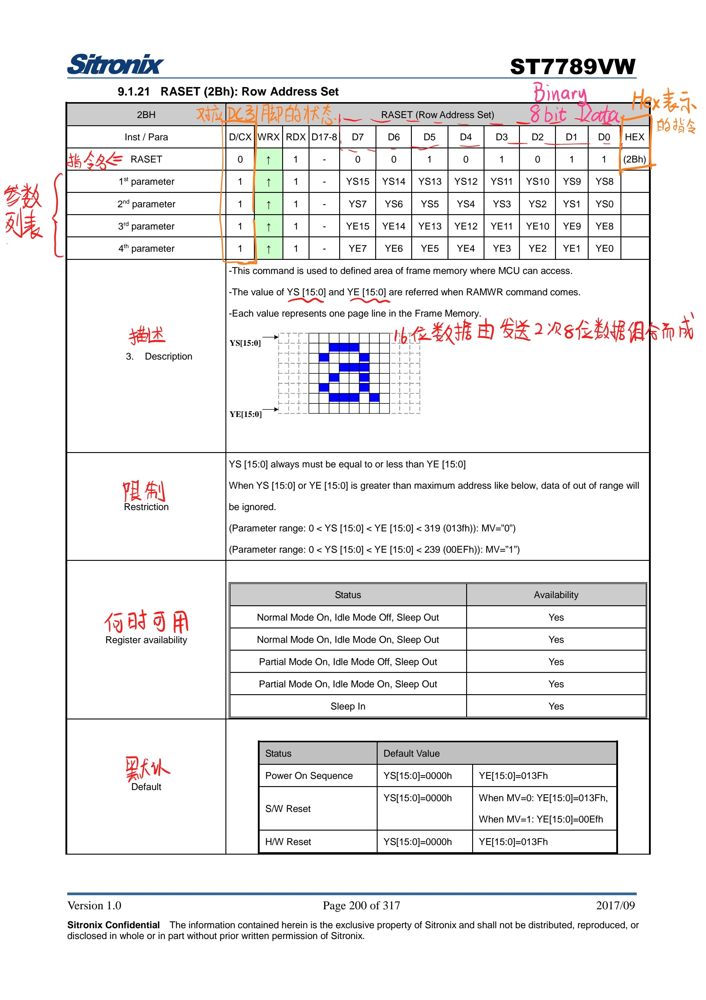
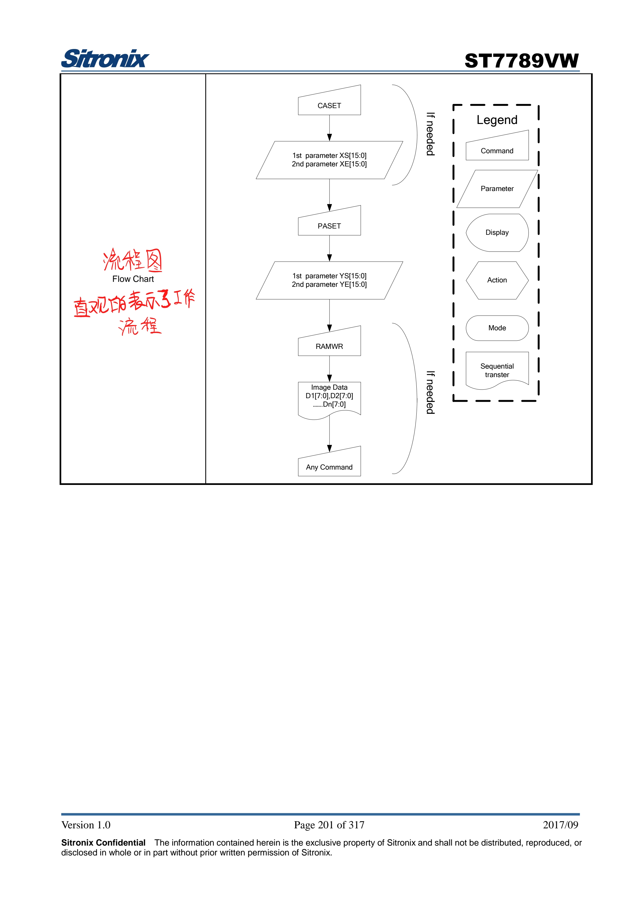

+++
author = "ALKALiKong"
title = "STM32 03 SPI 通信与 ST7789 LCD 简易驱动实现"
date = "2025-07-27"
description = "STM32 SPI 通信的基本原理 & ST7789 简易驱动的实现"
tags = [
    "STM32",
    "CMSIS",
    "SPI",
    "ST7789",
    "LCD",
    "C",
]
categories = [
    "STM32",
    "CMSIS",
    "DRIVER",
]

+++

## SPI 通信

### 简介

STM32 SPI 通信的具体内容可以参考[这个视频](https://www.bilibili.com/video/BV1Vg4y1v7VT)，这里只是记录一下重点内容。



上图为 STM32 支持的 SPI 特性。



通常SPI通过4个引脚与外部器件相连：

1. MISO：主设备输入/从设备输出引脚。该引脚在从模式下发送数据，在主模式下接收数据。
2. MOSI：主设备输出/从设备输入引脚。该引脚在主模式下发送数据，在从模式下接收数据。
3. SCK：串口时钟，作为主设备的输出，从设备的输入。
4. NSS：从设备选择。这是一个可选的引脚，用来选择主/从设备。它的功能是用来作为“片 选引脚”，让主设备可以单独地与特定从设备通讯，避免数据线上的冲突。

### 基本原理

#### 全双工/半双工

双工是指在一条数据线上可以进行双向通信。全双工允许两台设备**同时**进行通信，半双工则需要在一个设备通信完成后进行通信，**不能同时**进行通信。STM32的SPI可以工作在全双工模式下。

#### 时钟信号的相位和极性



上图介绍了时钟信号的相位和极性。具体有如下特点：

- CPOL 决定了空闲时的电平： 0-> 起始（空闲）时为低电平，1-> 起始（空闲）时为高电平。
- CPHA 决定了时钟相位，用于采样数据： 0->偶数沿采样，1->奇数沿采样。

#### 缓冲区

正如 C 的 printf 输出拥有缓冲区，SPI 通信也具有 RX buffer 和 TX buffer。发送数据和接收数据时，把数据写入缓冲区，从缓冲区中一个一个字节的发送，接受数据时，同样从缓冲区读入。

#### 中断



上表介绍了 SPI 中断的内容。

#### NSS 引脚



NSS 引脚可以配置为软件管理与硬件管理模式。

当从机比较多时，应使用软件管理。从机较少时，可以使用硬件管理，并开启 SSOE。当使用硬件管理且SSOE为0时，可以配置多主机模式。不过SPI一般应用为一主多从，所以没有主机冲突解决机制，这时有一个例子就是上图中 M1 和 M2 两个主机控制两个从机，输出并联到一起，并将两个设备的 NSS 连接，如果 M1 在进行通讯，则 M1 向 M2 的 NSS 引脚输出低电平，此时 M2 切断连接，一直等待 M1 给 M2 的 NSS 引脚再次传入高电平时进行通讯。这只是一种可能的解决方案，实际运用时比较复杂。

#### 片选

**对于片选来说，最重要的就是保证不用到对应外设时一定要保持高电平，只在需要的时候拉低电平，用完马上上拉。**

当我们以软件管理的方式进行片选管理时，就需要注意片选信号的意义。

SPI 具有以下两个特点：

- **共享总线**: 一个SPI主设备可以连接多个从设备
- **同时只能与一个设备通信**: 通过片选信号选择具体的设备

为了实现同时只能与一个设备通信的要求，我们就需要使用片选(Chip Select)信号来管理从机。比如对下面的 ST7789 的控制：

| CS状态       | 电平   | ST7789状态 | 意义                          |
| ------------ | ------ | ---------- | ----------------------------- |
| **拉高 (1)** | 高电平 | **未选中** | ST7789忽略SPI总线上的所有信号 |
| **拉低 (0)** | 低电平 | **被选中** | ST7789监听并响应SPI总线信号   |

对于单设备时，也需要通过片选来让 ST7789 知道何时要监听数据，何时停止监听数据，数据包的边界在哪里。

假设有多个设备，那么片选就更加重要：

``` C
// 假设你有多个SPI设备：
#define ST7789_CS_PIN    1    // PE1 - LCD显示屏
#define SD_CARD_CS_PIN   2    // PE2 - SD卡
#define SENSOR_CS_PIN    3    // PE3 - 传感器

// 与LCD通信时：
GPIO_RESET(cs_port, ST7789_CS_PIN);   // LCD被选中
GPIO_SET(cs_port, SD_CARD_CS_PIN);    // SD卡被忽略
GPIO_SET(cs_port, SENSOR_CS_PIN);     // 传感器被忽略

// 与SD卡通信时：
GPIO_SET(cs_port, ST7789_CS_PIN);     // LCD被忽略
GPIO_RESET(cs_port, SD_CARD_CS_PIN);  // SD卡被选中
GPIO_SET(cs_port, SENSOR_CS_PIN);     // 传感器被忽略
```

## ST7789

### 简介

手上的 MCUTools 的开发板集成了一块 2.8 寸的 LCD 显示模块，该模块使用 ST7789 作为显示驱动芯片，支持 320x240 分辨率，使用 SPI 作为通信方式。

ST7789 的参考手册可以在这里找到：[ST7789VW_SPEC_V1.0](https://cdn-learn.adafruit.com/assets/assets/000/082/882/original/ST7789VW_SPEC_V1.0.pdf?1571860977)

[LibDriver's ST7789 driver](https://github.com/libdriver/st7789) 这里是一个实现非常完整的 ST7789 驱动程序，很好的将 Hardware Interface 与 Driver 本身分离开了，使得这个驱动可以只修改 interface 层就可以实现移植。不过这个驱动本身比较繁杂，所以我们就借用一下他 Interface 分离的思想自己写一个简单的驱动出来。

开发板上对应的引脚如下：

| 功能            | 引脚 | 说明                     |
| --------------- | ---- | ------------------------ |
| Backlight       | PA8  | 背光开关控制             |
| DCX (数据/命令) | PE0  | 高电平=数据，低电平=命令 |
| CS (片选)       | PE1  | SPI片选信号              |
| RST (复位)      | PE3  | 硬件复位信号             |
| SPI1_SCK        | PA5  | SPI时钟                  |
| SPI1_MOSI       | PA7  | SPI MOSI                 |
| SPI1_MISO       | PA6  | SPI MISO                 |

顺便介绍一下

### Interface 层剖析

以下是 LibDriver 的 driver_st7789_interface.h 里的函数原型：

``` C
// SPI 操作部分
uint8_t st7789_interface_spi_init(void);
uint8_t st7789_interface_spi_deinit(void);
uint8_t st7789_interface_spi_write_cmd(uint8_t *buf, uint16_t len);
// 系统接口部分
void st7789_interface_delay_ms(uint32_t ms);
void st7789_interface_debug_print(const char *const fmt, ...);
// Command/Data 接口部分
uint8_t st7789_interface_cmd_data_gpio_init(void);
uint8_t st7789_interface_cmd_data_gpio_deinit(void);
uint8_t st7789_interface_cmd_data_gpio_write(uint8_t value);
// 复位部分
uint8_t st7789_interface_reset_gpio_init(void);
uint8_t st7789_interface_reset_gpio_deinit(void);
uint8_t st7789_interface_reset_gpio_write(uint8_t value);
```

不过我们的 ST7789 模块还有一个用于开启 LCD 背光的引脚，所以也在这里补充上：

``` C
uint8_t st7789_interface_backlight_gpio_init(void);
uint8_t st7789_interface_backlight_gpio_deinit(void);
uint8_t st7789_interface_backlight_gpio_write(uint8_t value);
```

其中每个接口部分都有三种操作：初始化，去初始化，写入数据

#### SPI 部分

我们在这里使用 CMSIS 提供的 SPI API 来实现 SPI 的交互。在 csolution 中包含下面四个组件即可使用：

```
    - component: ARM::CMSIS Driver:SPI:Custom
    - component: Keil::CMSIS Driver:SPI
    - component: Keil::Device:DMA
    - component: Keil::Device:GPIO
```

首先，我们来关注一下 `Driver_SPI.h` 里对 SPI Driver 的定义：

``` C
typedef struct _ARM_DRIVER_SPI {
  ARM_DRIVER_VERSION   (*GetVersion)      (void);                             ///< Pointer to \ref ARM_SPI_GetVersion : Get driver version.
  ARM_SPI_CAPABILITIES (*GetCapabilities) (void);                             ///< Pointer to \ref ARM_SPI_GetCapabilities : Get driver capabilities.
  int32_t              (*Initialize)      (ARM_SPI_SignalEvent_t cb_event);   ///< Pointer to \ref ARM_SPI_Initialize : Initialize SPI Interface.
  int32_t              (*Uninitialize)    (void);                             ///< Pointer to \ref ARM_SPI_Uninitialize : De-initialize SPI Interface.
  int32_t              (*PowerControl)    (ARM_POWER_STATE state);            ///< Pointer to \ref ARM_SPI_PowerControl : Control SPI Interface Power.
  int32_t              (*Send)            (const void *data, uint32_t num);   ///< Pointer to \ref ARM_SPI_Send : Start sending data to SPI Interface.
  int32_t              (*Receive)         (      void *data, uint32_t num);   ///< Pointer to \ref ARM_SPI_Receive : Start receiving data from SPI Interface.
  int32_t              (*Transfer)        (const void *data_out,
                                                 void *data_in,
                                           uint32_t    num);                  ///< Pointer to \ref ARM_SPI_Transfer : Start sending/receiving data to/from SPI.
  uint32_t             (*GetDataCount)    (void);                             ///< Pointer to \ref ARM_SPI_GetDataCount : Get transferred data count.
  int32_t              (*Control)         (uint32_t control, uint32_t arg);   ///< Pointer to \ref ARM_SPI_Control : Control SPI Interface.
  ARM_SPI_STATUS       (*GetStatus)       (void);                             ///< Pointer to \ref ARM_SPI_GetStatus : Get SPI status.
} const ARM_DRIVER_SPI;
```

而 `SPI_STM32F10x.c` 中这样的定义：

``` C
ARM_DRIVER_SPI Driver_SPI1 = {
  SPIX_GetVersion,
  SPIX_GetCapabilities,
  SPI1_Initialize,
  SPI1_Uninitialize,
  SPI1_PowerControl,
  SPI1_Send,
  SPI1_Receive,
  SPI1_Transfer,
  SPI1_GetDataCount,
  SPI1_Control,
  SPI1_GetStatus
};
```

其中，大部分函数的名字和他的作用是一样的。其中 CMSIS Driver 提供的 Initialize 貌似会自动使能对应的 RCC (?)，我在测试的时候把用来开启 `RCC->APB2ENR |= RCC_APB2ENR_SPI1EN;` 注释掉以后仍能正常通信，所以有这种推测 OxO。

由此，我们可以实现 Interface 中 SPI 部分了：

``` C
// ST7789 GPIO引脚定义
#define ST7789_CS_PORT   'E'    // 片选引脚 PE1
#define ST7789_CS_PIN    1
#define ST7789_DC_PORT   'E'    // 数据/命令引脚 PE0  
#define ST7789_DC_PIN    0
#define ST7789_RST_PORT  'E'    // 复位引脚 PE3
#define ST7789_RST_PIN   3
#define ST7789_BL_PORT   'A'    // 背光引脚 PA8
#define ST7789_BL_PIN    8

// GPIO操作宏定义
#define GPIO_PORT(bank) ((GPIO_TypeDef *)(GPIOA_BASE + 0x400 * ((bank) - 'A')))
#define GPIO_SET(port, pin) (port->BSRR = (1 << pin))
#define GPIO_RESET(port, pin) (port->BSRR = (1 << (pin + 16)))

// 直接获取 Driver_SPI1
extern ARM_DRIVER_SPI Driver_SPI1;

// SPI 事件回调函数，在 Initialize 的时候传入
void SPI1_Event_Callback(uint32_t event) {
    // 事实上我们现在并没有真的用到这个回调函数，所以这里留空也可以，这里只是展示一下都能写点啥
    if (event & ARM_SPI_EVENT_TRANSFER_COMPLETE) {
        // SPI传输完成
    }
    if (event & ARM_SPI_EVENT_DATA_LOST) {
        // 数据丢失错误
    }
    if (event & ARM_SPI_EVENT_MODE_FAULT) {
        // 模式错误
    }
}

/**
 * @brief  interface spi bus init
 * @return status code
 *         - 0 success
 *         - 1 spi init failed
 * @note   none
 */
uint8_t st7789_interface_spi_init(void)
{
    int32_t status;

    // 初始化片选引脚
    gpio_init_output(ST7789_CS_PORT, ST7789_CS_PIN);
    GPIO_TypeDef *cs_port = GPIO_PORT(ST7789_CS_PORT);
    GPIO_SET(cs_port, ST7789_CS_PIN); // 默认拉高片选

    // 初始化 Driver_SPI1
    status = Driver_SPI1.Initialize(SPI1_Event_Callback);
    if (status != ARM_DRIVER_OK) {
        return 1;
    }

    // 给 Driver_SPI1 使能
    status = Driver_SPI1.PowerControl(ARM_POWER_FULL);
    if (status != ARM_DRIVER_OK) {
        return 1;
    }

    // 设置 SPI 工作模式
    /* 第二个参数指定了 SPI1 时钟，SPI1时钟 = APB2时钟 / 分频系数 （SPI1 挂载在 APB2 上）
     * 分频系数一般有 2, 4, 8, 16, 32, 64, 128, 256 等
     * 我设置为 18MHz 了，你也可以设置成别的，这会影响通信速率与稳定性
    */
    status = Driver_SPI1.Control(ARM_SPI_MODE_MASTER |       // 主模式
                                ARM_SPI_CPOL0_CPHA0 |        // 时钟极性和相位
                                ARM_SPI_SS_MASTER_SW |       // 软件控制片选
                                ARM_SPI_DATA_BITS(8),        // 8位数据
                                18000000);
    if (status != ARM_DRIVER_OK) {
        return 1;
    }

    return 0;
}

/**
 * @brief  interface spi bus deinit
 * @return status code
 *         - 0 success
 *         - 1 spi deinit failed
 * @note   none
 */
uint8_t st7789_interface_spi_deinit(void)
{
    int32_t status;

    // 先关闭SPI电源
    status = Driver_SPI1.PowerControl(ARM_POWER_OFF);
    if (status != ARM_DRIVER_OK) {
        return 1;
    }

    // 然后去初始化SPI驱动
    status = Driver_SPI1.Uninitialize();
    if (status != ARM_DRIVER_OK) {
        return 1;
    }

    // 将片选引脚设置为输入模式
    GPIO_TypeDef *gpio = GPIO_PORT(ST7789_CS_PORT);
    if (ST7789_CS_PIN < 8) {
        uint32_t pos = ST7789_CS_PIN * 4;
        gpio->CRL &= ~(0xF << pos);  // 清除配置位，默认为浮空输入
    } else if (ST7789_CS_PIN < 16) {
        uint32_t pos = (ST7789_CS_PIN - 8) * 4;
        gpio->CRH &= ~(0xF << pos);  // 清除配置位，默认为浮空输入
    }

    return 0;
}

/**
 * @brief     interface spi bus write
 * @param[in] *buf pointer to a data buffer
 * @param[in] len length of data buffer
 * @return    status code
 *            - 0 success
 *            - 1 write failed
 * @note      none
 */
uint8_t st7789_interface_spi_write_cmd(uint8_t *buf, uint16_t len)
{
    int32_t status;
    GPIO_TypeDef *cs_port = GPIO_PORT(ST7789_CS_PORT);
    
    // 拉低片选
    GPIO_RESET(cs_port, ST7789_CS_PIN);
    
    // 发送数据
    status = Driver_SPI1.Send(buf, len);
    if (status != ARM_DRIVER_OK) {
        GPIO_SET(cs_port, ST7789_CS_PIN); // 失败时释放片选
        return 1;
    }
    
    // 等待传输完成
    while (Driver_SPI1.GetStatus().busy);
    
    // 拉高片选
    GPIO_SET(cs_port, ST7789_CS_PIN);
    
    return 0;
}
```

这里面我们还是来关注一下片选：

- 在初始化 SPI 接口时，我们**先初始化并拉高了 CS 引脚的电平**，确保 ST7789 不处理 SPI 总线上的任何内容，然后再初始化 SPI1。
- 在给 ST7789 传输数据时，我们要**先拉低片选**，这样 ST7789 才会开始监听并接受数据，然后等待传输完成，最后**再次拉高片选**。

**对于片选来说，最重要的就是保证不用到对应外设时一定要保持高电平，只在需要的时候拉低电平，用完马上上拉。**

#### GPIO 部分

``` C
// 初始化GPIO引脚为推挽输出模式
static void gpio_init_output(char bank, uint8_t pin) {
    GPIO_TypeDef *gpio = GPIO_PORT(bank);
    
    if (pin < 8) {
        uint32_t pos = pin * 4;
        gpio->CRL &= ~(0xF << pos);  // 清除配置位
        gpio->CRL |= (0x2 << pos);   // 设置为2MHz输出，推挽模式
    } else if (pin < 16) {
        uint32_t pos = (pin - 8) * 4;
        gpio->CRH &= ~(0xF << pos);  // 清除配置位
        gpio->CRH |= (0x2 << pos);   // 设置为2MHz输出，推挽模式
    }
}

/**
 * @brief  interface command && data gpio init
 * @return status code
 *         - 0 success
 *         - 1 gpio init failed
 * @note   none
 */
uint8_t st7789_interface_cmd_data_gpio_init(void)
{
    // 初始化DC引脚为输出模式
    gpio_init_output(ST7789_DC_PORT, ST7789_DC_PIN);
    
    // 设置默认状态为命令模式 (DC = 0)
    GPIO_TypeDef *dc_port = GPIO_PORT(ST7789_DC_PORT);
    GPIO_RESET(dc_port, ST7789_DC_PIN);
    
    return 0;
}

/**
 * @brief  interface command && data gpio deinit
 * @return status code
 *         - 0 success
 *         - 1 gpio deinit failed
 * @note   none
 */
uint8_t st7789_interface_cmd_data_gpio_deinit(void)
{
    // 将DC引脚设置为输入模式（浮空输入）
    GPIO_TypeDef *gpio = GPIO_PORT(ST7789_DC_PORT);
    
    if (ST7789_DC_PIN < 8) {
        uint32_t pos = ST7789_DC_PIN * 4;
        gpio->CRL &= ~(0xF << pos);  // 清除配置位，默认为浮空输入
    } else if (ST7789_DC_PIN < 16) {
        uint32_t pos = (ST7789_DC_PIN - 8) * 4;
        gpio->CRH &= ~(0xF << pos);  // 清除配置位，默认为浮空输入
    }
    
    return 0;
}

/**
 * @brief     interface command && data gpio write
 * @param[in] value written value
 * @return    status code
 *            - 0 success
 *            - 1 gpio write failed
 * @note      none
 */
uint8_t st7789_interface_cmd_data_gpio_write(uint8_t value)
{
    GPIO_TypeDef *dc_port = GPIO_PORT(ST7789_DC_PORT);
    
    if (value) {
        // 数据模式 (DC = 1)
        GPIO_SET(dc_port, ST7789_DC_PIN);
    } else {
        // 命令模式 (DC = 0)
        GPIO_RESET(dc_port, ST7789_DC_PIN);
    }
    
    return 0;
}

/**
 * @brief  interface reset gpio init
 * @return status code
 *         - 0 success
 *         - 1 gpio init failed
 * @note   none
 */
uint8_t st7789_interface_reset_gpio_init(void)
{
    // 初始化RST引脚为输出模式
    gpio_init_output(ST7789_RST_PORT, ST7789_RST_PIN);
    
    // 设置默认状态为高电平（非复位状态）
    GPIO_TypeDef *rst_port = GPIO_PORT(ST7789_RST_PORT);
    GPIO_SET(rst_port, ST7789_RST_PIN);
    
    return 0;
}

/**
 * @brief  interface reset gpio deinit
 * @return status code
 *         - 0 success
 *         - 1 gpio deinit failed
 * @note   none
 */
uint8_t st7789_interface_reset_gpio_deinit(void)
{
    // 将RST引脚设置为输入模式（浮空输入）
    GPIO_TypeDef *gpio = GPIO_PORT(ST7789_RST_PORT);
    
    if (ST7789_RST_PIN < 8) {
        uint32_t pos = ST7789_RST_PIN * 4;
        gpio->CRL &= ~(0xF << pos);  // 清除配置位，默认为浮空输入
    } else if (ST7789_RST_PIN < 16) {
        uint32_t pos = (ST7789_RST_PIN - 8) * 4;
        gpio->CRH &= ~(0xF << pos);  // 清除配置位，默认为浮空输入
    }
    
    return 0;
}

/**
 * @brief     interface reset gpio write
 * @param[in] value written value
 * @return    status code
 *            - 0 success
 *            - 1 gpio write failed
 * @note      none
 */
uint8_t st7789_interface_reset_gpio_write(uint8_t value)
{
    GPIO_TypeDef *rst_port = GPIO_PORT(ST7789_RST_PORT);
    
    if (value) {
        // 非复位状态 (RST = 1)
        GPIO_SET(rst_port, ST7789_RST_PIN);
    } else {
        // 复位状态 (RST = 0)
        GPIO_RESET(rst_port, ST7789_RST_PIN);
    }
    
    return 0;
}

/**
 * @brief  interface backlight gpio init
 * @return status code
 *         - 0 success
 *         - 1 gpio init failed
 * @note   none
 */
uint8_t st7789_interface_backlight_gpio_init(void)
{
    // 初始化背光控制引脚为推挽输出模式
    gpio_init_output(ST7789_BL_PORT, ST7789_BL_PIN);
    
    return 0;
}

/**
 * @brief  interface backlight gpio deinit  
 * @return status code
 *         - 0 success
 *         - 1 gpio deinit failed
 * @note   none
 */
uint8_t st7789_interface_backlight_gpio_deinit(void)
{
    // 关闭背光
    st7789_interface_backlight_gpio_write(0);
    
    return 0;
}

/**
 * @brief     interface backlight gpio write
 * @param[in] value written value (1=on, 0=off)
 * @return    status code
 *            - 0 success
 *            - 1 gpio write failed
 * @note      none
 */
uint8_t st7789_interface_backlight_gpio_write(uint8_t value)
{
    GPIO_TypeDef *bl_port = GPIO_PORT(ST7789_BL_PORT);
    
    if (value) {
        // 开启背光 (BL = 1)
        GPIO_SET(bl_port, ST7789_BL_PIN);
    } else {
        // 关闭背光 (BL = 0)
        GPIO_RESET(bl_port, ST7789_BL_PIN);
    }
    
    return 0;
}
```

这一部分值得关注的是 DC gpio。DC，即 Data / Command，是 ST7789 用来确定 SPI 总线上传入的是数据还是指令。这一点会在下面写驱动时提及。总之，DC=1时为数据模式，DC=0时为指令模式。

#### 其他部分

``` C
/**
 * @brief     interface delay ms
 * @param[in] ms time
 * @note      none
 */
void st7789_interface_delay_ms(uint32_t ms)
{
    // 使用简单的循环延时
    // 假设系统时钟为72MHz，大概的循环次数
    volatile uint32_t count = ms * 18000; // 大约1ms的延时
    
    while (count--) {
        __NOP(); // ARM的空操作指令
    }
}

/**
 * @brief     interface print format data
 * @param[in] fmt format data
 * @note      none
 */
void st7789_interface_debug_print(const char *const fmt, ...)
{
    (void)fmt; // 避免未使用参数的警告
    
    // 之后实现 stdio 重定向至 UART 后会在这里实现输出 debug 信息的功能
}
```

### 实现驱动

#### 大概的工作原理

我们先来介绍一下工作原理。ST7789 内置了一个图像缓冲区（你也可以理解为显存），屏幕则通过这个缓冲区的内容进行显示，这一点比较类似 MCU 的寄存器。每一个像素点对应了一个颜色信息，在缓冲区内存储，通过修改这个缓冲区，我们就可以实现更改屏幕上显示的图像。另外，颜色信息的储存也有不同的方法。

但是~~戏说不是胡说，改编不是乱编~~，对于 ST7789 来说，从 SPI 总线上传过来内容有很多种，我怎么知道如何修改对应的内容呢？这里，我们就引入了 Data/Command 的概念，将指令和数据分开来，通过先传入指令告诉芯片如何处理马上要传过来的数据。这是如何实现的呢？它使用了一个 DC 引脚，使得 DC=1 时指示传过来的是指令，DC = 0 时指示传过来的是数据。

我们要绘制一个矩形，首先要设置一个显示窗口 ( CASET, RASET )，然后通过写入内存 ( RAMWR ) 向显示窗口填充像素。

我们这个简易的驱动程序中直接使用了默认配置，实际上有很多东西都是可以配置的，比如内存访问控制位所定义的内容等等，这些如果后期感兴趣可以去慢慢翻阅ST7789的参考手册去探索，这里就直接使用默认配置初始化了显示屏，主打一个能亮就行（逃

#### 看ST7789参考手册的方法

主要还是看指令有哪些参数，指令对应的十六进制数据是什么，参数介绍是什么等等。以 RASET 指令为例：





#### 代码实现

知道了大概的内容后，我们就来写代码罢（

首先是 `simple_st7789_driver.h` :

``` C
#ifndef SIMPLE_ST7789_DRIVER_H
#define SIMPLE_ST7789_DRIVER_H

#include <stdint.h>
#include <stdbool.h>

// ST7789 显示屏尺寸定义
#define ST7789_WIDTH    240
#define ST7789_HEIGHT   320

// RGB565 颜色定义
#define COLOR_BLACK     0x0000
#define COLOR_WHITE     0xFFFF
#define COLOR_RED       0xF800
#define COLOR_GREEN     0x07E0
#define COLOR_BLUE      0x001F
#define COLOR_YELLOW    0xFFE0
#define COLOR_CYAN      0x07FF
#define COLOR_MAGENTA   0xF81F

// ST7789 常用命令定义
#define ST7789_SWRESET  0x01  // 软件复位
#define ST7789_SLPOUT   0x11  // 退出睡眠
#define ST7789_NORON    0x13  // 正常显示模式
#define ST7789_INVOFF   0x20  // 显示反转关闭
#define ST7789_INVON    0x21  // 显示反转开启
#define ST7789_DISPOFF  0x28  // 显示关闭
#define ST7789_DISPON   0x29  // 显示开启
#define ST7789_CASET    0x2A  // 列地址设置
#define ST7789_RASET    0x2B  // 行地址设置
#define ST7789_RAMWR    0x2C  // 内存写入
#define ST7789_MADCTL   0x36  // 内存访问控制
#define ST7789_COLMOD   0x3A  // 像素格式设置

// 内存访问控制 (MADCTL) 位定义
#define ST7789_MADCTL_MY    0x80  // 行地址顺序
#define ST7789_MADCTL_MX    0x40  // 列地址顺序
#define ST7789_MADCTL_MV    0x20  // 行/列交换
#define ST7789_MADCTL_ML    0x10  // 垂直刷新顺序
#define ST7789_MADCTL_BGR   0x08  // RGB/BGR顺序
#define ST7789_MADCTL_MH    0x04  // 水平刷新顺序

// 函数声明
uint8_t simple_st7789_init(void);
uint8_t simple_st7789_deinit(void);
uint8_t simple_st7789_fill_screen(uint16_t color);
uint8_t simple_st7789_fill_rect(uint16_t x, uint16_t y, uint16_t width, uint16_t height, uint16_t color);
uint8_t simple_st7789_draw_pixel(uint16_t x, uint16_t y, uint16_t color);
uint8_t simple_st7789_set_window(uint16_t x1, uint16_t y1, uint16_t x2, uint16_t y2);
uint8_t simple_st7789_send_command(uint8_t cmd);
uint8_t simple_st7789_send_data(uint8_t data);
uint8_t simple_st7789_send_data_16(uint16_t data);

// 测试函数（其实作为 Driver 不应该把这种东西放在这里，不过既然是演示就先这样吧）
uint8_t simple_st7789_test(void);

#endif // SIMPLE_ST7789_DRIVER_H
```

这些指令都可以在 ST7789 的参考手册中找到。

然后是驱动主体实现：

``` C
#include "simple_st7789_driver.h"
#include "driver_st7789_interface.h"
#include "RTE_Components.h"
#include CMSIS_device_header

// 延时函数
static void st7789_delay_ms(uint32_t ms)
{
    // 简单的循环延时，基于72MHz主频
    for (volatile uint32_t i = 0; i < ms * 7200; i++) {
        __NOP();
    }
}

/**
 * @brief 发送命令到ST7789
 * @param cmd 命令字节
 * @return 0=成功, 其他=失败
 */
uint8_t simple_st7789_send_command(uint8_t cmd)
{
    uint8_t res;
    
    // 设置DC引脚为命令模式 (低电平)
    st7789_interface_cmd_data_gpio_write(0);
    
    // 发送命令
    res = st7789_interface_spi_write_cmd(&cmd, 1);
    return res;
}

/**
 * @brief 发送数据到ST7789
 * @param data 数据字节
 * @return 0=成功, 其他=失败
 */
uint8_t simple_st7789_send_data(uint8_t data)
{
    uint8_t res;
    
    // 设置DC引脚为数据模式 (高电平)
    st7789_interface_cmd_data_gpio_write(1);
    
    // 发送数据
    res = st7789_interface_spi_write_cmd(&data, 1);
    return res;
}

/**
 * @brief 发送16位数据到ST7789
 * @param data 16位数据
 * @return 0=成功, 其他=失败
 */
uint8_t simple_st7789_send_data_16(uint16_t data)
{
    uint8_t res;
    uint8_t data_bytes[2];
    
    // 高字节在前 (大端序)
    data_bytes[0] = (data >> 8) & 0xFF;
    data_bytes[1] = data & 0xFF;
    
    // 设置DC引脚为数据模式 (高电平)
    st7789_interface_cmd_data_gpio_write(1);
    
    // 发送数据
    res = st7789_interface_spi_write_cmd(data_bytes, 2);
    return res;
}

/**
 * @brief 设置显示窗口
 * @param x1 起始列
 * @param y1 起始行
 * @param x2 结束列
 * @param y2 结束行
 * @return 0=成功, 其他=失败
 */
uint8_t simple_st7789_set_window(uint16_t x1, uint16_t y1, uint16_t x2, uint16_t y2)
{
    uint8_t res;
    
    // 设置列地址范围 (CASET)
    res = simple_st7789_send_command(ST7789_CASET);
    if (res != 0) return res;
    
    res = simple_st7789_send_data_16(x1);
    if (res != 0) return res;
    
    res = simple_st7789_send_data_16(x2);
    if (res != 0) return res;
    
    // 设置行地址范围 (RASET)
    res = simple_st7789_send_command(ST7789_RASET);
    if (res != 0) return res;
    
    res = simple_st7789_send_data_16(y1);
    if (res != 0) return res;
    
    res = simple_st7789_send_data_16(y2);
    if (res != 0) return res;
    
    return 0;
}

/**
 * @brief 初始化ST7789显示器
 * @return 0=成功, 其他=失败
 */
uint8_t simple_st7789_init(void)
{
    uint8_t res;
    
    // 1. 初始化硬件接口
    res = st7789_interface_backlight_gpio_init();
    if (res != 0) return 1;
    
    res = st7789_interface_cmd_data_gpio_init();
    if (res != 0) return 2;
    
    res = st7789_interface_reset_gpio_init();
    if (res != 0) return 3;
    
    res = st7789_interface_spi_init();
    if (res != 0) return 4;
    
    // 2. 开启背光
    st7789_interface_backlight_gpio_write(1);
    
    // 3. 硬件复位
    st7789_interface_reset_gpio_write(0);
    st7789_delay_ms(10);
    st7789_interface_reset_gpio_write(1);
    st7789_delay_ms(50);
    
    // 4. ST7789 初始化序列
    
    // 软件复位
    res = simple_st7789_send_command(ST7789_SWRESET);
    if (res != 0) return 5;
    st7789_delay_ms(150);
    
    // 退出睡眠模式
    res = simple_st7789_send_command(ST7789_SLPOUT);
    if (res != 0) return 6;
    st7789_delay_ms(10);
    
    // 设置颜色模式为RGB565
    res = simple_st7789_send_command(ST7789_COLMOD);
    if (res != 0) return 7;
    res = simple_st7789_send_data(0x05); // 16位RGB565
    if (res != 0) return 8;
    
    // 设置内存访问控制 (正常方向，RGB顺序)
    res = simple_st7789_send_command(ST7789_MADCTL);
    if (res != 0) return 9;
    res = simple_st7789_send_data(0x00); // 正常方向，RGB顺序
    if (res != 0) return 10;
    
    // 反转颜色
    res = simple_st7789_send_command(ST7789_INVON);
    if (res != 0) return 13;
    st7789_delay_ms(10);

    // 正常显示模式
    res = simple_st7789_send_command(ST7789_NORON);
    if (res != 0) return 11;
    st7789_delay_ms(10);
    
    // 开启显示
    res = simple_st7789_send_command(ST7789_DISPON);
    if (res != 0) return 12;
    st7789_delay_ms(100);
    
    return 0;
}

/**
 * @brief 反初始化ST7789
 * @return 0=成功, 其他=失败
 */
uint8_t simple_st7789_deinit(void)
{
    // 关闭显示
    simple_st7789_send_command(ST7789_DISPOFF);
    
    // 关闭背光
    st7789_interface_backlight_gpio_write(0);
    
    // 反初始化硬件接口
    st7789_interface_spi_deinit();
    st7789_interface_reset_gpio_deinit();
    st7789_interface_cmd_data_gpio_deinit();
    st7789_interface_backlight_gpio_deinit();
    
    return 0;
}

/**
 * @brief 填充整个屏幕
 * @param color RGB565颜色值
 * @return 0=成功, 其他=失败
 */
uint8_t simple_st7789_fill_screen(uint16_t color)
{
    return simple_st7789_fill_rect(0, 0, ST7789_WIDTH, ST7789_HEIGHT, color);
}

/**
 * @brief 填充矩形区域
 * @param x 起始X坐标
 * @param y 起始Y坐标
 * @param width 宽度
 * @param height 高度
 * @param color RGB565颜色值
 * @return 0=成功, 其他=失败
 */
uint8_t simple_st7789_fill_rect(uint16_t x, uint16_t y, uint16_t width, uint16_t height, uint16_t color)
{
    uint8_t res;
    uint32_t pixel_count = width * height;
    
    // 边界检查
    if (x >= ST7789_WIDTH || y >= ST7789_HEIGHT) return 1;
    if (x + width > ST7789_WIDTH) width = ST7789_WIDTH - x;
    if (y + height > ST7789_HEIGHT) height = ST7789_HEIGHT - y;
    
    // 设置绘制窗口
    res = simple_st7789_set_window(x, y, x + width - 1, y + height - 1);
    if (res != 0) return res;
    
    // 开始写入像素数据
    res = simple_st7789_send_command(ST7789_RAMWR);
    if (res != 0) return res;
    
    // 发送颜色数据
    for (uint32_t i = 0; i < pixel_count; i++) {
        res = simple_st7789_send_data_16(color);
        if (res != 0) return res;
    }
    
    return 0;
}

/**
 * @brief 绘制单个像素
 * @param x X坐标
 * @param y Y坐标
 * @param color RGB565颜色值
 * @return 0=成功, 其他=失败
 */
uint8_t simple_st7789_draw_pixel(uint16_t x, uint16_t y, uint16_t color)
{
    return simple_st7789_fill_rect(x, y, 1, 1, color);
}
```

应该看注释能看懂吧（？），这个驱动实现了绘制矩形的功能。

20250805 Update: 屏幕默认颜色是反的，需要在初始化时开启颜色反转 (`ST7789_INVON`) 才能得到正确的颜色，有大佬知道这是为啥嘛 O.O ?

## 测试程序

`main.c`:

```C
#include "RTE_Components.h"
#include CMSIS_device_header
#include "libs/st7789/simple_st7789_driver.h"

/**
 * @brief  ST7789显示测试函数
 * @return 状态码
 */
uint8_t st7789_test(void)
{
    uint8_t res;
    
    // 1. 初始化ST7789驱动
    res = simple_st7789_init();
    if (res != 0) {
        return 1;
    }
    
    // 2. 填充红色屏幕测试
    res = simple_st7789_fill_screen(COLOR_RED);
    if (res != 0) {
        return 1;
    }
    
    for (volatile uint32_t i = 0; i < 2000000; i++) __NOP(); // 观察2秒
    
    // 3. 矩形绘制测试
    res = simple_st7789_fill_rect(60, 60, 120, 100, COLOR_BLUE);
    if (res != 0) {
        return 1;
    }
    
    for (volatile uint32_t i = 0; i < 2000000; i++) __NOP(); // 观察2秒
    
    // 4. 主循环 - 6色循环显示
    uint16_t colors[] = {COLOR_RED, COLOR_GREEN, COLOR_BLUE, COLOR_YELLOW, COLOR_CYAN, COLOR_MAGENTA};
    uint8_t color_index = 0;
    
    while (1) {
        // 填充背景色
        simple_st7789_fill_screen(colors[color_index]);
        
        // 在中央添加对比色矩形
        uint16_t contrast_color = (color_index % 2 == 0) ? COLOR_WHITE : COLOR_BLACK;
        simple_st7789_fill_rect(80, 120, 80, 80, contrast_color);
        
        color_index = (color_index + 1) % 6;
        
        // 延时2秒
        for (volatile uint32_t i = 0; i < 20000000; i++) __NOP();
    }
    
    return 0;
}

int main() {
    // 启用必要的时钟
    RCC->APB2ENR |= RCC_APB2ENR_IOPAEN;
    RCC->APB2ENR |= RCC_APB2ENR_IOPEEN;

    // 开始ST7789测试
    st7789_test();

    for (;;) {
    }
}
```

上传之后应该就能看到屏幕亮起并且开始绘制了。

## 总结

貌似这里的内容还是蛮多的，就说几点吧：

对于片选来说，最重要的就是保证不用到对应外设时一定要保持高电平，只在需要的时候拉低电平，用完马上上拉。

ST7789 还是一个蛮复杂的芯片，具有很多功能。这篇文章主要是拿 ST7789 来研究 SPI 通信，所以最重要的地方还是 Interface 那里，把底层操作和驱动设计隔离开。学会 SPI 大概怎么用就好了。具体以后开发的时候还是有很多复杂的东西要学习和考虑的，不过那都是以后的事情了 OwO。

调试信息的重定向挖了个坑，之后大概会填上。
