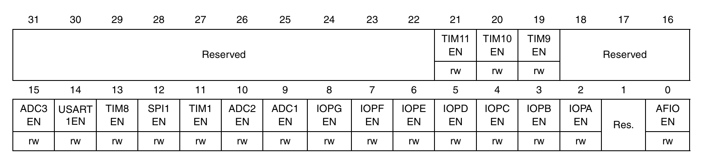

+++
author = "ALKALiKong"
title = "STM32 04 USART 通信实现"
date = "2025-07-31"
description = "自己实现了一个简陋的 USART 通信 util，然后分析了一下 CMSIS Driver 的实现，并利用他们的实现思路优化了一下自己的 util"
tags = [
    "STM32",
    "CMSIS",
    "USART",
    "C",
]
categories = [
    "STM32",
    "CMSIS",
    "DRIVER",
]

+++
## USART 基本实现

以 USART1 为例，开启 USART 大致需要四步：

1. 在 RCC 内启用 USART1 所需要的时钟
2. 为 RX 和 TX Pins 选用 复用功能 ，在参考手册里会有定义。
3. 通过 BRR 寄存器设置波特率
4. 配置 RX，TX

### 在 RCC 使能所需时钟



由参考手册可知，我们需要使能的 USART1EN 、 IOPAEN 和 AFIOEN 都在 APB2ENR 寄存器中，所以直接设置这个寄存器即可。

``` C
    // Enable AFIOEN
    RCC->APB2ENR |= RCC_APB2ENR_AFIOEN;
    // Enable IOPAEN
    RCC->APB2ENR |= RCC_APB2ENR_IOPAEN;
    // Enable USART1EN
    RCC->APB2ENR |= RCC_APB2ENR_USART1EN;
```

### 输出引脚配置

之前接触 GPIO CRH 与 CRL 寄存器的时候，应该注意到过 CNF 里有以下内容：

``` C
In input mode (MODE[1:0]=00):

- 00: Analog mode 
- 01: Floating input (reset state) 
- 10: Input with pull-up / pull-down 
- 11: Reserved 

In output mode (MODE[1:0] > 00): 

- 00: General purpose output push-pull 
- 01: General purpose output Open-drain 
- 10: Alternate function output Push-pull 
- 11: Alternate function output Open-drain
```

这里就涉及到 Alternate function （复用功能）了。比如说，USART 就是一种复用功能，我们要使用它，就需要对他的引脚进行配置。


上面是参考手册对于复用功能配置的介绍，下面是从参考手册中截取的 USART 所需要的配置。


可以看到，每个 pinout 都对应了一个 GPIO configuration。你说得对，但是我们需要用到 RX 和 TX 引脚，去哪里找这些引脚都是什么呢？这个可以在参考手册的 `AF remap and debug I/O configuration register (AFIO_MAPR)` 处寻找，这里给出了所有复用功能的引脚，以及可以软件设置的 remap。


上面是 AFIO_MAPR 的寄存器结构，以及他下面写的的 USART1 Remapping。Remap 就是重新映射的意思，这里就是说可以通过这个寄存器把原本 TX->PA9, RX->PA10 的 USART1 引脚给重新映射到 TX/PB6, RX/PB7 上，相当于给设计电路时提供了更多可选的选择。至此，我们便知道了设置 USART1 GPIO 输出的方法。

``` C
    /* Configure GPIO pins for USART1 */
    // PA9 (TX) -  Alternate function push-pull (50MHz)
    // 清除PA9配置位 (CRH bits 7:4)
    GPIOA->CRH &= ~(0xF << 4);
    // 设置PA9为复用推挽输出，50MHz (1011)
    GPIOA->CRH |= (0xB << 4);
    
    // PA10 (RX) - Input floating / Input pull-up
    // 清除PA10配置位 (CRH bits 11:8)  
    GPIOA->CRH &= ~(0xF << 8);
    // 设置PA10为浮空输入 (0100)
    GPIOA->CRH |= (0x4 << 8);
```

### 设置波特率

下面给出的是分数波特率的计算公式、常见的编码波特率误码率的计算、BRR寄存器的结构：


我们要设置波特率，就需要对 BRR 寄存器进行设置。由图可以看出，BRR 寄存器的前16位分为 12 位整数部分和 4 位小数部分。由第二幅图片，我们可以直接找到需要的频率对应的编码波特率，比如 对于 115.2Kbps ，我们要设置为 39.0625，那么就把整数部分左移四位，再与小数部分*16进行或运算。

```C
    // 配置波特率
    // 115200 -> 39.0625
    // 小数部分 = 0.0625 * 16 = 1
    USART1->BRR = (39 << 4) | 1;
```

注意：对BRR寄存器的修改会直接应用到RX和TX上，所以请**不要在发送与接收数据的时候修改**。

### TX/RX 配置

根据参考手册，Transmitter 与 Receiver 的工作流程如下：


由这些步骤可见，我们需要访问 CR1，CR2，CR3，DR 这些寄存器，我们在这里先简单给出对应几个寄存器的结构：


由此，我们可以得到配置过程：

``` C
    // 配置控制寄存器
    // 先清除所有配置，然后设置需要的位
    USART1->CR1 = 0;
    USART1->CR2 = 0;
    USART1->CR3 = 0;
    
    // CR1配置:
    // UE (bit 13): USART Enable - 最后设置
    // M (bit 12): 0 = 8 data bits
    // PCE (bit 10): 0 = No parity
    // TE (bit 3): Transmitter enable
    // RE (bit 2): Receiver enable
    USART1->CR1 = USART_CR1_TE | USART_CR1_RE;
    
    // CR2配置:
    // STOP[13:12]: 00 = 1 stop bit (默认值)
    // 前面已经被置零了，无需设置

    // 最后启用USART
    USART1->CR1 |= USART_CR1_UE;
```

### 实现收发

这里提出一种收发方式。在这之前，我们先回顾一下 TX 和 RX 的工作流程（在上面），并关注一下 USART_SR：


在 TX 的工作流程中，有提到：

> 7. 把要发送的数据写进USART_DR寄存器(此动作清除 TXE 位)。在只有一个缓冲器的情况下，对每个待发送的数据重复步骤7。  
> 8. 在USART_DR寄存器中写入最后一个数据后，要等待TC=1，它表示最后一个数据帧的传输结束。当需要关闭USART或需要进入停机模式之前，需要确认传输结束，避免破坏最后一次传输。 

所以，我们就可以写出下面的发函数：

``` C
uint8_t usart1_send(void* buf, uint32_t len) {
    uint8_t* data = (uint8_t*)buf;
    for (uint32_t i = 0; i < len; i++) {
        while (!(USART1->SR & USART_SR_TXE)) {}
        USART1->DR = data[i];
    }
    while (!(USART1->SR & USART_SR_TC)) {}
    return 0;
}
```

对于接收，这里提供的是一个比较简陋的接收方式，通过阻塞等待数据读入，实际使用应该没人会这么写（

``` C
uint8_t usart1_receive(void* buf) {
    uint8_t* data = (uint8_t*)buf;
    
    volatile uint32_t timeout = 100;
    // 等待接收数据寄存器非空
    while ( !(USART1->SR & USART_SR_RXNE) && timeout > 0 ) {
        timeout--;
    }
    if ( USART1->SR & USART_SR_RXNE )
        *data = (uint8_t)(USART1->DR & 0xFF);
    else
        return 1;
    
    return 0;
}
```

一般来说，我们设计的是接收一个数据， 触发中断，然后把数据发回来。这种处理方式是没有缓冲的，当数量太大的时候，亦或者当数据接收太快的时候，我们来不及处理已经收到的数据，那么，当再次收到数据的时候，就会将之前还未处理的数据覆盖掉。那么就会出现丢包的现象了，对我们的程序是一个致命的问题。所以，我们一般会设计一个缓冲区，在有数据可以读入的时候写入缓冲区内，在缓冲区内读取数据。

## CMSIS Driver 实现

### 初始化

启用以下两个组件即可使用 CMSIS 提供的 USART 驱动：

```
    - component: ARM::CMSIS Driver:USART:Custom
    - component: Keil::CMSIS Driver:USART
```

同时，需要在 `RTE_Device.h` 中启用需要的 USART 设备，比如启用 USART1 :

``` C
// <e> USART1 (Universal synchronous asynchronous receiver transmitter)
// <i> Configuration settings for Driver_USART1 in component ::CMSIS Driver:USART
#define RTE_USART1                       1

//   <o> USART1_TX Pin <0=>Not Used <1=>PA9
#define RTE_USART1_TX_PORT_ID_DEF       1
#if    (RTE_USART1_TX_PORT_ID_DEF == 0)
#define RTE_USART1_TX_DEF               0
#elif  (RTE_USART1_TX_PORT_ID_DEF == 1)
#define RTE_USART1_TX_DEF               1
#define RTE_USART1_TX_PORT_DEF          GPIOA
#define RTE_USART1_TX_BIT_DEF           9
#else
#error "Invalid USART1_TX Pin Configuration!"
#endif

//   <o> USART1_RX Pin <0=>Not Used <1=>PA10
#define RTE_USART1_RX_PORT_ID_DEF       1
#if    (RTE_USART1_RX_PORT_ID_DEF == 0)
#define RTE_USART1_RX_DEF               0
#elif  (RTE_USART1_RX_PORT_ID_DEF == 1)
#define RTE_USART1_RX_DEF               1
#define RTE_USART1_RX_PORT_DEF          GPIOA
#define RTE_USART1_RX_BIT_DEF           10
#else
#error "Invalid USART1_RX Pin Configuration!"
#endif
```

之后，可以这样初始化 USART1:

``` C
extern ARM_DRIVER_USART Driver_USART1;
void USART1_Event_Callback(uint32_t event) {}
void USART1_Init() {
    Driver_USART1.Initialize(USART1_Event_Callback);
    Driver_USART1.PowerControl(ARM_POWER_FULL);
    Driver_USART1.Control(ARM_USART_MODE_ASYNCHRONOUS |
                            ARM_USART_DATA_BITS_8 |
                            ARM_USART_PARITY_NONE |
                            ARM_USART_STOP_BITS_1 |
                            ARM_USART_FLOW_CONTROL_NONE, 115200);
    Driver_USART1.Control(ARM_USART_CONTROL_TX, 1);
    Driver_USART1.Control(ARM_USART_CONTROL_RX, 1);
}
```

### 发送数据

``` C
const char *msg = "Hello From Driver USART1.\n";
Driver_USART1.Send( msg, strlen(msg) );
while (Driver_USART1.GetStatus().tx_busy);
```

### 接收数据

我们来着重讲一下 CMSIS Driver 中接收的实现。我们要用到的核心代码是这样子的：

``` C
// 缓冲区
static uint8_t rx_buffer[256];
static volatile bool rx_complete = false;
static volatile uint32_t rx_count = 0;
// 回调函数
void USART1_Event_Callback(uint32_t event) {
    if (event & ARM_USART_EVENT_RECEIVE_COMPLETE) {
        // 接收到完整的256字节
        rx_complete = true;
        rx_count = 256;
        // 停止接收
        Driver_USART1.Control(ARM_USART_ABORT_RECEIVE, 0);
    }
    
    if (event & ARM_USART_EVENT_RX_TIMEOUT) {
        // IDLE检测到，获取实际接收的字节数
        rx_count = Driver_USART1.GetRxCount();
        rx_complete = true;
        // 停止接收
        Driver_USART1.Control(ARM_USART_ABORT_RECEIVE, 0);
    }
}
// 启动接收模式
int32_t result = Driver_USART1.Receive(rx_buffer, 256);
// 停止接收
Driver_USART1.Control(ARM_USART_ABORT_RECEIVE, 0);
```

个人理解的这个 USART 的接收流程为

1. `int32_t result = Driver_USART1.Receive(rx_buffer, 256);` 启用接收模式，开启后会开始接收数据。这里指定了最多接收的长度。
2. 当接收到数据时，会不断将收到的数据写入 buffer。
3. 当数据接收完成时，会触发回调函数（在初始化时指定）。回调函数带有一个参数 event ，可以通过这个 event 判断是什么事件。
4. 目前会触发的事件一般是这两类：接收完、空闲。接收完是指已经接收到指定大小的数据了；而空闲是指对方已经发送完连续的数据，但不够指定的大小（数据传送都是连续的，中间不会存在空闲位置，所以当连接空闲时就是对方已经发送完数据了）。这时，我们可以使用 `Driver_USART1.GetRxCount()` 获取最后接收到了多少数据。
5. 在每一次接收数据结束后，应当停止接收，通过 `Driver_USART1.Control(ARM_USART_ABORT_RECEIVE, 0);`  实现。如果不进行停止接收，那么下一次接收就无法开始。

具体来说， `Driver_USART1.Receive()` 是通过中断来实现的，在调用这个函数时，它会开启 CR1 的 RXNEIE 和 IDLEIE，在接收到数据或空闲时产生中断。 CMSIS Driver 在内部实现了一个 `USART_IRQHandler` ，他大致的工作流程如下：

``` C
// USART_STM32F10x.c, line 1986
void USART_IRQHandler(const USART_RESOURCES *usart) {
    uint32_t sr = usart->reg->SR;  // 读取状态寄存器
    
    // Reset local variables
    val = 0U;
    event = 0U;
    data = 0U;

    // 检查 RXNE（接收数据寄存器非空）
    if (sr & USART_SR_RXNE & usart->reg->CR1) {
        // 读取数据
        data = (uint16_t)usart->reg->DR;
        *(usart->xfer->rx_buf++) = (uint8_t)data;
        usart->xfer->rx_cnt++;
        
        // 检查是否接收完成
        if (usart->xfer->rx_cnt == usart->xfer->rx_num) {
            event |= ARM_USART_EVENT_RECEIVE_COMPLETE;
        }
    }
    
    // 检查 IDLE（空闲线路检测）
    if (sr & USART_SR_IDLE & usart->reg->CR1) {
        usart->reg->DR;  // 读取DR寄存器清除IDLE标志
        event |= ARM_USART_EVENT_RX_TIMEOUT;
    }
    
    // 调用用户回调函数
    if ((event && usart->info->cb_event) != 0U) {
        usart->info->cb_event(event);  // <-- 这里调用 USART1_Event_Callback
    }
}
```

这里有一个蛮有意思的点，IDLEIE 、RXNEIE 在 USART_CR1 中的位置是与 IDLE、RXNE 在 USART_SR 中的位置是相同的！我想了好久为什么检测的时候要对 CR1 进行与计算，原因就是为了确保对应的中断触发时确认他们的触发器是启用的，避免处理那些不需要处理的中断。

借此，我们可以实现一个简单的 demo 展示如何使用这个 Driver:

``` C
#include "Driver_Common.h"
#include "Driver_USART.h"
#include "RTE_Components.h"
#include "stdint.h"
#include CMSIS_device_header
#include "string.h"

extern ARM_DRIVER_USART Driver_USART1;
static uint8_t rx_buffer[256];
static volatile bool rx_complete = false;
static volatile uint32_t rx_count = 0;

void USART1_Event_Callback(uint32_t event) {
    if (event & ARM_USART_EVENT_RECEIVE_COMPLETE) {
        // 接收到完整的256字节
        rx_complete = true;
        rx_count = 256;
        // 停止接收
        Driver_USART1.Control(ARM_USART_ABORT_RECEIVE, 0);
    }
    
    if (event & ARM_USART_EVENT_RX_TIMEOUT) {
        // IDLE检测到，获取实际接收的字节数
        rx_count = Driver_USART1.GetRxCount();
        rx_complete = true;
        // 停止接收
        Driver_USART1.Control(ARM_USART_ABORT_RECEIVE, 0);
    }
}

void USART1_Init() {
    Driver_USART1.Initialize(USART1_Event_Callback);
    Driver_USART1.PowerControl(ARM_POWER_FULL);
    Driver_USART1.Control(ARM_USART_MODE_ASYNCHRONOUS |
                            ARM_USART_DATA_BITS_8 |
                            ARM_USART_PARITY_NONE |
                            ARM_USART_STOP_BITS_1 |
                            ARM_USART_FLOW_CONTROL_NONE, 115200);
    Driver_USART1.Control(ARM_USART_CONTROL_TX, 1);
    Driver_USART1.Control(ARM_USART_CONTROL_RX, 1);
}

int main() {
    USART1_Init();
    // 发送启动消息
    const char* welcome = "USART CMSIS Demo Ready! Send data (max 256 bytes):\r\n";
    Driver_USART1.Send(welcome, strlen(welcome));
    while (Driver_USART1.GetStatus().tx_busy);

    for (;;) {
        // 清空缓冲区
        memset(rx_buffer, 0, sizeof(rx_buffer));
        
        // 启动接收256字节
        rx_complete = false;
        rx_count = 0;
        int32_t result = Driver_USART1.Receive(rx_buffer, 256);
        
        if (result == ARM_DRIVER_OK) {
            // 简陋的计数
            uint32_t timeout_counter = 0;
            const uint32_t MAX_TIMEOUT = 100000;
            
            // 等待接收完成
            while (!rx_complete && timeout_counter < MAX_TIMEOUT) {
                // 简单延时，让系统有时间处理中断
                for (volatile int i = 0; i < 100; i++) __NOP();
                timeout_counter++;
            }
            
            if (timeout_counter >= MAX_TIMEOUT) {
                // 超时处理
                const char* timeout_msg = "Timeout! No data received.\r\n";
                Driver_USART1.Send(timeout_msg, strlen(timeout_msg));
                while (Driver_USART1.GetStatus().tx_busy);
                
                // 取消当前接收
                Driver_USART1.Control(ARM_USART_ABORT_RECEIVE, 0);
            } else {
                // 正常接收到数据
                if (rx_count > 0) {
                    // 发送确认消息
                    const char* ack = "Received: ";
                    Driver_USART1.Send(ack, strlen(ack));
                    while (Driver_USART1.GetStatus().tx_busy);
                    
                    // 回显接收到的数据
                    Driver_USART1.Send(rx_buffer, rx_count);
                    while (Driver_USART1.GetStatus().tx_busy);
                    
                    // 换行
                    const char* newline = "\r\n";
                    Driver_USART1.Send(newline, 2);
                    while (Driver_USART1.GetStatus().tx_busy);
                } else {
                    const char* no_data = "No data received.\r\n";
                    Driver_USART1.Send(no_data, strlen(no_data));
                    while (Driver_USART1.GetStatus().tx_busy);
                }
                Driver_USART1.Control(ARM_USART_ABORT_RECEIVE, 0);
            }
        } else {
            // 接收启动失败
            const char* error_msg = "Failed to start receive!\r\n";
            Driver_USART1.Send(error_msg, strlen(error_msg));
            while (Driver_USART1.GetStatus().tx_busy);
        }
        
        // 短暂延时，然后继续下一轮接收
        for (volatile uint32_t i = 0; i < 100000; i++) __NOP();
    }
}
```

## 利用中断改良

经过上面对 CMSIS Driver 的研究，我们大致理解了这个中断怎么工作，以及 CMSIS 是如何处理对应的中断发生。接下来，我们就借用他们的思想，自己实现一个没有阻塞的改良版接收函数。

### 初始化

我们选择自己内建一个缓冲区，让数据在中断读取时都读到内建缓冲区内，在调用 `usart1_receive_interrupt()` 时才把数据从内建缓冲区移动到指定位置。

``` C
volatile uint8_t usart1_rx_buffer[256];
volatile uint32_t usart1_rx_index = 0;
volatile uint8_t usart1_rx_complete = 0;
```

初始化部分与之前是基本一样的，不过我们要实现一个自己的中断处理，所以我们要自己启用对应中断。中断调用的函数名都在向量表中定义好了（在 CMSIS 中是 `startup_stm32f10x_hd.s` ），所以我们需要写好对应的函数，linker 会把检测到的函数放到对应的位置上。具体可以参照下面的内容。

``` C
/*
 * STM32 中断处理流程
 * 
 * 1. 硬件事件发生（如USART接收到数据）
 *    ↓
 * 2. 外设检查中断使能位（USART1->CR1 的 RXNEIE 位）
 *    ↓ (如果使能)
 * 3. 外设向NVIC发送中断请求信号
 *    ↓
 * 4. NVIC检查该中断是否被使能（NVIC_EnableIRQ）
 *    ↓ (如果使能)
 * 5. NVIC检查中断优先级和屏蔽状态
 *    ↓ (如果允许)
 * 6. CPU跳转到中断向量表中的对应地址
 *    ↓
 * 7. 执行USART1_IRQHandler()函数
 */
uint8_t usart1_init_with_interrupt() {
    ...
    
    // 配置NVIC - 启用USART1中断
    NVIC_SetPriority(USART1_IRQn, 1);  // 设置中断优先级
    NVIC_EnableIRQ(USART1_IRQn);       // 启用USART1中断

    // 最后启用USART
    USART1->CR1 |= USART_CR1_UE;

    // 初始化中断相关变量
    usart1_rx_index = 0;
    usart1_rx_complete = 0;
    
    return 0;
}
```

### 中断函数设计

通过对 CMSIS Driver 中中断函数的分析，我们可以写出这样子的中断函数：

``` C
// 硬件中断处理函数
void USART1_IRQHandler(void) {
    uint32_t sr = USART1->SR;
    
    // 检查接收数据寄存器非空中断
    if (sr & USART_SR_RXNE) {
        // 读取接收到的数据
        uint8_t received_data = (uint8_t)(USART1->DR & 0xFF);
        
        // 将数据存储到缓冲区（防止溢出）
        if (usart1_rx_index < sizeof(usart1_rx_buffer)) {
            usart1_rx_buffer[usart1_rx_index++] = received_data;
        }

        // 如果读入的数据数量大于缓冲区，也设置接收完成
        // 其实这里最好是塞一个解决溢出的方案(类似动态扩容)，不过目前我还不是很熟悉内存管理机制，就先不做了
        if (usart1_rx_index >= sizeof(usart1_rx_buffer)) {
            usart1_rx_complete = 1;
        }
    }
    
    // 检查空闲线路中断（接收完成）
    if (sr & USART_SR_IDLE) {
        // 读取DR寄存器清除IDLE标志
        USART1->DR;
        
        // 设置接收完成标志
        usart1_rx_complete = 1;
    }
    
    // 检查溢出错误
    if (sr & USART_SR_ORE) {
        USART1->DR;
    }
    
    // 检查帧错误
    if (sr & USART_SR_FE) {
        USART1->DR;
    }
    
    // 检查校验错误
    if (sr & USART_SR_PE) {
        USART1->DR;
    }
}
```

### 接收函数

我们建立了一个 `usart1_rx_complete` 的 flag，当数据接收完成时就会被设置为 true。所以我们可以这样实现接收函数：

``` C
uint8_t usart1_receive_interrupt(void* buf, uint32_t* len) {
    uint8_t* data = (uint8_t*)buf;
    
    if (usart1_rx_complete) {
        // 复制接收到的数据
        for (uint32_t i = 0; i < usart1_rx_index && i < *len; i++) {
            data[i] = usart1_rx_buffer[i];
        }
        
        *len = usart1_rx_index;  // 返回实际接收的字节数
        
        // 重置状态
        usart1_rx_index = 0;
        usart1_rx_complete = 0;
        
        return 0;  // 成功
    }
    
    *len = 0;
    return 1;  // 没有数据
}
```

### Guard

因为我们自己实现的 `USART1_IRQHandler` 会和 CMSIS Driver 的实现冲突，所以我们最好只在不使用 CMSIS USART Driver 时使用我们自己的实现。所以我们要给我们添加中断的地方使用 `#ifdef` 套起来，只在需要的时候启用。

``` C
#ifdef SIMPLE_USART_USES_INTERRUPT
...
#endif
// 如要使用：
#define SIMPLE_USART_USES_INTERRUPT
```

### 演示程序

``` C
#include "RTE_Components.h"
#include <stdint.h>
#include <string.h>
#include CMSIS_device_header

#include "libs/usart/simple_usart1.h"

int main() {

    // 使用带中断的USART初始化
    usart1_init_with_interrupt();
    
    // 发送欢迎消息
    const char* welcome = "USART1 Interrupt Demo Ready! Send data:\r\n";
    usart1_send((void*)welcome, strlen(welcome));

    uint8_t rx_buffer[256];
    uint32_t rx_len;

    for (;;) {
        // 检查是否有新数据通过中断接收
        rx_len = sizeof(rx_buffer);
        if (usart1_receive_interrupt(rx_buffer, &rx_len) == 0) {
            // 有新数据接收到
            
            // 发送确认消息
            const char* ack = "Received (interrupt): ";
            usart1_send(ack, strlen(ack));
            
            // 回显接收到的数据
            usart1_send(rx_buffer, rx_len);
            
            // 添加换行
            const char* newline = "\r\n";
            usart1_send(newline, 2);
        }
        
        for (volatile uint32_t i = 0; i < 10000; i++) {
            __NOP();  // 简单延时
        }
    }
}
```

## 总结

其实即使是改良之后的读取，依然不是很好，所以还是更推荐直接使用 CMSIS Driver 的实现 XD。自己尝试去写，只是为了更加了解这些东西具体是怎么实现的，所以应该也没有必要去细究写的代码怎么样。

另外考虑到这只是我自己在学习过程中的见解，所以可能文中有很多错误的地方，还请大佬们多多指正 OmO

代码应该过几天我就会开放在我个人的 GitHub 的仓库里，所以最后的完整代码就不写在文里了。

