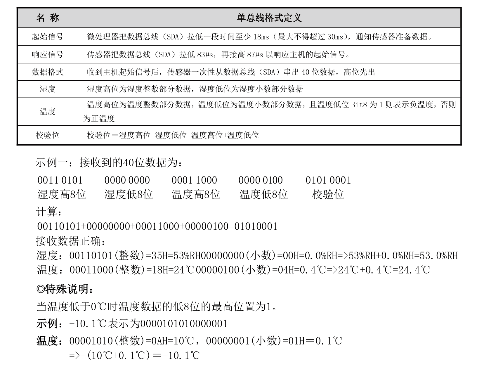
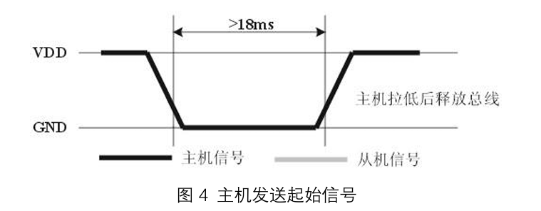
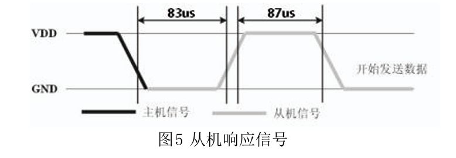
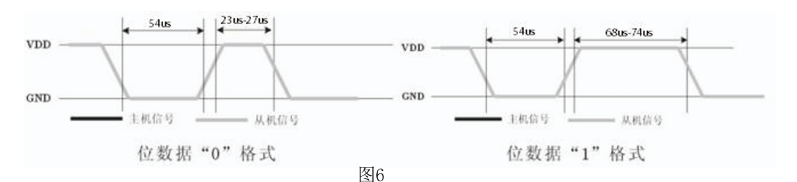
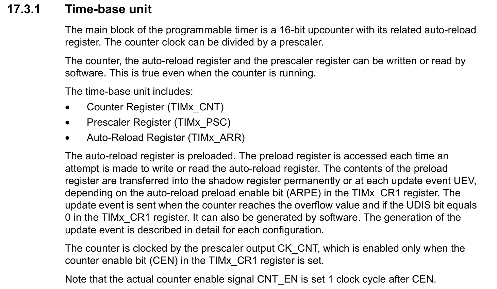

+++
author = "ALKALiKong"
title = "STM32 05 DHT11 温湿度传感器交互 与 TIM 基本定时器"
date = "2025-08-06"
description = "在使用 DHT11 时学习到单总线操作，以及通过 TIM 实现微秒级延时"
tags = [
    "STM32",
    "CMSIS",
    "DHT11",
    "TIM",
    "C",
]
categories = [
    "STM32",
    "CMSIS",
    "DRIVER",
]

+++

## DHT11

### 简介

DHT11 是一个比较常见的温湿度传感器，只使用了一个 DATA 接口实现了单总线与主机的通信，一次传送40位数据， 高位先出。

[DHT11 说明书](https://www.aosong.com/userfiles/files/media/DHT11-V1_3%E8%AF%B4%E6%98%8E%E4%B9%A6%EF%BC%88%E8%AF%A6%E7%BB%86%E7%89%88%EF%BC%89.pdf)

### 数据定义

数据格式: 8bit湿度整数数据+8bit湿度小数数据+8bit温度整数数据+8bit温度小数数据+8bit校验位。

 注：其中湿度小数部分为0。 

校验位数据定义为 “8bit湿度整数数据+8bit湿度小数数据+8bit温度整数数据+8bit温度小数数据”。8bit校验位等于所得结果的末8位。



由此，我们可以对数据进行以下定义：

``` C
// DHT11数据结构
typedef struct {
    uint8_t humity;     // 湿度整数部分
    uint8_t temp;       // 温度整数部分
    uint8_t humity_dec; // 湿度小数部分 (DHT11固定为0)
    uint8_t temp_dec;   // 温度小数部分
    uint8_t check;      // 校验和
    _Bool negative;     // 是否为负数
} dht11_dt;
```

### 通信

#### 初始化

DHT11上电后（DHT11上电后要等待 1S 以越过不稳定状态在此期间不能发送任何指令），测试环境 温湿度数据，并记录数据，同时 DHT11的DATA数据线由上拉电阻拉高一直保持高电平；此时 DHT11的  DATA 引脚处于输入状态，时刻检测外部信号。 

微处理器的I/O设置为输出同时输出低电平，且低电平保持时间不能小于18ms（最大不得超过30ms）， 然后微处理器的I/O设置为输入状态，由于上拉电阻，微处理器的I/O即DHT11的DATA数据线也随之变高，等待DHT11作出回答信号，发送信号如图所示： 



由此，我们便可以设计初始化代码，但是在此之前，我们需要先来看一下对于其数据端口操作的定义：

``` C
// DHT11 GPIO
#define DHT11_GPIO_PORT     GPIOC
#define DHT11_PIN_NUM       4
#define DHT11_GPIO_PIN      (1 << DHT11_PIN_NUM)
#define DHT11_GPIO_CLK      RCC_APB2ENR_IOPCEN

// Set the PIN to Input with pull-up / pull-down Mode ( 0x8 -> 0b1000 )
#define DHT11_IO_IN()   do { \
    if(DHT11_PIN_NUM < 8) { \
        DHT11_GPIO_PORT->CRL &= ~(0xF << (DHT11_PIN_NUM * 4)); \
        DHT11_GPIO_PORT->CRL |= (0x8 << (DHT11_PIN_NUM * 4)); \
    } else { \
        DHT11_GPIO_PORT->CRH &= ~(0xF << ((DHT11_PIN_NUM - 8) * 4)); \
        DHT11_GPIO_PORT->CRH |= (0x8 << ((DHT11_PIN_NUM - 8) * 4)); \
    } \
} while(0)

// Set the PIN to Push-pull Output Mode ( 0x3 -> 0b0011 )
#define DHT11_IO_OUT()  do { \
    if(DHT11_PIN_NUM < 8) { \
        DHT11_GPIO_PORT->CRL &= ~(0xF << (DHT11_PIN_NUM * 4)); \
        DHT11_GPIO_PORT->CRL |= (0x3 << (DHT11_PIN_NUM * 4)); \
    } else { \
        DHT11_GPIO_PORT->CRH &= ~(0xF << ((DHT11_PIN_NUM - 8) * 4)); \
        DHT11_GPIO_PORT->CRH |= (0x3 << ((DHT11_PIN_NUM - 8) * 4)); \
    } \
} while(0)

// Set the output of the DHT11 PIN
#define DHT11_DQ_OUT(x)  do { \
    if(x) DHT11_GPIO_PORT->BSRR = DHT11_GPIO_PIN; \
    else DHT11_GPIO_PORT->BRR = DHT11_GPIO_PIN; \
} while(0)

// Read the input of the DHT11 PIN
#define DHT11_DQ_IN      (DHT11_GPIO_PORT->IDR & DHT11_GPIO_PIN)
```

然后，就可以实现：

``` C
// Reset DHT11. (其实就是向DHT11发送起始信号)
void dht11_rst(void)
{
    DHT11_IO_OUT(); // SET OUTPUT
    DHT11_DQ_OUT(0); // 拉低 DQ
    delay_ms(20);    // 拉低至少18ms
    DHT11_DQ_OUT(1); // 拉高 DQ
    delay_us(20);    // 主机拉高20~40us
}
// Init DHT11
uint8_t dht11_init(void)
{
    // 使能 DHT11 所在 Pin 的时钟
    RCC->APB2ENR |= DHT11_GPIO_CLK;
    
    // 配置GPIO为推挽输出
    DHT11_IO_OUT();
    DHT11_DQ_OUT(1);
    
    // DHT11需要上电后至少1秒才能稳定
    delay_ms(1500);  // 等待1.5秒确保稳定
    
    dht11_rst();
    
    return dht11_check();
}
```

其中，delay_ms 是通过 SysTick 实现的毫秒延迟函数，实现方案可以看看

#### 检查连接状态

DHT11的DATA引脚检测到外部信号有低电平时，等待外部信号低电平结束，延迟后DHT11的 DATA引脚处于输出状态，输出83微秒的低电平作为应答信号，紧接着输出87微秒的高电平通知外设准备接收数据，微处理器的I/O此时处于输入状态，检测到I/O有低电平（DHT11回应信号） 后，等待87微秒的高电平后的数据接收，发送信号如图5所示



``` C
/**
 * @brief  Check the connectivity between DHT11 and MCU.
 * @return status code
 *         - 0 Success.
 *         - 1 Timed out.
 */
uint8_t dht11_check(void)
{
    uint16_t retry = 0;
    DHT11_IO_IN(); // SET INPUT
    
    // 等待DHT11拉低（响应信号开始）
    while (DHT11_DQ_IN && retry < 1000)
    {
        retry++;
        delay_us(1);
    }
    if(retry >= 1000) return 1; // 超时，DHT11没有响应
    
    retry = 0;
    // 等待DHT11拉高（响应信号结束）
    while (!DHT11_DQ_IN && retry < 1000) 
    {
        retry++;
        delay_us(1);
    }
    if(retry >= 1000) return 1; // 超时
    
    return 0;
}
```

delay_us 是使用 TIM 基本计时器实现的微秒级延迟函数，下面会介绍到。

#### 读取数据

由DHT11的DATA引脚输出40位数据，微处理器根据I/O电平的变化接收40位数据，位数据 “0”的格式为：54微秒的低电平和23-27微秒的高电平，位数据“1”的格式为：54微秒的低 电平加68-74微秒的高电平。位数据“0”、“1”格式信号如图6所示：



根据上面数据定义，我们需要一位一位的读取，并把内容放在5个 uint8_t 的数据中，所以我们可以这样写：

``` C
// 通过缓冲区内的数据保存好内容数据
static uint8_t save_data_from_buf( uint8_t *buf, dht11_dt *dest ) {
    // 零下的温度在缓冲区内最高位为 1
    dest->negative = ((1<<7) & buf[3]) ? 1 : 0;
    dest->temp = buf[2];
    // 把零下温度最高位的1排除掉
    dest->temp_dec = ~(1<<7) & buf[3];
    dest->humity = buf[0];
    dest->humity_dec = buf[1];
    dest->check = buf[4];
    return 0;
}

static uint8_t dht11_read_bit(void)
{
    uint16_t retry = 0;
    
    // 等待变为低电平（每个位开始）
    while(DHT11_DQ_IN && retry < 100) 
    {
        retry++;
        delay_us(1);
    }
    if(retry >= 100) return 0; // 超时，返回0
    
    retry = 0;
    // 等待变高电平（数据位）
    while(!DHT11_DQ_IN && retry < 100) 
    {
        retry++;
        delay_us(1);
    }
    if(retry >= 100) return 0; // 超时，返回0
    
    // Bit 0 -> 23-27us 高电平
    // Bit 1 -> 68-74us 高电平
    // 如果高电平持续时间较长，则为'1'，否则为'0'
    // 延时50ms后检测当前为高电平还是低电平
    // 不能使用 delay_us(1) 来计算持续了多少微秒
    // 因为在 1us 时间内 delay_us 调用的时间就已经远大于 1us
    delay_us(50);
    if(DHT11_DQ_IN) return 1;
    else return 0;
}

static uint8_t dht11_read_byte(void)
{
    uint8_t i, dat;
    dat = 0;
    
    // 1 byte <- 8 bit
    for (i = 0; i < 8; i++)
    {
        dat <<= 1;
        dat |= dht11_read_bit();
    }
    
    return dat;
}

/**
 * @brief  Read data from DHT11
 * @param datavalue A pointer to the dest where receives the data.
 * @return status code
 *         - 0 Success.
 *         - 1 Failed to connect with DHT11.
 *         - 2 Checksum failed.
 */
uint8_t dht11_read(dht11_dt *datavalue)
{
    uint8_t buf[5];
    uint8_t i;
    
    dht11_rst();
    
    uint8_t check_result = dht11_check();
    if(check_result == 0)
    {
        for(i = 0; i < 5; i++) 
        {
            buf[i] = dht11_read_byte();
        }
        
        uint8_t checksum = buf[0] + buf[1] + buf[2] + buf[3];
        
        if ( checksum == buf[4] ) {
            save_data_from_buf(buf, datavalue);
        }
        
        // 0 -> Success, 2-> Checksum falied.
        return ( checksum == buf[4] ) ? 0 : 2;
    }
    else
    {
        return 1; // Failed to communicate with DHT11.
    }
}
```

这里最有坑的地方就是检测一个 bit 内后面高电平的部分，我一开始的写法是使用 delay_us(1) 来每过1us统计高电平持续了多久，但是这样写就会出现严重问题：函数调用本身，以及进行读取操作，都是会占用时间的，造成了对于延迟 1us 来说，其函数调用以及内部实现的开销就已经达到了约 1.5us 左右，造成计时严重问题。所以在实际开发中，要避免使用 delay_us(1) 这样的极短时间作为计数，因为对于极短的时间来说损耗是极大的。

## TIM 基本计时器

STM32F103 集成了多个 TIM，可以实现很多功能。其中，TIM 6 和 7 是基本计时器 (Basic Timers)。

我们接下来实现一个最基本的微秒计时功能。TIM的基本知识可以看看这个：https://www.bilibili.com/video/BV11u4y1A7gS

我们实现的微秒计时器没有用到中断以及任何高级功能，所以只需要设置基本的 Time-base unit：



``` C
#include "delay.h"
#include "stm32f10x.h"
#include <stdbool.h>
#include <stdint.h>

/* SysTick */
volatile uint32_t systick_counter = 0;
volatile bool is_delay_inited = false;

void delay_init() {
    if ( is_delay_inited ) return;
    /* SysTick Init */
    SysTick->CTRL |= SysTick_CTRL_ENABLE |
                    SysTick_CTRL_TICKINT |
                    SysTick_CTRL_CLKSOURCE;
    /* Our MCU is at 72MHz, so set load to this for 1ms timer */
    SysTick->LOAD = 72000 - 1;
    SysTick->VAL = 0;

    /* TIM6 Init */
    // 使能TIM6时钟
    RCC->APB1ENR |= RCC_APB1ENR_TIM6EN;

    // 重置TIM6并清除重置位
    RCC->APB1RSTR |= RCC_APB1RSTR_TIM6RST;
    RCC->APB1RSTR &= ~RCC_APB1RSTR_TIM6RST;
    
    // 配置TIM6
    TIM6->PSC = 72 - 1; // 预分频 72，即相当于 1us timer
    TIM6->ARR = 0xFFFF;
    TIM6->CNT = 0;

    // 启动定时器
    TIM6->CR1 |= TIM_CR1_CEN;

    is_delay_inited = true;
}

void SysTick_Handler() {
    ++systick_counter;
}

uint32_t delay_get_tick() {
    if ( !is_delay_inited ) delay_init();
    return systick_counter;
}

void delay_ms(uint32_t ms) {
    if ( !is_delay_inited ) delay_init();
    uint32_t start = systick_counter;
    while (systick_counter - start < ms);
    return;
}

// t: expiration time, prd: period, now: current time. Return true if expired
bool timer_expired(uint32_t *t, uint32_t prd, uint32_t now) {
    if ( !is_delay_inited ) delay_init();
    if (now + prd < *t) *t = 0;                    // Time wrapped? Reset timer
    if (*t == 0) *t = now + prd;                   // First poll? Set expiration
    if (*t > now) return false;                    // Not expired yet, return
    *t = (now - *t) > prd ? now + prd : *t + prd;  // Next expiration time
    return true;                                   // Expired, return true
}

void delay_us(uint16_t us) {
    if ( !is_delay_inited ) delay_init();
    if (us == 0) return;

    uint16_t start = TIM6->CNT;
    uint16_t target = start + us;
    
    // 检查是否会发生溢出
    if (target > start) {
        // 无溢出情况：直接等待
        while (TIM6->CNT < target && TIM6->CNT >= start);
    } else {
        // 会发生溢出：先等到溢出，再等到目标值
        while (TIM6->CNT >= start);  // 等待溢出
        while (TIM6->CNT < target);  // 等待到目标值
    }
}
```

这里使用了循环检测 TIM6->CNT，而不是使用中断，是因为对于特别低的时间来说，使用中断是不合适的。

## 总结

一定要注意 delay_us 函数调用本身也是有开销的，对于 ms 的时间来说影响比较小，但是对于 us 来说这是不可忽视的，所以一定要谨慎使用。